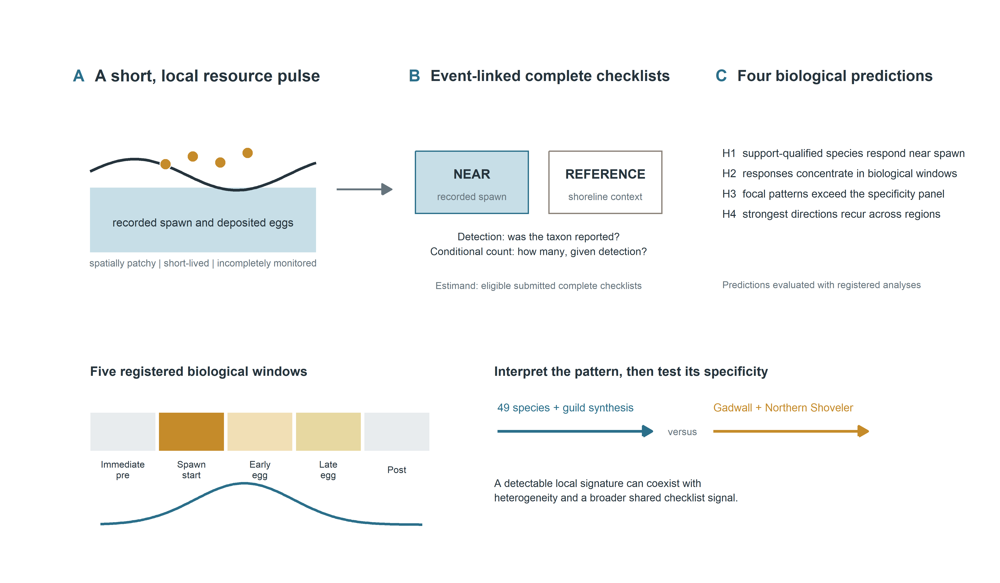
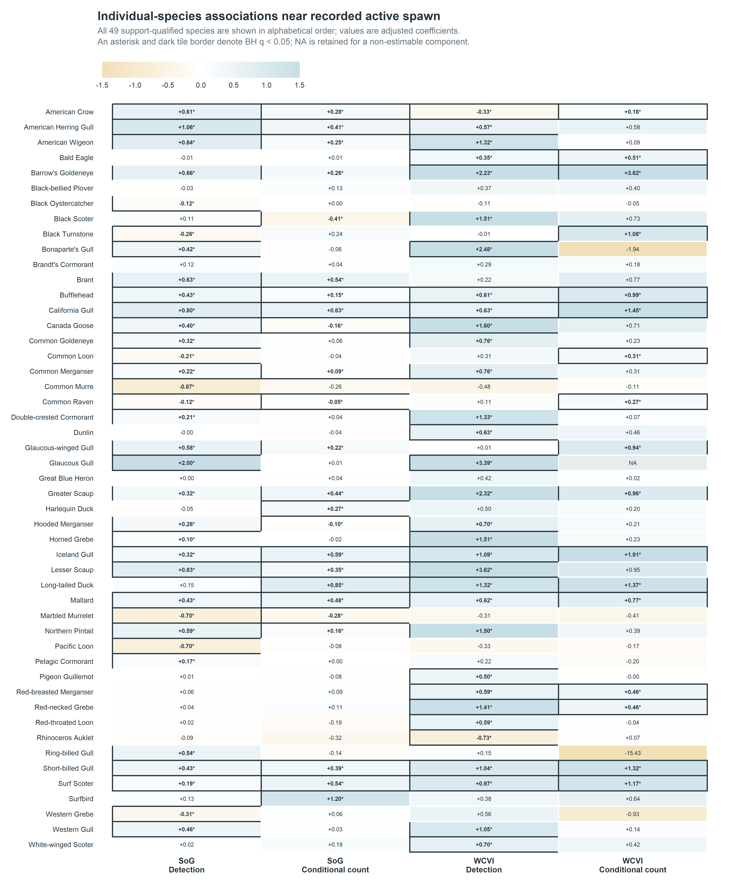
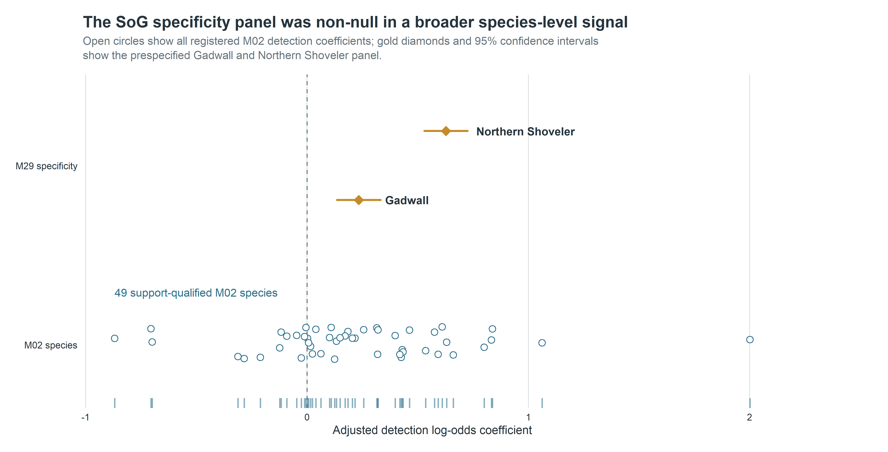
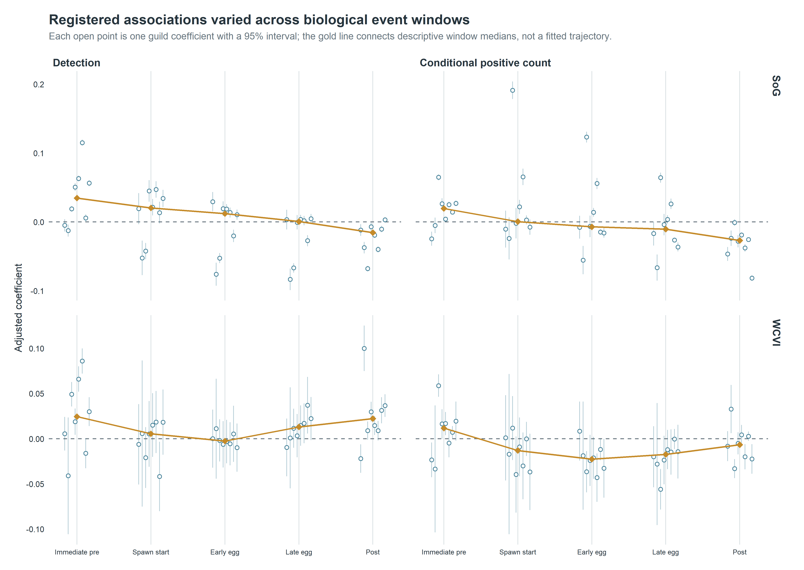
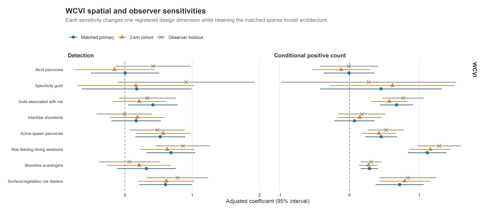

**Author details:** Blinded for review. This companion is provided for editorial convenience; Marine Environmental Research currently uses single-anonymized review and does not require a blinded manuscript.

# Abstract

Pacific herring (*Clupea pallasii*) spawning creates a concentrated coastal resource pulse. We tested whether coastal birds were reported more often and in higher positive counts near recorded spawn, whether associations concentrated in spawn and egg-availability windows, whether focal responses exceeded a prespecified specificity panel, and whether patterns recurred across regions. We linked complete eBird checklists to event-level Fisheries and Oceans Canada spawn records and used mixed models adjusted for effort, observer, year, location, and event structure. Analyses included 217,200 Strait of Georgia and 8,584 West Coast Vancouver Island checklist events. All 49 support-qualified species were displayed regardless of prior literature prominence or coefficient direction. Species-level associations were heterogeneous: SoG detection, SoG conditional-count, WCVI detection, and WCVI conditional-count models yielded 36/49, 34/49, 42/49, and 38/48 positive completed coefficients, respectively. Common shore and sea birds showed positive, negative, and mixed regional patterns; Surf Scoter and Short-billed Gull had positive coefficients for both response components in both regions. Event-window coefficients did not form a single resource-pulse trajectory. Matched sensitivities generally preserved direction, and shifted-exposure placebos were null after Benjamini-Hochberg adjustment. The Strait of Georgia specificity panel was non-null for Gadwall (beta = 0.234, 95% CI 0.132–0.337; q = 7.28 × 10^-6^) and Northern Shoveler (beta = 0.628, 0.527–0.729; q = 6.56 × 10^-34^). Spawning therefore left a detectable but heterogeneous and not uniformly taxon-specific signature in eligible submitted checklists, supporting a qualified resource-pulse interpretation rather than a causal or population-level effect.

**Keywords:** Pacific herring; eBird; community science; coastal birds; resource pulse; mixed models; falsification analysis

# Introduction

Pacific herring spawning is an unusually concentrated marine resource pulse. Over a short spring interval, adults and deposited eggs create prey and carrion subsidies in shallow coastal habitats, potentially changing where birds forage and aggregate. The pulse is spatially patchy, varies among years, and moves through biologically distinct phases from pre-spawn arrival to active spawning, egg availability, and post-spawn decay [@haegele1985; @hay1987; @hay2009; @rooper2024; @grinnell2023]. That combination of high local intensity and short duration makes herring spawn a useful system for asking whether mobile consumers track ephemeral resources.

Resource pulses can reorganize coastal food webs over periods much shorter than conventional monitoring intervals. Their effects depend not only on the amount of material released but also on access: eggs occur at particular depths and substrates, adult fish move through nearshore waters, and tides or weather alter when resources can be used. Mobile predators may consequently concentrate near a pulse, change flock size without changing occurrence, or respond at different stages. A regional analysis must therefore retain spatial proximity, temporal phase, taxon identity, and response component rather than reducing spawning to a single annual index.

Field studies provide strong reasons to expect a bird response. Waterbirds aggregate near spawning areas, consume roe or adult herring, alter foraging behavior, and move in relation to spawn timing [@haegele1993; @sullivan2002; @rodway2003; @lewis2007; @lok2008; @lok2012]. Scoters can exploit attached roe, gulls can use roe and mixed shoreline subsidies, and piscivores or scavengers may respond to adult fish, carcasses, or displaced prey. These mechanisms also predict heterogeneity: taxa differ in diet, diving ability, migration timing, habitat access, and flocking behavior. A short resource pulse should therefore generate a structured community signature rather than a universal increase in every species.

That heterogeneity makes broad individual-species reporting important. Common coastal birds can provide informative contrasts even when a dedicated herring-specific literature is sparse: a species may respond through adult-fish predation, roe access, scavenging, habitat displacement, seasonal co-occurrence, or the observation process itself. Restricting the biological display to taxa with the best-developed prior literature would hide potentially useful positive, negative, and mixed patterns. We therefore present every species that passed the frozen response-free support rules and use literature to interpret mechanisms, not to decide which fitted species results deserve visibility.

Most direct evidence comes from focused locations or particular taxa. Those studies establish ecological plausibility but leave open whether the signal can be detected across a large, irregular coastline and an observation network not designed around spawning. At that scale, regional repetition is valuable because the same biological mechanism must appear against different coastline geometry, observer participation, and monitoring intensity. Failure to repeat can also be informative: it may identify ecological context dependence, insufficient precision, or mismatched exposure rather than simply a failed hypothesis.

The unresolved question is whether local responses documented at particular sites scale to a consistent, time-localized, and taxon-specific pattern across regions. A genuine resource-pulse signature should be strongest near recorded spawning, should vary through biologically relevant windows, and should be most coherent for taxa with plausible links to herring. Regional recurrence would strengthen that interpretation, whereas negative, imprecise, or region-specific responses would reveal important limits. Site-based studies motivate these expectations but cannot alone establish a broad-scale checklist signature or a regional population response [@kelly2018].

Complete eBird checklists offer broad temporal and spatial coverage together with effort metadata and an explicit statement that observers reported all species detected [@sullivan2009; @kelling2019]. This creates an opportunity to link bird observations directly to recorded spawn events while distinguishing whether a taxon was reported from how many individuals were reported after detection. The same open participation complicates ecological specificity: observers choose sites and dates, accessible shorelines receive disproportionate effort, and birders may visit known spawn events. Effort, observer, spatial, and calendar adjustment can reduce measured differences but cannot remove every site-selection or checklist-submission mechanism [@johnston2018; @johnston2021]. A comparison with taxa lacking a verified direct spawn mechanism is therefore biologically informative, not merely a technical diagnostic.

We asked: **Does the short-lived Pacific herring spawn pulse produce a spatially local, temporally structured, and taxon-specific signature in coastal bird checklists?** We linked event-level Fisheries and Oceans Canada (DFO) spawn information to eligible complete eBird checklists in the Strait of Georgia (SoG) and West Coast Vancouver Island (WCVI). The primary estimand was the association between recorded active-near exposure and checklist detection or positive numeric count conditional on detection. It describes eligible submitted checklists rather than a causal effect, population abundance, biomass, occupancy, migration, or individual movement.

## Biologically motivated predictions

The frozen scientific framework prespecified positive near-spawn responses, temporal localization around spawn and egg availability, mechanism-based guild differences, and a null-mechanism specificity panel. It did not register the following four labels verbatim as a single directional hypothesis family. We therefore treat them as biologically motivated predictions evaluated with registered analyses:

**H1 - Focal response.** Bird taxa and guilds with established or plausible links to herring spawning should have higher checklist detection and conditional positive counts near recorded active spawn.

**H2 - Temporal localization.** Associations consistent with a short-lived resource pulse should be concentrated in biologically relevant spawn and egg-availability windows rather than occurring uniformly before and after recorded events.

**H3 - Ecological specificity.** Focal herring-associated taxa should show stronger or more coherent associations than the prespecified Gadwall and Northern Shoveler specificity panel.

**H4 - Regional repeatability.** The strongest focal associations should recur in direction across SoG and WCVI, although magnitude and precision may differ.

**Table 1. Biological predictions and observed evidence.** Prediction-level conclusions summarize registered analyses; they do not replace complete coefficient reporting.



{width=100% fig-alt="Conceptual design showing local herring spawn, near and reference shorelines, pre-spawn through post-spawn windows, support-qualified species predictions, and the specificity-panel comparison."}

**Figure 1. Scientific hypotheses and event-linked checklist design.** The conceptual geography is privacy-safe. Recorded spawn defines near and reference shoreline conditions and discrete biological windows; all support-qualified individual species are reported, guilds provide a complementary synthesis, and focal interpretations are compared with a prespecified specificity panel. The figure states predictions, not observed effect sizes.

# Methods

## Study system and regional frames

The study linked complete eBird checklists to recorded Pacific herring-spawn events along the British Columbia coast. SoG observations from 2005-2025 formed the primary regional frame, and WCVI observations from 2015-2025 formed a candidate-primary frame selected from response-free coverage criteria. Central Coast and North observations were retained as descriptive contexts. The two primary regions differ in coastline geometry, monitoring density, accessibility, and observer composition, so regional recurrence was evaluated without treating region as interchangeable replication.

## Complete checklists and bird-response outcomes

The eBird source was EBD_relMay-2026, restricted to response years through 2025 [@ebird_ebd]. Eligible observations were complete stationary or traveling checklists lasting 5-300 minutes, covering no more than 5 km, and submitted by groups of one to ten observers. The checklist was the analytical row.

We modeled two complementary outcomes. Detection indicated whether an eligible complete checklist reported a taxon or guild. Conditional positive count was the log numeric count among detected checklists with a finite positive value. An unquantified `X` contributed to detection but not count; lower-bound reports, ambiguous records, and structurally unknown responses remained distinct. Thus, detection concerns reporting at least one bird, whereas conditional count concerns reported flock size after a numeric detection. Neither estimates absolute abundance or biomass.

## Event-level herring exposure

The exposure source was the official Pacific Herring Spawn Index Data [@grinnell2023; @dfo_spawn_data]. Checklists were linked to recorded event locations using registered distance strata and to five discrete biological windows: immediate pre-spawn, spawn start, early egg, late egg, and post-spawn. The primary contrast compared recorded active-near exposure with the registered reference condition. When events overlapped, all eligible links contributed additively within one checklist row; checklists were not duplicated by event.

Surveyed-positive, surveyed-negative, and unmonitored-unknown herring states remained distinct. Missing components and absent records were not coded as zero or surveyed negatives. The DFO index is a relative spawn index, not absolute biomass, and incomplete monitoring or uncertain timing can misclassify recorded biological exposure.

## Hypothesis-linked models and adjustment

Registered mixed models estimated individual-species and guild associations with active-near exposure and discrete event windows. Detection used binomial-logit models; conditional positive count used Gaussian models of log count among positive numeric reports, with a registered zero-truncated negative-binomial sensitivity. Models adjusted for checklist protocol, duration, distance traveled, observer count, year, region-period, event time, and distance stratum, with random intercepts for herring-event block, observer cluster, and generalized location cluster [@bates2015]. These terms address measured effort and clustering but do not eliminate unmeasured site selection or checklist submission.

The M02 models retained all 49 species that met the frozen, response-free support rules. Their complete species-level coefficients are the primary biological display; species were ordered alphabetically rather than by effect size, significance, or literature prominence. M01 guild models provide a complementary mechanism-based synthesis, and M05 guild models evaluate registered event windows. Coefficients above zero indicate higher modeled detection or conditional positive count on recorded active-near checklists, on the relevant link scale. Confidence intervals describe model-based uncertainty, and BH q-values distinguish multiplicity-adjusted support from nominal p-values. Coefficient magnitude was not converted to a population change, because checklist selection and the two-part response prevent that interpretation.

H1 was evaluated from active-near coefficients for all 49 support-qualified species and the registered guilds. H2 used the complete five-window event-time family. H4 compared direction across SoG and WCVI, with magnitude and uncertainty retained rather than pooled into one coast-wide response. All prespecified models were reported regardless of sign.

## Specificity, sensitivity, multiplicity, and synthesis

H3 used a prespecified SoG detection-only specificity panel containing Gadwall and Northern Shoveler. These taxa lacked a verified direct spawn mechanism but were not assumed to be guaranteed biological nonresponders. Positive panel coefficients would indicate that shared seasonality, shoreline access, checklist submission, site selection, or exposure classification contributed to the same recorded near-spawn signal.

Matched WCVI analyses restricted exposure geometry to 2 km or removed the pre-defined dominant observer cluster. Response-blind shifted-exposure placebos reassigned complete linked exposure bundles within region-year strata. Detailed transformation, validation, and singular-fit procedures are in the supplement. Benjamini-Hochberg (BH) adjustment was applied within coherent model, region, and outcome families [@benjamini1995]. Corrected partial pooling grouped only compatible evidence, retained every individual estimate, and preserved model-specific BH q-values. Singular warnings remained explicit; no headline claim depended exclusively on a singular component.

# Results

The primary analyses included 217,200 eligible SoG checklist events and 8,584 eligible WCVI checklist events. The descriptive Central Coast and North frames contained 861 and 9,007 checklist events, respectively (Supplementary Table S11). All 128 protected sensitivity components completed; manuscript preparation used only frozen, privacy-safe aggregate outputs.

## Individual species showed heterogeneous near-spawn associations



These coefficients give H1 a qualified answer. Near-spawn increases occurred for many species, but the complete pattern rejects a universal response and shows that detection and positive count carry related but non-identical information.

{width=100% fig-alt="Matrix of all 49 support-qualified species and their active-near coefficients for detection and conditional positive count in SoG and WCVI; cells show signed coefficients, BH significance, and one explicit NA."}

**Figure 2. Complete individual-species associations.** All 49 support-qualified species are ordered alphabetically and shown for both regions and response components. Coefficients are log odds for checklist detection and log positive count conditional on a numeric detection. Dark borders and asterisks identify BH q < 0.05; color encodes direction but signed labels make the figure interpretable without color. Estimates are checklist-conditional associations, not causal effects.

**Table 2. Completeness and direction of the individual-species M02 results.** Counts use the 49 frozen support-qualified species; positive coefficients are descriptive, whereas the final column uses model-family BH adjustment. The noncompleted WCVI conditional-count component remains explicit rather than being coded as zero.



## Common shore and sea birds showed diverse species-specific patterns

The complete display reveals patterns that were obscured by the earlier literature-priority emphasis (Figure 2; Supplementary Figure S1). Canada Goose detection was positive in both regions, whereas its SoG conditional-count coefficient was negative. Common Merganser detection was positive in both regions, with a positive SoG count coefficient and a less precise positive WCVI count coefficient. Common Loon shifted from negative detection in SoG to positive detection and conditional count in WCVI. Black Oystercatcher detection was negative in SoG and imprecise in WCVI; Great Blue Heron coefficients were near zero or imprecise. Black Turnstone combined negative SoG detection with positive WCVI conditional count. Red-breasted Merganser, grebes, cormorants, and the several gull species likewise differed by region and response component. These contrasts are ecologically informative regardless of whether each taxon has a well-developed herring-specific literature.

Across the complete set, 25 species had positive completed coefficients in all four region-outcome components. Eight were both positive and BH q < 0.05 in all four: Surf Scoter, Greater Scaup, Mallard, Bufflehead, Iceland Gull, California Gull, Barrow's Goldeneye, and Short-billed Gull. American Crow also had BH q < 0.05 in all four, but its WCVI detection coefficient was negative, illustrating why support and direction must be read together. Within the frozen Priority-A subset, Surf Scoter and Short-billed Gull were the two species with positive coefficients in all four components. Their recurrence supports H4 without implying stronger regional population responses, because the regional observation processes and exposure geometries differ.

{width=100% fig-alt="Distribution of all 49 SoG individual-species detection coefficients and confidence intervals for the Gadwall and Northern Shoveler specificity panel."}

**Figure 4. The SoG specificity panel in the complete species-level context.** Open circles show the 49 support-qualified SoG detection coefficients. Gadwall and Northern Shoveler are detection-only specificity taxa; their non-null coefficients reveal a broader shared signal and are not conditional-count tests.

## Event timing did not follow a single resource-pulse trajectory



The 160 registered event-window coefficients supported temporal structure but not the simple form predicted by H2. In SoG, seven of eight guilds had BH-significant coefficients in the immediate-pre window for both outcomes, and seven of eight had post-window coefficients with a negative median. WCVI showed a different distribution across windows. The mixture of positive and negative coefficients, and the disagreement between regions and response components, indicates that no single monotone trajectory described the community. Because the windows are discrete registered contrasts, they should not be read as a continuous causal event study.

{width=100% fig-alt="All 160 registered event-time coefficients summarized by region, outcome, and discrete window."}

**Figure 3. Registered discrete event-time coefficients.** Five frozen windows were modeled for each guild, region, and hurdle component. The plot displays uncertainty and includes the falsification guild; the median is descriptive and not a new pooled estimand.

## The SoG specificity panel revealed a broader shared signal

The prespecified SoG detection-only specificity panel was non-null for both taxa. Gadwall had beta = 0.234 (95% CI 0.132-0.337; BH q = 7.28 x 10^-6^), and Northern Shoveler had beta = 0.628 (0.527-0.729; q = 6.56 x 10^-34^) (Figure 4; Table 3). Their magnitudes overlapped the distribution of primary SoG individual-species detection coefficients. H3 was therefore not supported as a clean contrast between focal taxa and a null panel.

The prespecified Strait of Georgia specificity panel was non-null for Gadwall and Northern Shoveler. This indicates that recorded active-near exposure captured shared seasonal, spatial-access, checklist-submission, site-selection, or exposure-classification structure in addition to any taxon-specific ecological response. The panel therefore limits causal and simple species-specific interpretations, but does not negate the checklist-conditional associations or directly test conditional positive-count responses.

**Table 3. Sensitivity, placebo, singular-fit, and specificity-panel summary.** Component-level estimates and explicit warning states are supplied in the companion CSV tables. Three headline claims include some singular-warning support, but each also has ordinary-fit or otherwise stable evidence; no headline claim depends exclusively on a singular component.



## Matched sensitivities supported most directions with qualification



{width=100% fig-alt="Matched WCVI reference, 2-kilometre cohort, and dominant-observer coefficients with 95 percent intervals."}

**Figure 5. WCVI matched spatial and observer sensitivities.** Each sensitivity changed one registered dimension while retaining the sparse mixed-model architecture. Singular fits are retained and disclosed, so visual agreement is qualified robustness rather than proof of a fully supported covariance structure.

The 2-km and dominant-observer analyses each preserved the matched-reference sign in 15 of 16 components. The shifted-exposure placebos provided a distinct result: none of 64 matched whole-bundle components had BH q below 0.05 (Supplementary Figure S5). This combination argues against wholesale dependence on one spatial radius, one observer cluster, or arbitrary placement of the recorded exposure bundle, but it does not remove residual selection or classification mechanisms. Forty-three completed sensitivity components had singular-fit warnings. Three headline claims include some singular-warning support, but each also has ordinary-fit or otherwise stable evidence; no headline claim depends exclusively on a singular component.

The compatible-family repair affected synthesis only. It identified 6,562 finite historical rows in 112 families, produced 162 estimable v2 families, left 439 duplicate M11/M12 representations and 38 noncompleted rows as explicit NA, and did not change any individual estimate, interval, p-value, or BH q-value. Complete technical details are in the supplement.

# Discussion

## A detectable local signature was strong for some taxa, not universal

The central question receives a partial and qualified yes. Recorded Pacific herring spawning was associated with a detectable local signature in eligible submitted bird checklists. Across all 49 support-qualified species, coefficients differed in sign, magnitude, precision, response component, and region; this heterogeneity is itself the principal biological result rather than a reason to reduce the evidence to guild averages or a few literature-prominent taxa. The registered results support a structured ecological pattern without supporting the stronger proposition that every coastal bird taxon aggregates at spawn.

That distinction matters for resource-pulse ecology. A detectable signature need not require uniform responses across consumers. Instead, the joint evidence consists of locality, taxonomic contrast, response-component differences, temporal structure, and recurrence under different regional observation settings. This study supported some dimensions more strongly than others: active-near locality and focal cross-region recurrence were clearest, while a common temporal trajectory and clean ecological specificity were not. Describing the result as partial preserves both the positive evidence and the failed or qualified predictions.

Surf Scoter is biologically compelling because direct roe use and redistribution around spawning have been documented [@sullivan2002; @rodway2003; @lok2008; @lok2012]. Short-billed Gull can exploit roe and other shoreline subsidies and may respond quickly to dense, visible prey. Positive detection and conditional-count coefficients in both primary regions are consistent with more frequent reporting and larger reported flocks near recorded spawn. They do not distinguish local attraction from redistribution within observable habitat, increased detectability, or observer visitation.

## Ecological mechanisms differ among taxa and response components

Taxonomic heterogeneity is expected when one pulse creates several resources. Diving birds may use attached eggs or adult fish; gulls and scavengers may use roe, carcasses, or prey displaced toward the surface; other taxa may be constrained by water depth, substrate, tides, migration schedules, or competition. A negative coefficient can reflect displacement away from heavily used shorelines or a mismatch between the biological window and the recorded event rather than an absence of ecological interaction. Complete reporting of positive, negative, imprecise, and non-estimable results is therefore essential to the biological interpretation.

Individual species are the primary ecological unit in this manuscript. Their complete presentation reveals exceptions, mixed components, and regional contrasts that a guild mean can conceal. Guild averages answer a complementary question—whether taxa grouped by a proposed feeding pathway share a broad checklist pattern—but membership does not guarantee identical resource use and guild results are not substituted for species evidence. The recurring Surf Scoter pattern aligns with established roe-feeding ecology; other common taxa show why mechanistic labels should remain hypotheses rather than post hoc explanations of every coefficient.

Detection and conditional positive count also represent different processes. Detection can increase if a taxon is present on more submitted checklists, whereas count can increase if numerically reported flocks are larger once the taxon is detected. Divergence between them may indicate changes in encounter probability, flock size, visibility, reporting, or selection. Because `X` is detection-only and positive-count models exclude nondetections, neither component should be substituted for the other or translated into total abundance.

## Timing and regional heterogeneity complicate a simple pulse trajectory

The event-window analysis did not reveal one community-wide rise and fall centered on spawning. Immediate-pre associations in SoG may reflect staging birds, herring activity preceding the recorded start date, or anticipatory birder visitation. Negative post-window medians may reflect depletion or redistribution, while positive coefficients for particular guilds may reflect continued egg availability. Differences in WCVI could arise from ecology, sample size, coastline geometry, survey timing, or exposure error. These alternatives make the window results biologically useful but secondary: they show that response timing is structured and taxon dependent rather than estimating a continuous causal trajectory.

The absence of one shared trajectory does not imply that event timing is irrelevant. It indicates that a single clock, anchored to recorded spawn start, is insufficient for all consumers and observation settings. Biological availability can begin before the recorded start, persist while eggs remain accessible, and end differently with depth, substrate, tides, or scavenging. The registered windows reveal this heterogeneity without selecting a preferred lag after seeing the outcomes. Finer mechanistic timing would require contemporaneous local measurements rather than another outcome-informed reparameterization of the present data.

Regional recurrence for Surf Scoter and Short-billed Gull is notable because SoG and WCVI differ greatly in checklist volume and monitoring geometry. At the same time, WCVI intervals were often wider, and some random-effect structures were weakly identified. The matched sensitivities show that most directions persisted under a narrower spatial cohort and removal of the dominant observer cluster. Singularity indicates limited support for part of the specified variance structure, not automatically an invalid coefficient. The evidence is strongest where ordinary-fit and sensitivity components agree; singular components are retained as qualified support rather than made uniquely decisive.

## The specificity panel identifies a shared near-spawn signal

The non-null Gadwall and Northern Shoveler coefficients are inconsistent with a simple interpretation in which every positive near-spawn detection association is uniquely attributable to herring-spawn ecology. The true active-near exposure may also index season, shoreline accessibility, habitat, where birders submit checklists, or how recorded spawn is classified. Because the panel used the same exposure rather than a shifted one, it addresses specificity in a way the null placebos do not.

The implication must also remain proportional. M29 does not show that every focal-species, guild, regional, timing, or sensitivity result is spurious. It is confined to SoG detection, does not test conditional positive counts, and does not reproduce the cross-region four-component pattern of Surf Scoter or Short-billed Gull. The panel weakens causal and broad specificity claims while leaving the checklist-conditional associations intact. This localized interpretation is carried through the claim-to-evidence matrix rather than used to relabel the entire study.

Several shared mechanisms could produce the panel result. Gadwall and Northern Shoveler may respond to seasonal habitat conditions correlated with spawning, accessible sites may attract both birds and observers, or recorded spawn proximity may classify a broader nearshore context. The present analysis cannot separate these pathways. What it does establish is that the active-near contrast contains more than a uniquely focal-species signal. That finding raises the evidentiary threshold for ecological specificity while leaving room for stronger inference where focal responses recur across outcomes and regions.

Independent replication and structured local monitoring would help distinguish ecological response from residual observation-process and exposure-classification mechanisms.

## Community science can resolve resource pulses when specificity is tested

The scale of complete eBird checklists makes regional event-linked ecology possible where standardized surveys are sparse. Complete-checklist semantics, effort covariates, two-part outcomes, event-level exposure, all-model reporting, matched sensitivities, and response-blind placebos make the resulting associations more interpretable. The study also shows why specificity panels belong in the scientific design. A conventional robustness analysis could have emphasized the stable focal directions and null placebos alone; the non-null biological comparison reveals a shared signal that materially changes how those same coefficients should be read.

The registered analyses provide confirmatory observational evidence for the defined checklist population. Registered timing and sensitivity analyses remain secondary, and outcome-informed analyses remain exploratory. Corrected compatible-family pooling prevents duplicated or incompatible evidence from acquiring synthetic precision, but its role is supporting synthesis rather than the ecological narrative. These design features strengthen trust in the reported statistical associations without converting community-science submissions into a probability sample or supplying causal identification.

# Limitations

First, checklist submission and site selection are not random. Observers may visit accessible shorelines or known spawn sites, and visitation may change after public knowledge of an event. Recorded effort variables and observer/location structure reduce measured differences but cannot eliminate selection bias. This limits attribution of a coefficient to bird behavior alone, especially for SoG detection, but it does not erase the association among eligible submitted checklists.

Second, recorded spawn exposure is imperfect. DFO monitoring varies in space and time; unmonitored areas remain unknown rather than negative. Recorded dates, source points, and index components may not coincide perfectly with biological availability to birds. Concurrent events can interfere, although all registered concurrent links were retained additively rather than duplicating checklists. These limits affect interpretation of recorded active-near exposure, not the internal identity of the fitted contrast.

Third, WCVI has sparse geometry and concentrated observer participation. Matched 2-km and dominant-observer results are useful, but singular-fit warnings show that some intended random-effect variance components were weakly identified. This limits confidence in the full specified variance structure; it does not automatically invalidate finite fixed-effect coefficients supported by ordinary-fit or otherwise stable evidence.

Fourth, the two-part response is conditional on eBird reporting. A complete-checklist nondetection is not proof of biological absence; a positive numeric count is not a census; `X` is detection-only; and ambiguity can create structural unknowns. The models therefore describe reporting and reported flock size among eligible checklists, not occupancy or population abundance.

Fifth, the design cannot distinguish every ecological mechanism. Roe consumption, adult-fish use, carrion, displaced prey, redistribution, detectability, and birder visitation can produce overlapping checklist patterns. This limits mechanistic and causal claims while leaving taxonomic, temporal, and regional heterogeneity available for ecological comparison.

These are specific boundaries, not a declaration that the study is uninformative. Selection limits generalization beyond eligible submitted checklists; monitoring and timing error limit the biological meaning of exposure; sparse WCVI geometry limits precision and variance-structure support; and response semantics prevent population-level inference. Structured local surveys that measure spawn availability, shoreline access, and visitation would directly target those remaining uncertainties.

# Conclusions

The short-lived Pacific herring spawn pulse produced a spatially local and taxonomically heterogeneous signature across 49 support-qualified species in eligible submitted coastal-bird checklists. Complete species-level reporting revealed positive, negative, mixed, and region-dependent patterns among common shore and sea birds; Surf Scoter and Short-billed Gull provided especially consistent cross-region evidence. Event timing did not follow one community-wide trajectory, and the non-null SoG specificity panel showed that the signal was not uniformly specific to focal herring-associated taxa. The registered analyses therefore support a partial and qualified resource-pulse interpretation. They estimate checklist-conditional associations, not causal effects or changes in population abundance, biomass, occupancy, migration, or individual movement.

# Data availability

DFO-derived source data are available through the Government of Canada Open Government Portal [@dfo_spawn_data], subject to the source record and its monitoring caveats. eBird checklist data require authorized access under eBird terms and are not redistributed [@ebird_ebd]. Raw EBD/SED, protected row-level derivatives, observer identities, exact localities, exact coordinates, event tokens, and transformation mappings cannot be shared because of source terms and privacy controls. Privacy-safe aggregate tables, claim audits, provenance records, and publication figures are deposited in the project repository [repository URL withheld in this optional blinded companion]. An authorized researcher can reconstruct the analysis from permitted source data, frozen registries, and the tagged code.

# Code availability

Code, frozen specifications, privacy-safe aggregate outputs, and reproducibility instructions are available in the project repository [repository URL withheld in this optional blinded companion]. The exact analysis freeze identifier will be restored in the accepted unblinded version. Manuscript assembly did not refit response models or alter any frozen v1 or v2 analysis artifact.

# Declarations

**CRediT authorship contribution statement:** Blinded for review.

**Funding:** Blinded for review.

**Declaration of competing interest:** Blinded for review.

**Ethics and permits:** Not applicable; the study used secondary observational datasets and involved no animal handling or human-participant research.

**Declaration of generative AI and AI-assisted technologies in the manuscript preparation process:** Blinded for review; the complete proposed declaration is retained in the unblinded manuscript.

# Acknowledgments

Blinded for review.

# References
