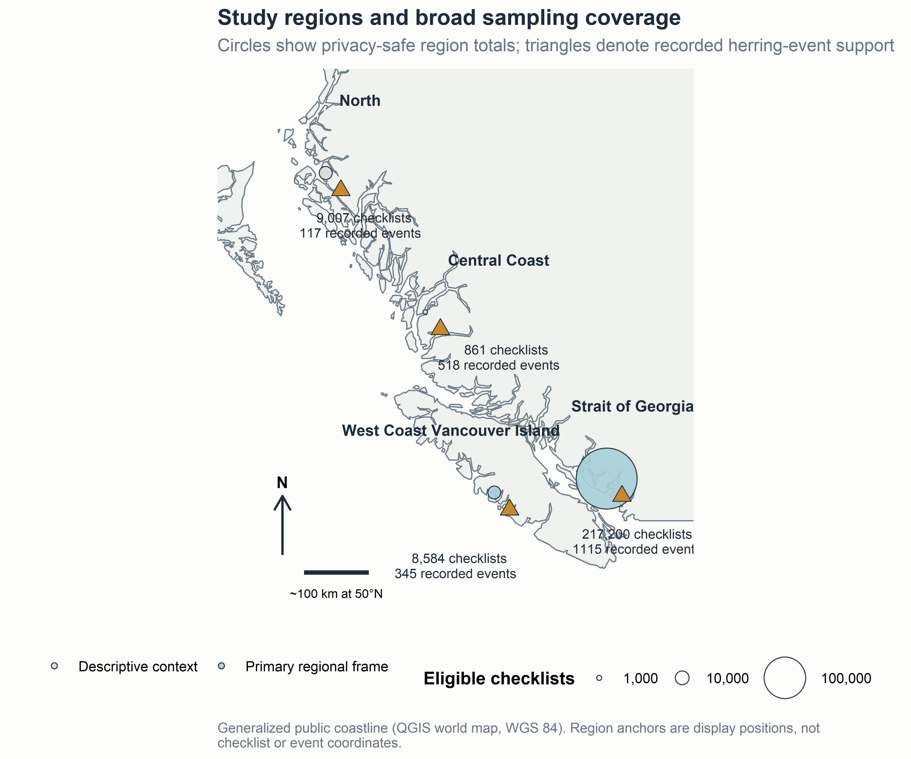
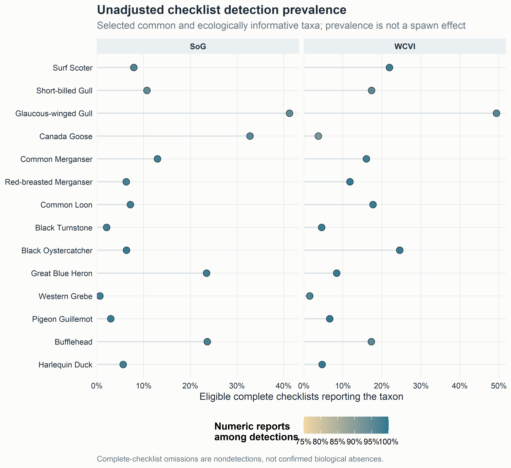
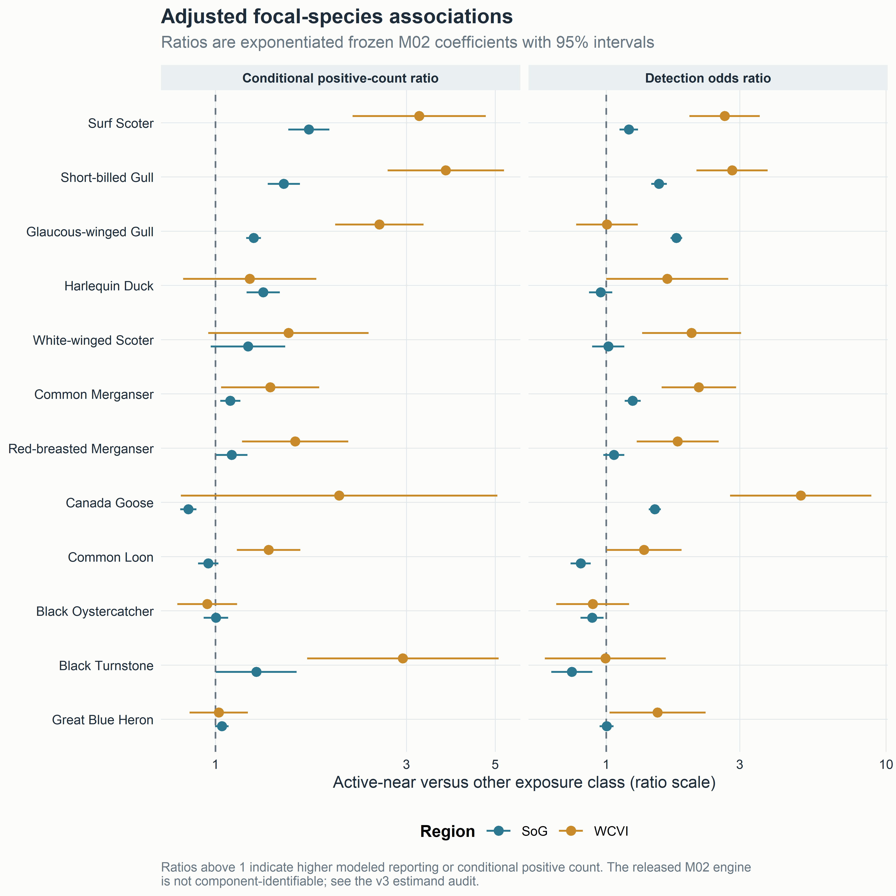
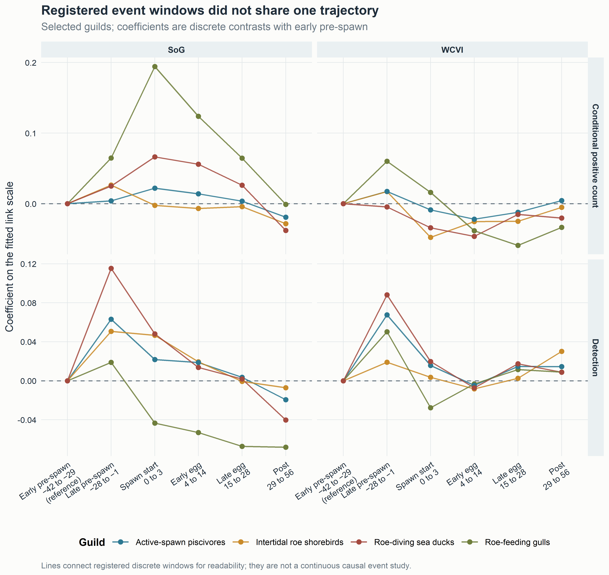
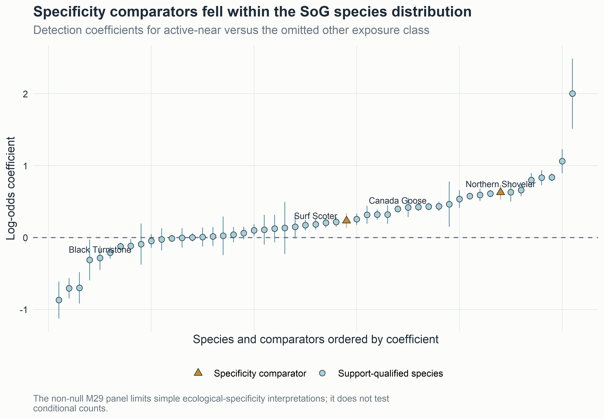
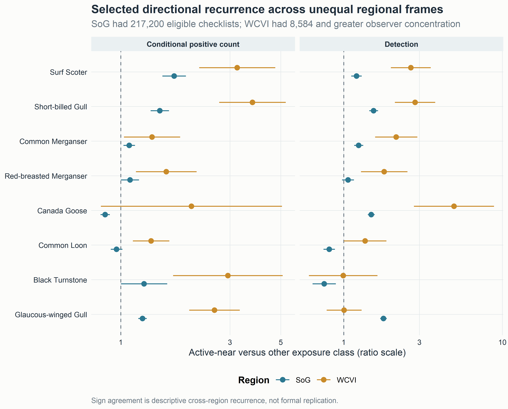

**Author information:** Omitted for double-anonymous review

# Abstract

Pacific herring (*Clupea pallasii*) spawning creates a concentrated coastal resource pulse. We asked how checklist detection and finite positive reported flock size were associated with recorded local spawning among eligible complete eBird checklists. Event-level Fisheries and Oceans Canada records were linked to 217,200 Strait of Georgia checklists (2005–2025) and 8,584 West Coast Vancouver Island checklists (2015–2025). The primary released species coefficient compared active-near checklists (0–28 days, <5 km) with an omitted other exposure class, conditional on effort, year, event-time, distance, and available clustering structure. Associations were heterogeneous across 49 support-qualified species. In the Strait of Georgia, Surf Scoter detection odds were 1.20 times higher (95% CI 1.12–1.30) and conditional positive counts were 1.71 times higher (1.52–1.93) for active-near than other checklists; corresponding West Coast Vancouver Island ratios were 2.65 (1.98–3.54) and 3.23 (2.20–4.73). Detection and count components often differed, and six registered event windows showed no shared trajectory. Specificity comparators were also non-null in the Strait of Georgia: Gadwall odds ratio 1.26 (1.14–1.40) and Northern Shoveler 1.87 (1.69–2.07). Complete community-science checklists can reveal event-linked marine resource-pulse associations, but attribution remains limited by phenology, habitat, observer behavior, exposure classification, and legacy engine provenance.

**Keywords:** Pacific herring; eBird; community science; coastal birds; resource pulse; checklist detection; flock size

# Introduction

Pacific herring spawning is a spatially concentrated marine resource pulse. During a short spring period, adults move into coastal waters and deposit eggs in shallow habitats. The event can make adult fish, eggs, milt, carcasses, and associated nutrient transfers available through different pathways and on different schedules [@haegele1985; @hay1987; @hay2009; @rooper2024; @grinnell2023]. Recorded spawning is patchy among shorelines and years, and biological availability depends on depth, substrate, tides, weather, and the interval between deposition and egg loss or hatch. Herring therefore provide a useful system for asking how mobile consumers associate with a pulse that is intense locally but brief relative to annual monitoring cycles.

Consumer responses to such pulses can have at least two components. An aggregative response occurs when animals are encountered more often at pulse locations or assemble there in larger groups over short periods. A longer-term numerical response would involve survival, reproduction, or population change. The present study addresses the first component only. Checklist reporting may change because a taxon is encountered at more sampled sites, because flocks are larger where the taxon is reported, or because observer behavior and site selection change. It cannot identify a regional population response, and it does not observe individuals moving between places.

Cross-ecosystem subsidies make the distinction important. Herring transfer marine production into shallow subtidal, intertidal, and shoreline food webs. Diving ducks can reach attached eggs; piscivores can use adult fish or associated prey; gulls and shoreline scavengers can use surface material, eggs, carcasses, or displaced prey. Consumers differ in diving ability, diet, flocking behavior, migration timing, and access to particular substrates. An event-linked community signature should therefore be heterogeneous rather than a universal increase. The same pulse can be associated with more frequent reporting for one taxon, larger conditional flocks for another, and little or negative local association for a third.

Field studies provide strong ecological motivation. Waterbirds aggregate near herring spawning areas, consume roe or adult fish, change foraging behavior, and redistribute with spawn timing [@haegele1993; @sullivan2002; @rodway2003; @lewis2007; @lok2008; @lok2012; @kelly2018]. Surf Scoters offer the clearest regional example. Their movement in relation to successive spawning areas has been described as tracking a “silver wave,” linking resource-wave theory to a marine forage-fish pulse [@lok2012]. These studies establish mechanism at selected sites or for selected taxa. They do not by themselves show whether a semi-structured observation network can recover an event-linked signal across a large coastline and a broader bird community.

Complete eBird checklists provide an opportunity to examine that question. A complete checklist indicates that the observer reported all species detected and identified, so an omitted species can be treated as a checklist nondetection under explicit eligibility and ambiguity rules [@sullivan2009; @kelling2019]. Duration, distance traveled, protocol, and party size describe measured effort. Repeated observers and generalized locations support clustering or sensitivity analyses. Unlike a standardized probability survey, however, eBird does not determine where participants go. Accessible shorelines can receive more submissions, known spawning events can attract birders, and observers differ in detection, counting, and use of the unquantified `X` report [@johnston2018; @johnston2021]. Complete-checklist semantics make omissions informative about reporting, not proof that a bird was biologically absent.

Direct integration of complete eBird checklists with event-level Fisheries and Oceans Canada (DFO) Pacific herring spawn information has rarely been reported. The integration is demanding because a checklist point may represent a traveling route, a recorded source point is not a prey-availability footprint, multiple spawning events can be concurrent, and unmonitored DFO records cannot be converted into surveyed negatives. Calendar season, shoreline habitat, access, and observer participation may all align with recorded spawning. A credible analysis must therefore show readers what data were available, retain both response components, define the exact exposure baseline, display all supported species, and test whether the fitted signal is biologically specific.

We asked: **How were coastal-bird checklist detection and conditional reported flock size associated with local recorded Pacific herring spawning, and how did those associations vary among taxa, event periods, and regions?** Detection concerns whether a taxon was reported on an eligible complete checklist. Conditional positive count concerns flock size after a finite numeric detection. These can be discussed as local occurrence/aggregation and intensity components in the submitted-checklist population. They do not estimate abundance, biomass, occupancy, migration, movement, or causal effects.

Our principal contribution is methodological and ecological. Complete community-science checklists can reveal event-linked bird associations around a short-lived marine resource pulse. Ecological attribution still requires careful treatment of seasonality, shoreline habitat, observer behavior, exposure classification, and biological specificity. We retain all registered analyses but use a clear hierarchy: selected individual species and the main local contrast lead the paper; guilds, event timing, regional recurrence, sensitivities, and placebos provide secondary evidence; complete coefficient families and diagnostics remain in the supplement; and redistribution, intensity, community composition, birder visitation, and prospective confirmation remain future or companion questions.

## Predictions and registered-analysis crosswalk

We use P1–P4 for manuscript predictions so they do not collide with the registered H1–H8 framework.

**P1 — Local focal response.** Taxa with established or plausible links to herring should show higher checklist detection, larger conditional positive reported counts, or both on active-near checklists. This evaluates registered local aggregation and functional-mechanism questions (H1 and H6) through species E01/M02 and guild E04/M01 components.

**P2 — Event-time localization.** Associations should be most evident in biologically relevant spawning or egg-availability periods if one common event-centered pulse dominates. This evaluates registered temporal-pulse question H3 through E06/M05. The prediction does not authorize selection of a preferred lag after inspecting results.

**P3 — Ecological specificity.** Focal associations should be more coherent than the Gadwall and Northern Shoveler specificity comparators. This addresses observation-process separation (H8) through E13/M29, together with shifted date- and location-bundle diagnostics M27 and M28. The comparators were not guaranteed biological null taxa.

**P4 — Cross-region recurrence.** Strong focal directions should recur descriptively between the Strait of Georgia (SoG) and West Coast Vancouver Island (WCVI), while magnitude and precision may differ. This reuses the registered local species/guild components across frozen regional frames; it is not a claim that the regions are replicated experiments.

**Table 2. Manuscript predictions and registered-analysis crosswalk.** The crosswalk preserves the registered H1–H8 framework while using P1–P4 for the ecological narrative.

| Manuscript prediction | Registered question(s) | Principal evidence | Interpretation boundary |
|---|---|---|---|
| P1 local focal response | H1, H6; E01/M02, E04/M01 | species detection and conditional count; guild synthesis | active-near versus other checklist association |
| P2 event-time localization | H3; E06/M05 | six windows, five nonbaseline coefficients | discrete timing contrasts, not a continuous causal event study |
| P3 ecological specificity | H8; E13/M29, M27, M28 | two biological comparators and shifted bundles | different diagnostics target different biases |
| P4 cross-region recurrence | H1/H6 across regional frames | SoG–WCVI direction, magnitude, and uncertainty | descriptive recurrence, not formal replication |

# Methods

## Study system, sources, and regional frames

Bird observations came from the eBird Basic Dataset EBD_relMay-2026, with response records restricted through 2025 [@ebird_ebd]. Herring exposure came from the official DFO Pacific Herring Spawn Index Data and its documented index construction [@grinnell2023; @dfo_spawn_data]. The DFO index is relative, not absolute biomass. Surveyed-positive, surveyed-negative, and unmonitored-unknown states remained distinct; missing records and missing components were not coded as zero.

The primary regional frame contained SoG observations from 2005–2025. WCVI observations from 2015–2025 formed a qualified comparison selected from response-free support criteria. Central Coast and North observations were retained as descriptive or hierarchical contexts because sustained annual support did not meet the primary-frame rule. The regional frames differ in coastline geometry, access, monitoring, checklist volume, and observer composition. We therefore retained regional estimates and uncertainty rather than treating the coast as one exchangeable sample.

## Eligible checklists and response semantics

Eligible observations were complete stationary or traveling checklists lasting 5–300 min, traveling no more than 5 km, and submitted by groups of one to ten observers. One eligible complete checklist was the analytical row. A checklist was not duplicated when linked to multiple herring events.

Detection indicated whether a taxon or registered guild was reported. A complete-checklist omission contributed a deterministic nondetection only when frozen taxonomy and ambiguity rules permitted it. An unquantified `X` report contributed to detection but not to the numeric response. Finite numeric reports greater than zero contributed to conditional positive count. Lower-bound reports, ambiguity-affected records, and structurally unknown states remained distinct. Conditional positive count was modeled on the log scale among numeric detections, so it describes reported flock size given that a finite count was available. It is not unconditional abundance.

## Descriptive summaries

We built v3 descriptive outputs only from tracked privacy-safe aggregates. Final region-specific checklist, exposure, event, observer, species-detection, and numeric-availability summaries came from Stage 3 fold partitions and the released Stage 4A sample-size table. Event-blocked validation folds partitioned the final checklist frame and were summed after verifying the expected regional totals. Event-window and distance-ring counts were also summed across those folds, but were treated as nonexclusive because a checklist can link to multiple events.

The response-free Stage 2 support audit supplied pooled X reports, ambiguity counts, positive-count medians, 90th and 99th percentiles, represented years and events, and observer/event concentration. Those values describe a broader pooled frozen event-linked frame, not a region-specific Stage 4A denominator. Candidate-frame medians for checklist duration, travel distance, and observer number were retained with the same label. Regional quartiles, taxon-by-exposure raw prevalence, event-date distributions, and fine spatial cells were not present in the public release. We left them unavailable rather than opening protected rows or approximating them.

Detection prevalence was the proportion of eligible checklists that reported a taxon. Numeric availability was the proportion of detections with a finite positive numeric report. All descriptive prevalence and count summaries are unadjusted. They provide scale and support, not a substitute for the adjusted models.

## Privacy-safe spatial displays

The study-area map used a public generalized British Columbia polygon and one hand-set cartographic display anchor for each released region. Circle sizes and labels show region-level checklist and recorded-event totals. The supplementary support map shows region-level active and reference counts. No anchor was calculated from checklist, observer, locality, event-token, or source-point coordinates. Every displayed regional count exceeded 20. Consequently, the maps show broad sampling imbalance and regional overlap but not within-region density.

A nongeographic exposure schematic explains the active-near zone, contemporaneous reference zone, omitted other class, source-point limitation, and a traveling checklist represented by a point coordinate. The projection, aggregation rule, date range, suppression rule, and layer meaning for every spatial display are recorded in `spatial_figure_privacy_audit_v3.csv`.

## Exposure coding and exact estimands

For each checklist, the executed builder selected a primary region and evaluated links in that region. A checklist was classified `active` if any link fell 0–28 days from the recorded event and less than 5 km from the source point. If no active link existed, it was classified `reference` when any link fell 0–28 days and 5–20 km from the source point. Remaining linked checklists were `other`. Active took priority when a checklist had both active-near and reference-zone links.

The fitted formula contained mutually exclusive indicators `active_near` and `contemporaneous_reference`; `other` was omitted. Therefore the M01/M02/M29 `active_near` coefficient is active-near versus other, conditional on the remaining fitted terms. The reference indicator is contemporaneous reference versus other. M08 is the direct active-minus-reference contrast, calculated as the active coefficient minus the reference coefficient with its covariance-based standard error. We reserve “active versus reference” for M08 and do not apply it to the primary M02 species coefficient.

All eligible concurrent links were retained additively as time-window and distance-ring counts. Six event windows were executed: early pre-spawn (−42 to −29 d), late pre-spawn (code `immediate_pre`; −28 to −1 d), spawn start (0–3 d), early egg (4–14 d), late egg (15–28 d), and post-spawn (29–56 d). Early pre-spawn was the omitted temporal category. We call the 28-day interval late pre-spawn rather than “immediate.”

Eight rings were executed: 0–<0.5, 0.5–<1, 1–<2, 2–<3, 3–<4, 4–<5, 5–<10, and 10–20 km (the builder allowed a 20.0001-km tolerance). The 10–20 km ring was the omitted spatial category. Because window and ring terms count concurrent links, a coefficient is conditional on the other link counts and should not be read as a mutually exclusive assignment of each checklist to one time–distance cell.

The privacy-safe design schematic in Supplementary Figure S1 shows these mutually exclusive active, reference, and other classes, including active priority, the omitted M01/M02/M29 baseline, and the traveling-checklist point-geometry limitation.

## Adjusted models, engine provenance, and interpretation

The registered fixed adjustment set included event-window and distance-ring link counts, checklist year, protocol, log duration, log traveled distance, and observer count. The intended mixed structure added random intercepts for event block, observer cluster, and generalized location cluster. Detection used a binomial-logit response; positive numeric count used a Gaussian model of log count. These terms address measured effort, calendar structure, and clustering. They do not eliminate preferential site selection, checklist submission, habitat differences, or detectability.

The final guild reference (`M01_PRIMARY_v2`) and matched placebos/sensitivities used sparse `lme4` models [@bates2015]: `glmer` for detection and REML `lmer` for log positive count, with event-block, observer, and location random intercepts. Simplified fallback was prohibited, and singularity remained an explicit warning.

The legacy M02 species, M05 timing, M08 contrast, and M29 comparator releases require a narrower description. Their executed code attempted `mgcv::bam` with the intended random-effect smooth representation and silently used fixed-effect `glm` or `lm` if that fit errored. The public effect and geometry tables do not record which engine generated each component. We did not inspect protected checkpoints. We therefore call these released adjusted coefficients, not uniformly mixed-model coefficients. The fixed formula, estimand, signs, intervals, q-values, and fit states are unchanged; component-level engine identity remains a provenance limitation documented in the v3 audit.

The M02 release retained all 49 support-qualified species regardless of sign, precision, or prior literature. Species results are the main biological display. The sparse M01 guild reference is complementary. M05 contributes the five nonbaseline coefficients for each six-window sequence. A registered zero-truncated negative-binomial count sensitivity, complete geometry states, and pooling-repair detail remain supplementary.

## Specificity, regional comparisons, sensitivities, and multiplicity

The prespecified SoG M29 panel contained Gadwall and Northern Shoveler. They were selected as taxa without a verified direct herring-spawn mechanism, not as guaranteed nonresponders. A positive comparator can reflect shared season, shoreline habitat, access, checklist submission, site choice, or exposure classification; an indirect ecological response is also possible but not established.

Response-blind M27 and M28 diagnostics shifted complete linked exposure bundles within region-year strata. They test whether similarly structured date- or location-bundle reassignments reproduce the fitted signal. They do not test the same weakness as the biological comparators. Matched WCVI sensitivities restricted the cohort to high spatial precision (2 km) or removed the pre-defined dominant observer cluster while retaining the sparse engine and formula.

Benjamini–Hochberg (BH) adjustment was applied within coherent model, region, and outcome families [@benjamini1995]. We report effect sizes and 95% intervals first and q-values as multiplicity-adjusted evidence. A negative coefficient is not called avoidance unless its interval and natural history support that interpretation. Imprecision is not treated as a negative response. Singular and rank-deficient states remain visible. Current-data analyses are hypothesis-driven and registered where stated, but repository governance classifies them as exploratory/estimand-refining until prospective confirmation.

## Compact inferential definition

| Element | Definition |
|---|---|
| Analysis population | eligible submitted complete checklists in frozen region-period frames |
| Detection component | taxon reported versus eligible complete-checklist nondetection |
| Count component | log finite positive reported count, conditional on numeric detection |
| Primary released species exposure | active-near (0–28 d, <5 km) versus omitted other class |
| Direct reference-zone contrast | M08 active coefficient minus contemporaneous-reference coefficient |
| Time baseline | early pre-spawn, −42 to −29 d |
| Distance baseline | 10–20 km ring (20.0001-km implementation tolerance) |
| Fixed adjustment | time/ring link counts, year, protocol, log duration, log distance, observer count |
| Intended clustering | event block, observer cluster, generalized location cluster |
| Inferential boundary | checklist reporting and reported flock size; not causation or population state |

# Results

## Study coverage and descriptive patterns

The final analytical frames contained 217,200 eligible SoG checklists from 2005–2025 and 8,584 WCVI checklists from 2015–2025 (Figure 1; Table 1). The Central Coast and North descriptive frames contained 861 and 9,007 checklists. SoG represented 1,115 recorded herring source events grouped into 58 event blocks; WCVI represented 345 source events in 24 blocks. Event-blocked support showed 1,013 SoG and 246 WCVI source events with checklist representation in both primary periods.

{width=100% fig-alt="Generalized map of coastal British Columbia with broad display anchors for Strait of Georgia, West Coast Vancouver Island, Central Coast, and North, showing region-level eligible checklist and recorded herring-event totals."}

**Figure 1. Study regions and broad sampling coverage.** The coastline is public and generalized. Symbols and labels show region totals; anchors are cartographic display positions, not checklist or herring-event coordinates. The map answers where the regional frames occurred and how strongly sampling differed, but it cannot show within-region density.

The mutually exclusive exposure classes were strongly imbalanced. SoG included 15,500 active-near checklists (7.1%), 41,067 contemporaneous-reference checklists (18.9%), and 160,633 other checklists (74.0%). WCVI included 843 active (9.8%), 1,170 reference (13.6%), and 6,571 other checklists (76.6%). These counts describe exposure support. They are not taxon detections and should not be multiplied by 49 or treated as independent species rows.



| Region (years) | Checklists | Active | Reference | Other | Events (blocks) |
|---|---:|---:|---:|---:|---:|
| SoG (2005–2025) | 217,200 | 15,500 | 41,067 | 160,633 | 1,115 (58) |
| WCVI (2015–2025) | 8,584 | 843 | 1,170 | 6,571 | 345 (24) |
| Central Coast (1988–2025) | 861 | 211 | 226 | 424 | 518 (43) |
| North (1988–2025) | 9,007 | 250 | 1,627 | 7,130 | 117 (46) |

**Table 1. Study population and broad exposure support.** Active and reference are mutually exclusive checklist classes. Source events and blocks (in parentheses) describe recorded linkage support, not spawn biomass. Observer concentration and effective replication are reported in the following text and the supplementary sampling table.

The response-free candidate frame showed different observation profiles across the two main regions. In SoG, 67,118 of 219,692 candidate-frame checklists were stationary and 152,574 traveling; median duration was 42 min (90th percentile 120), median travel distance was 1.17 km (90th percentile 3.37), and median party size was one observer (90th percentile two). WCVI had 3,106 stationary and 5,478 traveling checklists among 8,584 candidate-frame observations; median duration was 30 min (90th percentile 93) and median distance 1.00 km (90th percentile 3.22). These effort summaries are not presented as exact final-frame distributions because the candidate SoG denominator exceeds the final response-analysis denominator.

The final sparse-engine specification recorded 29,248 observer and 22,980 generalized location clusters in SoG, compared with 1,880 and 1,144 in WCVI. The pooled WCVI dominant observer contributed 35.6% of eligible checklists, whereas the maximum SoG share was 1.1%. Effective observer replication was consequently 7.4 in WCVI and 432.0 in SoG. This imbalance is central to the regional interpretation even though the dominant-observer holdout retained adequate aggregate support.

Event-window and distance-ring support also differed. SoG had 51,145 checklists linked to at least one late-pre-spawn event stratum and 59,731 linked to a post-spawn stratum; WCVI had 1,426 and 3,517. The 10–20 km ring appeared in 150,836 SoG and 8,062 WCVI checklist-stratum records. These counts overlap because one checklist can retain multiple event links. They therefore describe coverage of link strata, not a partition of checklists.

Across species, unadjusted detection prevalence ranged widely (Figure 2). American Crow was reported on 53.5% of eligible SoG and 61.8% of WCVI checklists; Glaucous-winged Gull on 41.2% and 49.4%; and Surf Scoter on 8.0% and 21.9%. At the sparse end, Glaucous Gull was reported on 189 SoG checklists, and its WCVI detection count was not released as an estimable numeric cell. Such contrasts show why identical checklist denominators do not imply identical taxon support.

{width=100% fig-alt="Two-panel dot plot of unadjusted detection prevalence for selected coastal bird species in Strait of Georgia and West Coast Vancouver Island, with color indicating numeric count availability among detections."}

**Figure 2. Unadjusted bird reporting patterns.** Detection prevalence is the proportion of eligible complete checklists reporting a taxon. Color shows the availability of finite positive numeric reports among detections. Neither quantity is an adjusted spawn association.

Numeric availability was high but not complete. In SoG it was 96.9% for Surf Scoter, 94.7% for Short-billed Gull, 95.9% for Canada Goose, and 99.3% for Black Oystercatcher. The pooled response-free support audit nevertheless contained many X reports for common taxa, including 5,538 for Glaucous-winged Gull, 5,455 for Mallard, 5,134 for American Crow, and 3,462 for Canada Goose. Because X contributes to detection but not conditional count, response components can differ even before model adjustment.

Positive counts were strongly right-skewed. In the pooled response-free frame, Surf Scoter had a median positive count of 12, a 90th percentile of 200, and a 99th percentile of 4,000. Corresponding values were 7, 80, and 800 for Short-billed Gull, and 4, 51, and 500 for Common Murre. These pooled quantiles illustrate flocking and upper-tail leverage; they are not region-specific, active/reference, or model-adjusted summaries. Regional interquartile ranges were not in the public release and were left unavailable.

Guild prevalence supplied a complementary summary. The registered guilds contained between three and 14 species, while the two-species specificity guild was kept separate. Guild detection was more common than detection of many individual members because a checklist contributed when any member was reported. Per-checklist guild richness distributions and guild positive-count quantiles were unavailable in the public aggregates, so guild prevalence was not allowed to replace the complete species display.

The herring summaries describe recorded exposure rather than prey availability. Source-point links span the registered windows and rings, but no public aggregate gives event-date-within-year, checklists-per-event, concurrent-link, or comparable spawn-index distributions. We therefore did not characterize those unavailable distributions. Incomplete DFO monitoring, event-date uncertainty, and source-point geometry remain exposure limitations rather than values to be filled with zeros.

## Main adjusted species-level associations

The released M02 species coefficients were heterogeneous in sign, magnitude, response component, and region (Figure 3; Table 3). Surf Scoter provided the clearest prior-supported pattern. In SoG, the active-versus-other detection odds ratio was 1.20 (95% CI 1.12–1.30; BH q = 2.62 × 10^-6^; n = 217,183), and the conditional positive-count ratio was 1.71 (1.52–1.93; q = 8.25 × 10^-18^; n = 16,632). In WCVI, the corresponding ratios were 2.65 (1.98–3.54; q = 3.45 × 10^-10^; n = 8,581) and 3.23 (2.20–4.73; q = 1.89 × 10^-8^; n = 1,857).

Short-billed Gull was also positive in both components and regions. SoG ratios were 1.54 for detection (1.45–1.65; q = 3.40 × 10^-39^) and 1.48 for conditional count (1.35–1.62; q = 6.17 × 10^-16^). WCVI ratios were 2.82 (2.10–3.77; q = 4.58 × 10^-11^) and 3.76 (2.69–5.25; q = 3.76 × 10^-13^). These estimates are associations among submitted checklists. They do not establish that individuals moved to recorded spawning areas.

{width=100% fig-alt="Forest plot of exponentiated adjusted coefficients for selected bird species, showing detection odds ratios and conditional positive-count ratios in Strait of Georgia and West Coast Vancouver Island."}

**Figure 3. Adjusted focal-species associations.** Ratios exponentiate frozen M02 coefficients and intervals. The comparison is active-near versus the omitted other exposure class. The public M02 release does not identify the engine for each legacy component.

| Taxon and region | Detection odds ratio (95% CI) | Conditional-count ratio (95% CI) | Main pattern |
|---|---|---|---|
| Surf Scoter, SoG | 1.20 (1.12–1.30) | 1.71 (1.52–1.93) | agreement between components |
| Surf Scoter, WCVI | 2.65 (1.98–3.54) | 3.23 (2.20–4.73) | positive cross-region recurrence |
| Short-billed Gull, SoG | 1.54 (1.45–1.65) | 1.48 (1.35–1.62) | agreement between components |
| Short-billed Gull, WCVI | 2.82 (2.10–3.77) | 3.76 (2.69–5.25) | positive cross-region recurrence |
| Canada Goose, SoG | 1.49 (1.42–1.57) | 0.86 (0.82–0.90) | opposing detection and count components |
| Common Loon, SoG | 0.81 (0.75–0.88) | 0.96 (0.91–1.02) | negative detection, weak count evidence |
| Black Turnstone, WCVI | 0.99 (0.60–1.63) | 2.94 (1.69–5.09) | weak detection, positive conditional count |

**Table 3. Selected focal species on interpretable ratio scales.** The complete 49-species table, coefficients, standard errors, intervals, p-values, BH q-values, sample sizes, and statuses are supplementary.

The complete set included common shore and sea birds not emphasized in earlier literature. Common Merganser had positive detection ratios in both regions and a positive SoG conditional-count ratio. Red-breasted Merganser was weak in SoG detection but positive in WCVI detection and count. Black Oystercatcher had a negative SoG detection coefficient, a near-null conditional count, and broad WCVI intervals. Great Blue Heron was near null in SoG and imprecise or weak in WCVI. These observations motivate hypotheses about feeding access and habitat but do not by themselves establish mechanisms.

## Detection versus conditional reported count

The two components often agreed, as for Surf Scoter and Short-billed Gull, but disagreement was biologically and observationally common. Canada Goose showed higher modeled detection odds in SoG but a conditional count ratio below one. This pattern could arise if the species occurred on more active-near checklists but in smaller numerically reported groups, or from differences in selected sites, visibility, and X reporting. It should not be summarized as a single positive or negative response.

Black Turnstone provided the reverse contrast in WCVI: detection was close to one with a broad interval, whereas the conditional count ratio was 2.94. The count component had only 386 numeric detections and therefore describes flock size among a much smaller subset. Common Loon shifted from lower SoG detection odds to higher WCVI conditional counts. These examples show why conditional count cannot be interpreted as abundance across all checklists and why a detection-only conclusion can miss aggregation conditional on presence.

## Guild synthesis

The final sparse M01 guild reference supported a broad positive active-near association for several guilds, but guild averages did not reproduce every member species. SoG detection coefficients were positive for roe-feeding gulls, active-spawn piscivores, roe-diving sea ducks, shoreline scavengers, and surface/vegetation roe feeders, while alcid piscivores and intertidal shorebirds were weaker or negative. Count patterns differed. WCVI intervals were wider and singular warnings were more common.

Guilds therefore answer a secondary question: whether taxa grouped by a proposed pathway share an average checklist pattern. They are not behavioral observations. Single primary guild membership prevents double counting in guild totals, while the complete species display preserves exceptions. The species-centered and guild summaries agree that a universal community increase is unsupported.

## Event timing

The registered timing analysis contained six windows, with early pre-spawn as the omitted reference and five displayed coefficients. No single community-wide trajectory emerged (Figure 4). The broad late-pre-spawn period was prominent in SoG: seven of eight registered guilds had BH q < 0.05 in that window for each response component. Post-spawn coefficients were also frequently different from the early-pre baseline and had a negative median in SoG. WCVI patterns differed by outcome and guild.

{width=100% fig-alt="Faceted line plot of selected guild coefficients across six registered event windows in Strait of Georgia and West Coast Vancouver Island, with early pre-spawn as the zero reference."}

**Figure 4. Registered event-time coefficients.** Lines connect discrete coefficients for readability and do not estimate a continuous trajectory. The late-pre-spawn interval spans 28 days; its code name `immediate_pre` is retained only in technical files.

P2 was therefore not supported in its simple common-trajectory form. Temporal structure remains evident, but it differs among guilds, outcomes, and regions. Plausible explanations include use of adult herring before recorded deposition, prolonged egg availability, event-date uncertainty, migration phenology, shoreline habitat, anticipatory birder visitation, uneven sampling, and concurrent events. The present coefficients cannot select among those explanations.

## Specificity comparators

The SoG M29 specificity panel was non-null for both taxa. Gadwall had a log-odds coefficient of 0.234 (95% CI 0.132–0.337; BH q = 7.28 × 10^-6^), equivalent to an odds ratio of 1.26 (1.14–1.40). Northern Shoveler had a coefficient of 0.628 (0.527–0.729; q = 6.56 × 10^-34^), equivalent to 1.87 (1.69–2.07). Both fell within the distribution of SoG species detection coefficients (Figure 5).

{width=100% fig-alt="Ranked distribution of Strait of Georgia species detection coefficients with Gadwall and Northern Shoveler specificity comparators highlighted."}

**Figure 5. Specificity comparators within the SoG species distribution.** The non-null panel is inconsistent with a clean interpretation in which every detection association is unique to direct herring-spawn ecology.

The panel indicates that recorded active-near exposure captured seasonal, spatial-access, checklist-submission, site-selection, habitat, or exposure-classification structure in addition to any taxon-specific ecological response. An indirect ecological association is possible but not established. The panel weakens causal and broad specificity claims. It does not demonstrate that every focal-species, guild, timing, regional, or sensitivity result is spurious, and it does not test conditional positive counts.



| Evidence | Result | Interpretation |
|---|---|---|
| Gadwall M29 | OR 1.26 (1.14–1.40), q = 7.28 × 10^-6^ | non-null SoG detection comparator |
| Northern Shoveler M29 | OR 1.87 (1.69–2.07), q = 6.56 × 10^-34^ | non-null SoG detection comparator |
| M27/M28 shifted bundles | 0 of 64 components with BH q < 0.05 | null matched placebos; not a biological specificity test |
| WCVI 2-km sensitivity | 15 of 16 signs matched sparse reference | qualified spatial-precision robustness |
| WCVI dominant-observer holdout | 15 of 16 signs matched sparse reference | qualified observer-composition robustness |
| Protected v2 diagnostics | 43 of 128 components singular | variance-structure warning retained |

**Table 4. Specificity, placebo, sensitivity, and warning summary.** The diagnostic families test different weaknesses and should not be collapsed into one “falsification” verdict.

## Regional recurrence and sensitivities

Surf Scoter and Short-billed Gull had positive detection and conditional-count directions in both main regions. Common and Red-breasted Mergansers also showed selected positive recurrence, whereas Common Loon, Glaucous-winged Gull, Canada Goose, and Black Turnstone demonstrated component or regional reversals (Figure 6). Sign agreement alone is not formal replication because SoG and WCVI differ in checklist volume, observer concentration, access, and monitoring geometry.

{width=100% fig-alt="Forest plot comparing selected Strait of Georgia and West Coast Vancouver Island detection and conditional-count ratios."}

**Figure 6. Selected cross-region recurrence.** The display retains magnitude, intervals, and response component. WCVI is a qualified regional comparison, not an exchangeable replicate of SoG.

The WCVI 2-km restriction and dominant-observer holdout each preserved the sign of 15 of 16 sparse guild components. Forty-three of 128 protected v2 reference, sensitivity, and placebo components carried singular-fit warnings. Singularity indicates limited support for part of the specified variance structure; it does not automatically invalidate a finite fixed-effect estimate. Three headline claims include some singular-warning support, but each also has ordinary-fit or otherwise stable evidence, and no headline claim depends exclusively on a singular component.

All 64 M27/M28 matched shifted-bundle components completed and none had BH q < 0.05. These null diagnostics argue against the specific proposition that an arbitrary within-region-year date or location shift reproduces the same sparse guild signal. They do not establish exchangeability, remove site selection, or override the non-null M29 comparators.

The publication pooling repair remains supplementary. It corrected incompatible or duplicated evidence synthesis without changing any individual estimate: 6,562 finite historical rows in 112 families were audited, 162 compatible v2 families were estimable, 439 duplicate M11/M12 representations and 38 noncompleted rows remained explicit NA, and all 43 singular warnings remained visible. No invalid v1 partial-pooling value is used here.

# Discussion

## Prediction-level synthesis

Focal event-linked responses were heterogeneous and partly supported. Several species, most clearly Surf Scoter and Short-billed Gull, had positive active-near detection and conditional-count associations in both main regions. Other taxa differed between detection and count, changed direction between regions, or were imprecise. P1 is therefore supported for selected taxa and response components, not as a universal bird-community response.

The simple common timing prediction failed. Six registered windows showed taxon-, guild-, outcome-, and region-dependent patterns, with a broad late-pre-spawn signal in SoG but no shared rise and fall centered on recorded spawning. P2 is not supported in its simplest form. The result motivates temporal-partitioning hypotheses but does not demonstrate them.

Clean ecological specificity was also unsupported. Gadwall and Northern Shoveler were non-null within the SoG species distribution. P3 therefore fails as a clean focal-versus-null contrast. Shifted-exposure placebos were null, but those diagnostics test reassignment structure rather than whether the true active-near indicator also contains shared phenology, habitat, access, and submission processes.

Selected taxa showed descriptive cross-region recurrence, supporting a qualified P4 for particular directions. SoG and WCVI were not replicated experiments, and their sampling imbalance is too large to interpret sign agreement alone as generality. The most credible recurrence combines prior mechanism, both response components, finite intervals, and matched sensitivity evidence.

## Detection and conditional intensity are different response components

Separating detection from conditional positive count is central to interpreting event-linked aggregation. A higher detection odds ratio means that a taxon was reported on a greater fraction of modeled active-near checklists than modeled other checklists, conditional on fitted terms. A higher conditional-count ratio means that numerically reported flocks were larger among detections. Either component can change without the other.

Agreement between components, as for Surf Scoter and Short-billed Gull, is consistent with a broader local reporting footprint and larger reported flocks. Even then, the design cannot distinguish bird redistribution from higher detectability, more complete counting, or selection of sites where large flocks are visible. Divergence, as for Canada Goose or Black Turnstone, should not be forced into a single “response” label. It may reflect genuinely different occurrence and aggregation processes, X reporting, countability, habitat selection, or different subsets of checklists contributing to each component.

The conditioning also limits extrapolation. A count ratio excludes checklist nondetections and X-only reports. It is not the expected number of birds per eligible checklist and cannot be multiplied by regional checklist totals. Conversely, detection treats a numerically small and a very large flock identically. Together the components characterize local checklist reporting more fully than either alone, but neither estimates population abundance or occupancy.

## Resource-pulse coupling and the Surf Scoter example

Surf Scoter supplies the strongest prior-supported ecological example. Scoters forage on herring roe, alter behavior during spawning, and have documented movements associated with successive herring spawn areas [@sullivan2002; @lewis2007; @lok2008; @lok2012]. Positive detection and conditional-count ratios in both SoG and WCVI are consistent with more frequent reporting and larger reported flocks near recorded active events. The pattern is also consistent with the silver-wave idea that mobile consumers track a sequence of resource pulses [@lok2012].

The present analysis does not observe individual movement. A checklist association could arise if birds already using a shoreline became more detectable or formed larger flocks, if different individuals occupied different sampled sites, or if birders preferentially visited visible spawning areas. Telemetry evidence from prior studies makes movement plausible for scoters; it does not convert these checklist coefficients into a movement estimate.

Short-billed Gull also showed coherent positive directions, but its mechanism is less specifically resolved by the current data. Gulls can use roe, carcasses, surface prey, and other shoreline subsidies. Without behavioral observations or diet data, the coefficient supports event-linked association rather than a single feeding pathway. Similar restraint applies to mergansers, loons, cormorants, herons, shorebirds, and other gulls. The all-species display is valuable because it reveals which mechanisms deserve targeted work; it is not a license to assign a herring diet to every positive coefficient.

## Timing heterogeneity

The simple trajectory prediction failed first and should remain the starting point. The late-pre-spawn signal in SoG cannot be called an immediate reaction because the interval spans 28 days. It could reflect adult-herring arrival before recorded deposition, staging or migratory phenology, habitat conditions that covary with the spawn season, date uncertainty, or anticipatory visitation by birders. Positive coefficients in egg windows can be consistent with egg availability, while post-spawn differences could reflect continued roe access, decay, redistribution, or a changing checklist population.

These alternatives may operate simultaneously and differently among consumers. Attached roe can persist beyond a recorded start date, adults may arrive earlier, and events can overlap in space and time. Some birds may respond rapidly to surface prey; others may use eggs exposed by tides or at particular depths. Event-linked sampling may also be densest after an event is public or visible. The registered windows expose that heterogeneity without allowing an outcome-informed lag search.

Future temporal work should measure local prey availability and observation timing directly. Repeated structured counts before, during, and after independently recorded events would distinguish a biological pulse from calendar and visitation effects more clearly than adding a finer outcome-selected partition to the present data.

## Negative and mixed species patterns

Negative and mixed coefficients are scientifically useful when they are not overinterpreted. Lower detection odds can reflect phenological non-overlap, use of offshore or deeper habitats, avoidance of accessible shorelines, competition, territorial spacing, displacement, or a mismatch between source points and prey accessible to a taxon. It can also reflect differences in when and where checklists are submitted. A negative point estimate with a broad interval is imprecision, not evidence of avoidance.

Black Oystercatcher illustrates the caution. Its SoG detection coefficient was negative, but conditional count was near null and WCVI intervals were broad. A source-point distance may poorly represent intertidal substrate and tide-dependent access, so the result motivates a shoreline-habitat hypothesis rather than an avoidance claim. Common Loon had lower SoG detection odds but positive WCVI conditional counts, suggesting either regional ecological context or sampling differences. Black Turnstone had weak WCVI detection but a positive conditional count among 386 numeric detections, a pattern compatible with larger flocks at a limited set of sampled sites.

Species with near-zero coefficients are also informative. They show that the active-near indicator did not force every common coastal taxon in the same direction. The complete matrix prevents selective reporting of positive or familiar species while preserving non-estimable and warning states.

## Regional heterogeneity

SoG and WCVI differ ecologically. WCVI is more exposed to the outer coast, has different shoreline habitat and access, and occupies a different migratory setting. Spawn predictability, source-point geometry, depth, and substrate availability may differ. Such contrasts can change the relation between a recorded event and prey accessible to birds.

Sampling explanations are equally prominent. SoG had more than 25 times as many eligible checklists, many more observer and location clusters, and an effective observer replication of 432.0. WCVI had effective observer replication of 7.4 because one observer cluster contributed 35.6% of checklists. Intervals were wider, singular fits more common, and the spatial relation between a checklist point and a traveling route may be especially consequential along a complex outer coast. The dominant-observer and 2-km sensitivities support several directions but cannot make the regional frames exchangeable.

Cross-region recurrence is therefore strongest as a prioritization tool. A taxon with prior mechanism, aligned detection and count components, and stable direction under regional sensitivities deserves targeted confirmation. A reversal identifies a testable interaction with habitat, phenology, exposure geometry, or observation process. Neither outcome justifies calling the regions replicated experiments.

## Specificity is a central methodological result

The M29 result supports two competing interpretations. Methodologically, the active-near indicator contains structure not unique to direct herring consumers. Recorded spawning occurs in particular seasons and accessible shoreline settings; checklists are submitted selectively; and a source-point classification can capture broad nearshore context. Under this interpretation, comparator associations expose residual seasonality, access, habitat, checklist submission, site selection, or classification.

Ecologically, the near-spawn footprint could include indirect or habitat-mediated responses. Gadwall and Northern Shoveler might use seasonal nearshore conditions correlated with spawning even without a verified direct herring mechanism. The present analysis cannot establish that explanation. It remains secondary to the observation-process interpretation because the same habitats and dates structure both exposure and checklist submission.

Shifted bundle placebos and biological comparators answer different questions. A null shifted exposure shows that a particular response-blind reassignment did not reproduce the sparse guild association. It does not show that the true exposure is biologically specific. Conversely, a non-null comparator does not demonstrate that focal associations are spurious. It localizes a limitation: SoG detection cannot be read as uniquely specific to plausible direct consumers without additional controls.

This proportional interpretation preserves the empirical result. The M29 panel constrains causal and broad specificity claims, but it does not erase conditional positive-count evidence, species heterogeneity, event-time differences, or selected regional recurrence. Independent replication and structured local monitoring would help distinguish ecological response from residual observation-process and exposure-classification mechanisms.

## Value and limits of community science

Complete community-science checklists make event-linked marine ecology possible at a scale difficult to obtain with dedicated field surveys alone. Complete-list semantics, effort metadata, broad participation, and repeated observations support a two-part response and regional comparisons. The same open participation creates the principal inferential boundary. Site choice, access, observer expertise, awareness of events, and the decision to submit a checklist are part of the data-generating process [@johnston2018; @johnston2021].

The strongest contribution is therefore not a claim that community science resolved movement or population response. It is a demonstration that event-linked signals can be detected, decomposed by species and response component, checked against timing and regional structure, and challenged with biological and shifted-exposure comparators. Complete community-science checklists can reveal event-linked resource-pulse signals, but attribution requires specificity controls, observation-process treatment, and independent validation.

# Limitations and future analyses

**Site selection and preferential visitation.** Measured effort and observer/location structure do not eliminate selection bias. Same-observer analyses, same-location calendar matching, and structured surveys independent of public spawn knowledge would address whether submission changes near events.

**Herring exposure error.** DFO monitoring is incomplete, recorded source points are not prey footprints, and missing records are not surveyed negatives. Future work should incorporate explicit survey effort, validated surveyed-negative states, mapped spawn footprints, and local egg-availability measurements while preserving unknown states.

**Traveling-checklist geometry.** A route of up to 5 km is represented by a point coordinate, so source-point distance can misclassify accessible shoreline. Stationary-only analyses, short-route sensitivities, and route-level spatial support require explicit authorization and privacy design before protected geometry is opened.

**Mechanism.** Checklist data do not identify diet, feeding behavior, or individual movement. Behavioral observation, diet sampling, stable isotopes, telemetry, and repeated local counts could test whether focal associations reflect roe consumption, adult-fish use, scavenging, or another process.

**Spawn intensity and accessibility.** The DFO relative index was not treated as absolute biomass, and no current model estimates a dose response. Event extent, egg density, duration, depth, substrate, and tide-dependent access would support a scientifically comparable intensity analysis.

**Redistribution.** A local increase does not establish regional movement. Redistribution requires contemporaneous regional totals, explicit declines in nonspawn areas, and a defined interference structure. M08 supplies an active-minus-reference contrast, but a complete regional mass-balance claim remains future work.

**Legacy engine provenance.** The public legacy species release does not identify the per-component engine after an attempted mixed fit and permitted fixed-effect fallback. A future outcome-blind authorization could release an `engine_used` audit from protected checkpoints without changing coefficients. Until then, the species results should not be described uniformly as mixed-model estimates.

**Prospective confirmation.** A future one-shot holdout should freeze a small claim hierarchy, execute without interim outcome-driven selection, and retain biological specificity and observation-process controls. Prospective work would strengthen attribution; it is not required to acknowledge the current checklist-conditional statistical associations.

# Conclusions

Recorded proximity to Pacific herring spawning was associated with heterogeneous coastal-bird checklist detection and conditional reported flock sizes. Selected taxa, especially Surf Scoter and Short-billed Gull, showed positive patterns across SoG and WCVI, while other species differed between response components or regions. Event timing did not follow one community-wide trajectory, and the non-null Gadwall and Northern Shoveler comparators showed that the recorded active-near signal was not unique to plausible direct consumers. Complete community-science checklists can therefore reveal event-linked marine resource-pulse associations, while attribution remains limited by phenology, habitat, observer behavior, exposure classification, traveling-checklist geometry, and legacy engine provenance. The estimates concern eligible submitted checklists; they do not identify causal effects, population abundance, biomass, occupancy, migration, or individual movement.

# Data availability

DFO-derived source data are available through the Government of Canada Open Government Portal [@dfo_spawn_data], subject to source documentation and monitoring caveats. eBird data require authorized access under eBird terms and are not redistributed [@ebird_ebd]. Raw EBD/SED, protected row-level derivatives, observer identities, exact localities, exact coordinates, protected event tokens, and transformation mappings are not shared. Privacy-safe aggregate tables, v3 descriptive outputs, claim audits, provenance records, and figures are available in the project repository at [repository URL withheld for double-anonymous review].

# Code availability

Code, frozen specifications, privacy-safe aggregate outputs, and reproduction instructions are available at [repository URL withheld for double-anonymous review]. The analysis freeze is commit `c54b8e7f95a2fe3573e2e38633079cd223c5a783`, tag `stage4a-publication-v2-analysis-freeze`. V3 assembly read only tracked aggregate outputs, did not fit a response model, did not open protected caches, and did not change frozen v1 or v2 artifacts.

# Declarations

Author contribution, funding, competing-interest, ethics, and AI-assistance declarations are supplied on the separate title page and are omitted here for double-anonymous review.

# Acknowledgments

Acknowledgments are omitted for double-anonymous review.

# References
