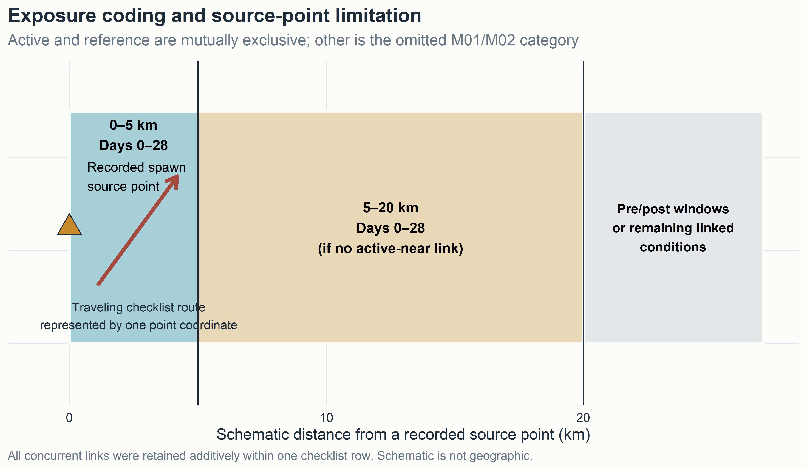
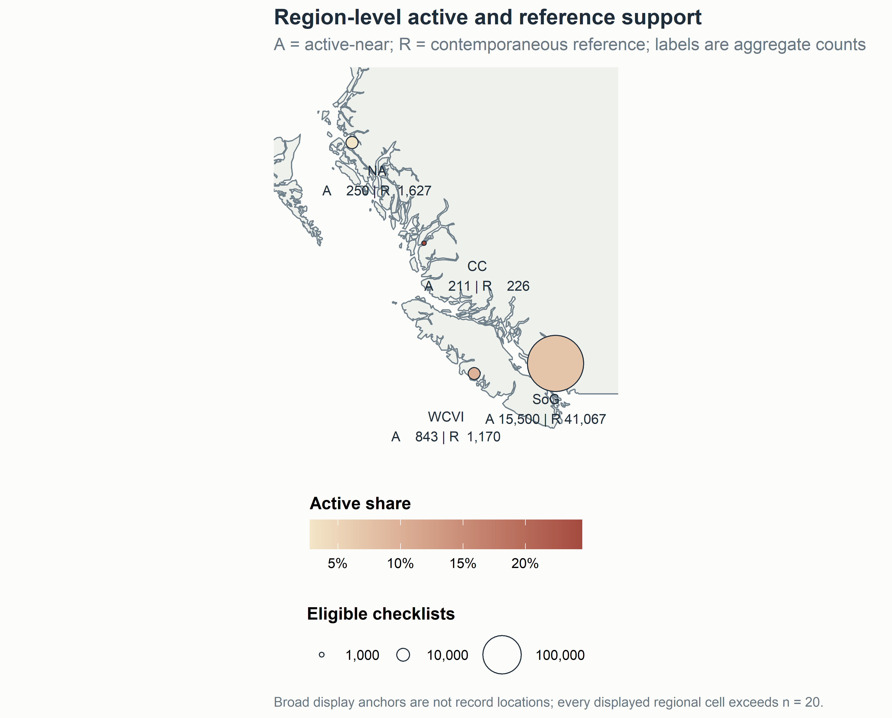
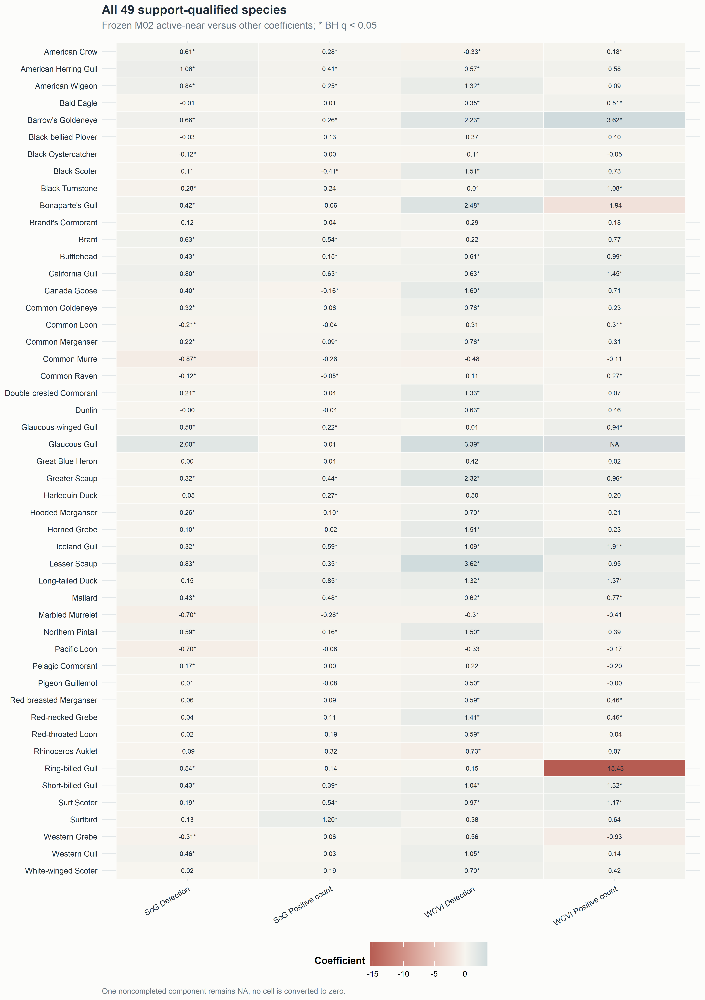
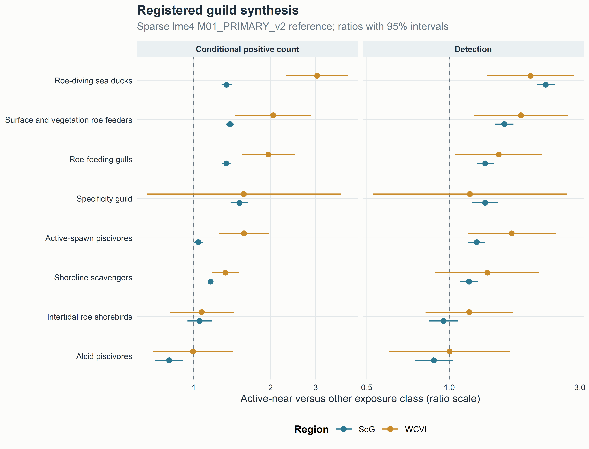
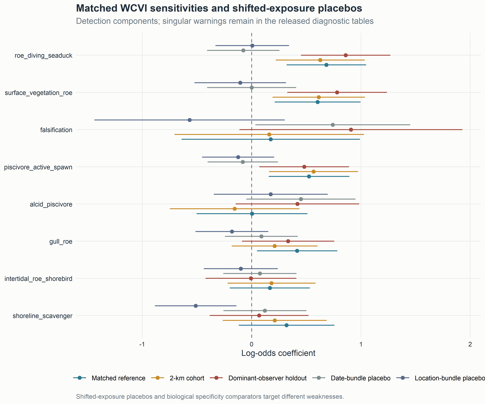
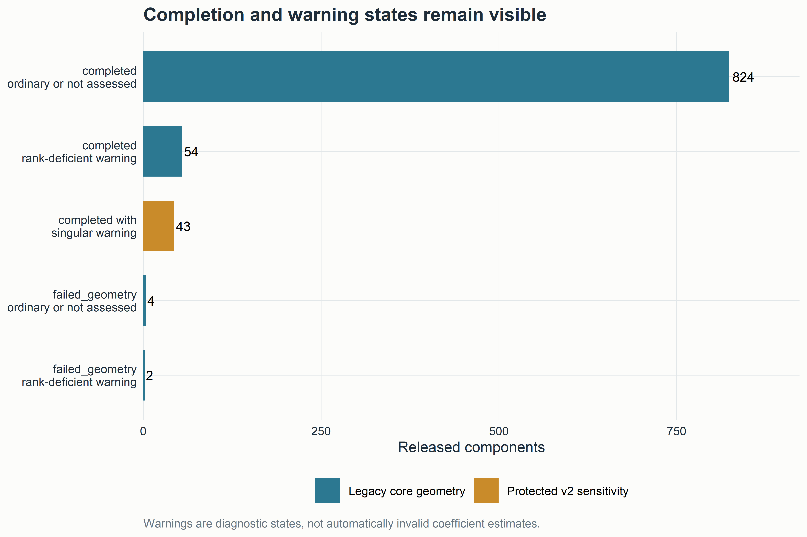

# Scope and reading guide

This supplement preserves complete released evidence and technical qualification for the v3 manuscript. It was assembled from tracked privacy-safe aggregate outputs. No protected response table, checklist coordinate, observer identity, locality, event token, model object, or transformation mapping was opened. No response model was fitted or refitted.

The main manuscript leads with selected individual species. Supplementary CSV files retain all 49 support-qualified species, all released event-window and distance-ring support, complete model and sensitivity components, failed and non-estimable states, singular and rank-deficient warnings, the zero-truncated count sensitivity, pooling-repair records, validation, and provenance.

# Estimand and engine detail

The primary coding audit is supplied as `audits/primary_estimand_and_engine_audit_v3.md`. The exact M01/M02/M29 coefficient is active-near versus the omitted other class. M08 is active minus contemporaneous reference. Active and reference are mutually exclusive, while time and distance terms are additive counts over concurrent links.

The final `M01_PRIMARY_v2`, M27/M28, WCVI 2-km, and dominant-observer components used sparse `lme4` mixed models without simplified fallback. Legacy M02, M05, M08, and M29 code attempted `mgcv::bam` and permitted fixed-effect fallback. The public aggregate release does not identify the engine used by each legacy component. V3 therefore avoids calling those components uniformly mixed-model estimates.

{width=100% fig-alt="Conceptual active, reference, and other exposure coding with traveling checklist geometry limitation."}

**Figure S1. Exposure design and geometry limitation.** The schematic contains no spatial records.

# Descriptive outputs and availability

Four machine-readable v3 tables distinguish available summaries from fields that would require a new aggregate-only authorization:

- `tables_v3/descriptive_statistics_v3.csv`: 128 region-metric rows for checklist, exposure, event, observer, effort, window, and ring support;
- `tables_v3/species_descriptive_summary_v3.csv`: 196 region-by-species rows for 49 species in four released regions;
- `tables_v3/guild_descriptive_summary_v3.csv`: 32 region-by-guild rows for eight guilds; and
- `tables_v3/herring_event_descriptive_summary_v3.csv`: 92 region-metric rows for recorded-event support.

Regional positive-count quartiles, regional X/lower-bound/ambiguity counts, taxon-by-exposure raw prevalence and counts, concurrent-link distributions, event-date distributions, and fine spatial cells were not in the public release. Those fields remain explicitly unavailable. Pooled Stage 2 count quantiles are labeled support-only and are not described as regional Stage 4A summaries.

{width=100% fig-alt="Generalized British Columbia map with broad region-level active and reference checklist support."}

**Figure S2. Region-level active and reference support.** Display anchors are not data coordinates. All displayed regional cells exceed n = 20.

# Complete species evidence

The full M02 effect table is versioned as `tables_v3/Table_S1_all_species_effects_v3.csv`. It retains 49 species, four released regions, two response components where estimable, BH q-values, component sample sizes, and explicit noncompletion. The descriptive companion contains detection prevalence and numeric availability by region plus pooled X, ambiguity, support, and flock-size quantiles.

{width=100% fig-alt="Heat map of all 49 species coefficients in Strait of Georgia and West Coast Vancouver Island for detection and positive count."}

**Figure S3. Complete 49-species coefficient matrix.** Values are frozen M02 coefficients for active-near versus other. An asterisk indicates BH q < 0.05. The noncompleted component remains NA.

Negative values, broad intervals, failed components, and taxa without a dedicated herring literature remain visible. The matrix is a completeness display, not an ecological mechanism assignment.

# Guild synthesis

Guild membership and mechanism descriptions are in `metadata/species_primary_guild.csv` and `metadata/canonical_guild_registry.csv`. Each species has one primary guild for aggregation, preventing duplicate contribution to guild totals. Multi-label mechanism traits remain separate metadata for future work.

{width=100% fig-alt="Sparse mixed-model guild ratios for Strait of Georgia and West Coast Vancouver Island detection and conditional positive count."}

**Figure S4. Sparse M01 guild synthesis.** Ratios compare active-near with other. Guild averages complement rather than replace species evidence.

# Event windows, distance rings, and temporal support

The executed six windows were early pre-spawn (−42 to −29 d, baseline), late pre-spawn (−28 to −1), spawn start (0–3), early egg (4–14), late egg (15–28), and post-spawn (29–56). The complete 160-row guild M05 family contains five nonbaseline coefficients for eight guilds, two regions, and two response components. It is versioned as `tables_v3/Table_S2a_guild_event_time_effects_v3.csv`.

The eight distance rings were 0–<0.5, 0.5–<1, 1–<2, 2–<3, 3–<4, 4–<5, 5–<10, and 10–20 km, with the final ring omitted from the fixed formula. All released M05 time and distance components are retained in `tables_v3/Table_S2_all_M05_time_distance_effects_v3.csv`; stratum support is retained in `descriptive_statistics_v3.csv`. Because all concurrent links were retained, window and ring counts can overlap and must not be summed as a composition.

The response-free region-year support table is copied as `tables_v3/Table_S3_temporal_sampling_support_v3.csv`. It describes sampling support, not bird-response estimates.

# Specificity, sensitivity, and placebos

The M29 SoG specificity panel was non-null for Gadwall and Northern Shoveler. Their coefficients, intervals, p-values, q-values, and transformed odds ratios are retained in `Table_4_specificity_sensitivity_v3.csv`.

{width=100% fig-alt="Matched West Coast Vancouver Island guild sensitivities and shifted-exposure placebos for detection."}

**Figure S5. Matched sensitivities and shifted-exposure placebos.** Placebos and biological comparators target different weaknesses. Null shifted bundles do not erase the non-null specificity panel.

All 128 protected v2 reference, sensitivity, and placebo components are supplied in `tables_v3/Table_S4_all_sensitivity_effects_v3.csv`. Complete validation is in `Table_S5_all_validation_v3.csv`. The WCVI 2-km and dominant-observer restrictions each preserved the matched-reference sign in 15 of 16 components. Forty-three components carried singular warnings.

# Completion, geometry, and warning states

{width=100% fig-alt="Bar chart of legacy completion and rank states plus protected v2 singular warnings."}

**Figure S6. Completion and warning states.** Singularity indicates limited support for part of a variance structure, not automatically an invalid coefficient. Rank-deficient, failed, and non-estimable components remain explicit.

The complete legacy geometry table is `tables_v3/Table_S6_model_geometry_v3.csv`; the component singularity audit is `Table_S7_singular_fit_audit_v3.csv`; and the registered model-disposition table is `Table_S8_model_disposition_v3.csv`. No failed value is converted to zero. No headline claim depends exclusively on a singular component.

# Positive-count sensitivity and ambiguity

The registered zero-truncated negative-binomial sensitivity is copied as `tables_v3/Table_S9_zero_truncated_nb2_v3.csv`. It preserves explicit engine/support and numerical failure states. Detection, finite numeric count, X, lower-bound count, ambiguity, and structural unknown remain distinct throughout the descriptive and inferential records.

# Compatible-family pooling repair

The v2 compatible-family repair did not change any coefficient, standard error, interval, p-value, q-value, model status, or component sample size. It audited 6,562 finite historical rows in 112 families, yielded 162 estimable compatible families, retained 439 duplicate M11/M12 representations as explicit NA, and retained 38 noncompleted rows as explicit NA.

The complete family table is copied as `tables_v3/Table_S10_pooling_families_v3.csv`; exclusion accounting is `Table_S11_pooling_exclusions_v3.csv`. V1 and v2 artifacts remain unchanged.

# Figure and table provenance

`audits/figure_table_provenance_v3.csv` records each v3 figure and table, deterministic source, SHA-256 hash, generation script, filter, model/family identifiers, caption purpose, and privacy class. `audits/spatial_figure_privacy_audit_v3.csv` separately records the map source, broad aggregation unit, threshold, suppression rule, coordinate class, projection, date range, layer meaning, and limitation.

# Reproducibility and governance statement

V3 manuscript assembly:

- used no response year after 2025;
- opened no protected response cache or row-level spatial derivative;
- exposed no checklist, observer, locality, exact coordinate, event-token, or transformation-mapping identifier;
- fitted no response model;
- changed no frozen v1 or v2 analysis artifact; and
- created versioned v3 files only.

The analysis freeze remains commit `c54b8e7f95a2fe3573e2e38633079cd223c5a783`, tag `stage4a-publication-v2-analysis-freeze`.

# Supplementary file inventory

| Identifier | File | Contents |
|---|---|---|
| Table S1 | `Table_S1_all_species_effects_v3.csv` | complete M02 species effects |
| Table S2 | `Table_S2_all_M05_time_distance_effects_v3.csv` | all released M05 time and distance components |
| Table S2a | `Table_S2a_guild_event_time_effects_v3.csv` | complete 160-row guild event-window family |
| Table S3 | `Table_S3_temporal_sampling_support_v3.csv` | response-free region-year support |
| Table S4 | `Table_S4_all_sensitivity_effects_v3.csv` | 128 protected v2 components |
| Table S5 | `Table_S5_all_validation_v3.csv` | matched four-fold validation |
| Table S6 | `Table_S6_model_geometry_v3.csv` | legacy convergence and rank states |
| Table S7 | `Table_S7_singular_fit_audit_v3.csv` | all 43 singular component warnings |
| Table S8 | `Table_S8_model_disposition_v3.csv` | model disposition and replacements |
| Table S9 | `Table_S9_zero_truncated_nb2_v3.csv` | count-family sensitivity |
| Table S10 | `Table_S10_pooling_families_v3.csv` | 162 compatible family records plus nonestimable families |
| Table S11 | `Table_S11_pooling_exclusions_v3.csv` | explicit exclusion and NA accounting |
| Table S12 | `Table_S12_M08_active_minus_reference_v3.csv` | direct active-minus-reference contrasts |
| Table S13 | `Table_S13_all_M29_components_v3.csv` | complete M29 release, including noncompleted WCVI rows |
| Table S14 | `Table_S14_complete_effect_release_v3.csv` | complete frozen aggregate effect release |
