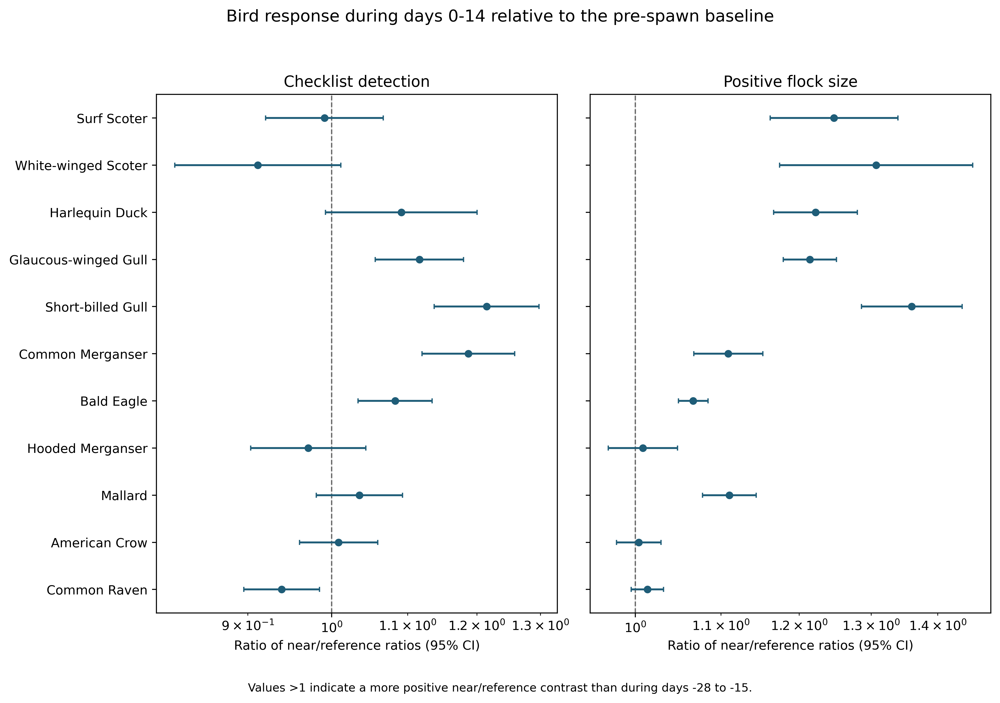
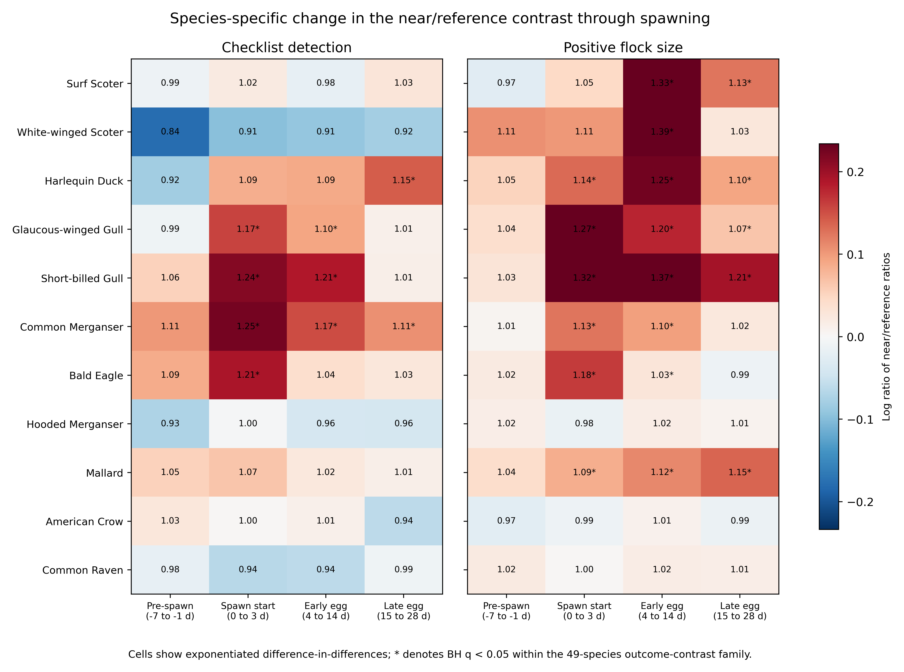

**Affiliation:** University of Victoria, [AUTHOR TO SUPPLY: full postal address], Canada 
**Corresponding author:** Jacob T. Dingwall; dingwalljake@gmail.com; [AUTHOR TO SUPPLY: telephone number] 
**ORCID:** 0009-0007-8389-6947

# Abstract

Pacific herring (*Clupea pallasii*) spawning is a brief, spatially concentrated marine resource pulse used by diverse coastal birds. Spring migration and shoreline sampling can, however, produce similar calendar patterns. We linked event-level Fisheries and Oceans Canada spawn records to 217,200 eligible complete eBird checklists from the Strait of Georgia, British Columbia (2005–2025). In a post-result ecological refinement, species-specific mixed models asked whether the difference between checklists within 5 km of recorded spawn and contemporaneous 5–20 km reference checklists changed from a −28 to −15 day baseline. We retained checklist detection and finite positive reported flock size as distinct outcomes and defined days 0–14 as the primary active period. Responses were heterogeneous. The active-period near/reference interaction was positive for detection in 13 of 48 estimable species and for conditional flock size in 19 of 46, after within-contrast Benjamini–Hochberg adjustment. Surf Scoter, White-winged Scoter, and Harlequin Duck showed larger conditional flocks but not higher detection; Common Merganser, Glaucous-winged Gull, Short-billed Gull, and Bald Eagle increased in both components. Bald Eagle responses peaked at spawn onset, Mallard showed a prolonged count-only response, Hooded Merganser and American Crow showed no post-baseline change, and Common Raven detection decreased. Positive effects were concentrated after recorded onset rather than in the 14-day pre-spawn period. Gadwall did not reproduce the active interaction, but Northern Shoveler did, demonstrating residual phenological, habitat, access, submission, or indirect ecological structure. These results are consistent with taxon-specific local aggregation around a herring pulse, especially through flock size, but do not identify individual movement, population change, or causation. Prospective confirmation and structured local sampling remain necessary.

**Keywords:** Pacific herring; eBird; community science; resource pulse; coastal birds; event study; flock size; migration

# Introduction

Ecological resource pulses are short-lived increases in resource availability that can reorganize consumer distributions and interactions far beyond the duration of the pulse itself. Their consequences depend on the amount, accessibility, and timing of the resource; the mobility and foraging traits of consumers; and the spatial scale at which redistribution is observed. In coastal systems, pulses may connect pelagic production to shallow subtidal, intertidal, terrestrial, and aerial consumers. Such connections are conspicuous when a mobile forage fish enters shallow water to reproduce, but conspicuousness does not make the resulting community response simple.

Pacific herring spawning is one such pulse. Adults move into coastal waters and deposit adhesive eggs on vegetation and other shallow substrates. Adults, eggs, milt, carcasses, and associated prey can then be available through different pathways and over different intervals [@haegele1985; @hay1987; @hay2009; @grinnell2023; @rooper2024]. Recorded spawn distribution is patchy among shorelines and years. The relationship between a recorded source point and biologically accessible food depends on spawning depth, substrate, tides, weather, shoreline configuration, event duration, and egg survival. A date and point therefore describe a documented event, not the complete footprint of prey available to birds.

The Strait of Georgia is especially useful for examining this pulse because it supports a dense mosaic of spawning shorelines within a region used by large numbers of coastal birds. Its sheltered and semi-exposed waters include estuaries, rocky shores, eelgrass and macroalgal substrates, urban waterfronts, islands, and narrow channels. Those environments differ in how roe is deposited and retained and in how birds can reach it. They also differ in road access, recreational use, visibility from shore, and the density of bird observations. Ecological opportunity and observation opportunity are consequently entangled at the scale of a checklist. A regional analysis gains temporal breadth but loses the direct habitat measurement available to an intensive site study.

Pulse responses also operate at more than one spatial scale. A bird can move from a reference shoreline to a nearby spawning shoreline without changing the number of birds in the Strait; several flocks can merge without changing local occurrence; and a migratory influx can raise both near and reference observations without any within-region redistribution. Conversely, a strong local resource can retain birds that would otherwise continue migrating. The present contrast is designed around local divergence between zones, not regional mass balance. It can reveal an event-linked change in where and how birds are reported but cannot decide whether the individuals arrived from elsewhere in the Strait, from another region, or from a previously unsampled site.

Bird responses should be equally heterogeneous. Diving sea ducks can reach attached roe; piscivores can consume adults or prey concentrated around spawning; gulls and corvids can exploit eggs, fish, carcasses, or exposed material; and raptors can use fish directly or scavenge. A consumer may be detected on a greater fraction of sampled checklists, occur in larger flocks when present, or show neither response. Detection and flock size may also move in opposite directions. The ecological signal expected from herring is consequently not a universal increase in all coastal birds, but a set of trait- and timing-dependent changes.

Field observations and telemetry establish strong biological motivation. Waterbirds aggregate near herring spawning areas, consume roe or adult fish, change foraging behavior, and redistribute in relation to spawn timing [@haegele1993; @sullivan2002; @rodway2003; @lewis2007; @lok2008; @lok2012; @kelly2018]. Harlequin Ducks aggregate at spawning sites in the Strait of Georgia [@rodway2003]. Surf and White-winged Scoters alter movements and foraging during spawning [@lewis2007; @lok2008], and Surf Scoters can track sequential spawning areas as a marine “silver wave” during spring migration [@lok2012]. These studies identify plausible mechanisms for selected species and locations. They do not establish that every near-spawn association in a broad community-science dataset is caused by the pulse.

The central inferential challenge is spring phenology. Herring spawning and northward bird migration occur during the same season. A comparison of active dates with dates many weeks earlier can therefore detect migration even if birds do not respond locally to herring. Persistent differences among shorelines pose a second challenge: near-spawn locations may differ from other coastal sites in habitat, access, observer participation, or the probability of checklist submission. Preferential visits to conspicuous events can add a third. A useful refinement should compare spatial zones on the same dates and ask whether their difference changes through spawning relative to the spatial difference measured before it.

Complete eBird checklists offer broad temporal and spatial coverage for that question. A complete checklist indicates that observers reported all species detected and identified, allowing an omitted species to contribute a checklist nondetection under explicit taxonomic and ambiguity rules [@sullivan2009; @kelling2019]. Protocol, duration, distance travelled, and party size describe measured effort. Repeated observers and generalized locations permit clustered models. Yet eBird remains a semi-structured observation process. Participants choose when and where to go, observers vary in detection and counting, and an unquantified `X` report indicates detection without supplying a numeric flock size [@johnston2018; @johnston2021]. Checklist nondetection is therefore a reporting outcome, not proof of biological absence.

This distinction motivates two response components. Checklist detection asks whether a taxon was reported on an eligible complete checklist. Conditional positive count asks how large a finite numeric report was when the taxon was detected and quantified. The first can reflect local occurrence, encounter, and detection. The second can reflect aggregation among detected flocks. Neither is regional abundance, occupancy, biomass, survival, reproduction, or a count of individuals moving between zones. Retaining both components prevents a larger conditional flock from being mislabeled as a general increase in occurrence and prevents an occurrence response from being hidden by stable flock size.

An earlier registered Stage 4A analysis estimated event-linked associations using a broader active-near classification and a six-window timing model. Those results remain immutable and complete. After reviewing them, we specified the present additive refinement to address the migration alternative more directly. It returns to the frozen, hashed checklist-to-event link table, preserves all eligible concurrent event links, and constructs joint period-by-zone counts rather than multiplying separate time and distance margins. The new models and estimands do not replace or relabel the registered analyses. They are explicitly post-result, ecologically motivated, and exploratory until prospective confirmation.

We ask: **Does the difference between near-spawn and contemporaneous reference checklists become more positive at recorded spawn onset and during egg availability than the same spatial difference before spawning?** The primary active period is days 0–14, combining spawn start (0–3 d) and early egg availability (4–14 d). The contrast is a difference-in-differences: the near/reference difference during an event period minus the near/reference difference in the −28 to −15 day baseline. A common Strait-wide seasonal change is removed to the extent that it affects both zones similarly, while a persistent pre-existing spatial difference is subtracted.

We organize the ecological predictions around three questions. First, species with established or plausible access to herring should show positive interactions in detection, conditional flock size, or both, but responses should not be universal. Second, positive interactions should be concentrated after recorded onset rather than throughout the pre-spawn period if the pulse contributes information beyond common migration. Third, specificity taxa without a strong assumed direct herring mechanism should not reproduce a coherent active-period response. We emphasize five deliberately promoted candidates—Bald Eagle, Hooded Merganser, Mallard, American Crow, and Common Raven—alongside six previously emphasized taxa. Promotion changes presentation, not eligibility, and all 49 support-qualified core species remain reported.

# Methods

## Study system and data sources

The study was restricted to the Strait of Georgia, British Columbia, Canada. This inland sea supports recurrent Pacific herring spawning along accessible and inaccessible shorelines and is used by resident, wintering, and migratory birds. Bird observations came from the eBird Basic Dataset EBD_relMay-2026, with responses restricted through 2025 [@ebird_ebd]. Herring exposure came from the official Fisheries and Oceans Canada Pacific Herring Spawn Index Data and its documented index construction [@dfo_spawn_data; @grinnell2023].

The DFO spawn index is relative and is not absolute spawning biomass. Missing herring components were not interpreted as zero, and unmonitored records were not converted to surveyed negatives. The event study used recorded source-event timing and geometry to define exposure links; it did not model spawn biomass. No record from 2026 onward, comment field, shoreline field, exact checklist coordinate, or protected identifier was read into a released output. Historical raw inputs and checksums were preserved.

The analytical population comprised 217,200 eligible complete checklists from 2005–2025. Eligible protocols were stationary and travelling. Checklists lasted 5–300 min, travelled no more than 5 km, and represented parties of one to ten observers. These rules were inherited without change. A submitted checklist was the independent model row even when it linked to several recorded herring events.

## Response semantics

Detection was one when a species was reported on an eligible complete checklist and zero when it was omitted under frozen taxonomic and ambiguity rules. An unquantified `X` report contributed to detection but never to numeric count. Finite numeric reports greater than zero entered the conditional count outcome. Lower-bound reports, ambiguous records, structural unknowns, and finite exact counts remained distinct; none was silently recoded as another state.

The conditional count model used the natural logarithm of finite positive reported count. Its exponentiated contrasts are ratios of geometric mean reported flock sizes among numeric detections. This conditioning is important. A species could have a count ratio above one without being detected on more checklists, and a rare species could have insufficient joint support for the count model despite sufficient detection support.

## Event periods, spatial zones, and concurrent links

Six fixed periods were defined relative to recorded onset: baseline (−28 to −15 d), early pre-spawn (−14 to −8 d), immediate pre-spawn (−7 to −1 d), spawn start (0–3 d), early egg (4–14 d), and late egg (15–28 d). These boundaries were fixed before the refinement was executed and were tested at every endpoint. We use “pre-spawn” for the duration-weighted average of the two seven-day pre periods and “active” for the duration-weighted average of spawn start and early egg.

Near links were less than 5 km from a recorded source point. Reference links were 5–20 km away, inclusive at 20 km. Exact zone boundaries were fixture-tested. Distances refer to the checklist point representation, including the point associated with a travelling checklist, and not to a reconstructed route or shoreline-access path. A source point is likewise not the full spawning footprint.

A checklist could link to several herring source events at different distances and event-relative dates. Every eligible link was retained and counted in its actual period-by-zone cell. The design therefore contained 12 additive joint counts: six periods crossed with near and reference zones. Marginal time totals and marginal distance totals were not multiplied because that would invent a pairing when different events supplied the two margins.

The join cardinality was declared and tested as many source-event links to one aggregated checklist model row. Source links joined to the analysis checklist token and were checked against checklist year. The `region` label in the link cache described the source event, not checklist-population eligibility, and was not used as a join key; missing descriptive source-event region labels were allowed. The selected aggregate link count was verified against the frozen historical concurrent-link total for every checklist.

This aggregation avoids pseudoreplication. A checklist linked to three concurrent events remained one observation rather than becoming three independently weighted checklist rows. At the same time, reducing the links to a single “closest” or “latest” event would discard real simultaneous exposure. The joint additive fields preserve both facts: the checklist supplies one response, while each eligible source event contributes to the appropriate design cell. Coefficients therefore describe a change per linked recorded event within a cell, conditional on the other joint counts, rather than a mutually exclusive assignment of every checklist to exactly one period and zone.

## Model specification

Each core species was fitted separately for detection and conditional positive numeric count. Detection used a binomial generalized linear mixed model with logit link, fitted by `lme4::glmer` with `nAGQ = 0`; conditional log count used a Gaussian linear mixed model fitted by restricted maximum likelihood with `lme4::lmer` [@bates2015]. The fixed structure contained all 12 joint period-by-zone link counts, factor checklist year, protocol, log duration, log travelled distance plus one, and observer count. Random intercepts represented herring event block, observer cluster, and generalized location cluster.

The fixed species list, response definitions, time windows, spatial zones, eligibility rules, adjustment set, and random-effects structure were not selected from refinement results. No simplified fallback was allowed. A component with insufficient joint-cell support or numerical failure remained failed; a singular fit remained identified. Four taxon-level workers were used only to schedule the unchanged fits.

All 49 frozen support-qualified species were fitted for both outcomes. The main ecological panel contained Hooded Merganser, Surf Scoter, White-winged Scoter, Common Merganser, Glaucous-winged Gull, Mallard, Harlequin Duck, American Crow, Short-billed Gull, Bald Eagle, and Common Raven. Gadwall and Northern Shoveler were fitted separately as detection-only specificity comparators. They were not called negative controls because their migration, habitat use, observation process, or indirect ecology could covary with spawning bays.

## Contrasts and interpretation

For period *p*, the near/reference interaction was:

> (near at period *p* − reference at period *p*) −
> (near at baseline − reference at baseline).

For detection, exponentiation produces a ratio of near/reference odds ratios. For conditional count, it produces a ratio of near/reference flock-size ratios. A value above one means that the near/reference contrast became more positive than its baseline value; a value below one means that it became more negative. It is not the raw ratio at near sites and should not be described as a percent increase in population size.

The primary active contrast covered days 0–14 and was \((4/15)\) times the spawn-start interaction plus \((11/15)\) times the early-egg interaction. Weighting reflected period duration and was not estimated from outcomes. The primary pre-spawn summary equally averaged the two seven-day pre interactions. We also report the immediate pre-spawn, spawn-start, early-egg, and late-egg contrasts separately. The baseline near/reference difference is descriptive rather than an event response.

This design adjusts for a temporal change common to near and reference zones, including a broad migration shift, and subtracts stable zone differences measured before onset. It does not control a factor that changes differently between zones at the same time as recorded spawning. Remaining alternatives include time-varying habitat use, access, targeted checklist submission, event-date error, shoreline geometry, weather, tide, observer behaviour, or an indirect ecological response.

## Multiplicity, support, diagnostics, and scientific gate

Benjamini–Hochberg (BH) adjustment was applied within each core-species outcome-by-contrast family across the 49 species [@benjamini1995]. Comparator detection contrasts formed separate two-species families. We present effect sizes and 95% confidence intervals before q-values, retain all estimates regardless of sign, and do not equate a confidence interval overlapping one with evidence of no effect.

Term support was evaluated for every joint period-by-zone cell. Model status, convergence messages, singularity, rank deficiency, sample size, and contrast availability were released in privacy-safe aggregate tables. Support counts below 20 years were suppressed. The complete family had to run before any manuscript claim was changed, and a scientific audit reviewed numerical transforms, duplicate keys, BH recalculation, input and output hashes, privacy, and preservation of frozen Stage 4A outputs.

The manuscript gate was “pass with qualifications.” Passing meant the complete primary panel was numerically stable and scientifically interpretable, not that every supplementary model succeeded or that causal identification was achieved. Registered Stage 4A M05 timing and M08 active-minus-reference results remain in the supplement as historical context. They are not combined with or relabelled as the present interaction.

The scientific review was conducted before revising narrative claims. It required all output families rather than only the 11-species panel, recomputed exponentiated intervals and BH values, checked finite values and unique keys, inspected joint support, and compared the working tree with frozen Stage 4A paths. The review also scanned tracked and candidate release files for protected checklist, observer, locality, credential, path, and coordinate patterns. This sequence separated computation from interpretation and prevented a visually attractive main panel from concealing a failed or contradictory supplementary component.

# Results

## Execution, support, and complete-family status

The analytical frame contained 217,200 eligible complete checklists from 2005–2025. All protected-input hashes, the source-link hash gate, the concurrent-link pairing gate, and all released-output hashes passed. No 2026 or later response was read. The one-to-many link join aggregated back to one row per checklist, and all concurrent links were retained in their observed period-by-zone cells.

Global joint exposure support ranged from 2,992 near-zone checklists at spawn start to 28,655 reference-zone checklists in the late-egg period. Near-zone early- and immediate-pre periods were represented in fewer than 20 checklist years, so year counts were suppressed, although checklist and event-block support remained above the privacy threshold. Across the main panel, the smallest released joint-cell support was 259 exposed model rows.

The complete family contained 100 species-response fits and 1,400 contrast rows. Ninety-five fits completed normally, one completed with a singular warning, three failed for insufficient support, and one failed numerically without fallback. Surfbird, Rhinoceros Auklet, and Glaucous Gull conditional-count models lacked sufficient joint-cell support. Glaucous Gull detection failed numerically, and its generic failure code did not preserve a more specific reason. Western Gull conditional count completed with a singular warning. All 22 main-panel models completed without convergence failure, rank deficiency, or singularity.

All 1,344 finite effect rows had finite estimates and confidence limits, and their exponentiated values reproduced the released ratios. Recalculated BH values matched all 42 families, with maximum absolute difference \(1.78\times10^{-15}\). No failed component was replaced by a simplified fit.

## Primary active-period interaction

The primary 0–14 day interaction was more often expressed through conditional flock size than checklist detection (Figure 1; Table 1). Among estimable core species, 13 of 48 detection interactions were positive at BH q < 0.05 and six were negative. Nineteen of 46 count interactions were positive and one was negative. These totals reject a universal community increase while showing that positive event-linked changes occurred across multiple taxa.

{width=100% fig-alt="Forest plot for eleven main bird species showing exponentiated difference-in-differences for checklist detection and conditional positive flock size during days zero to fourteen near recorded herring spawning, relative to reference-zone checklists and a pre-spawn baseline."}

**Figure 1. Primary 0–14 day near/reference interactions.** Points and 95% confidence intervals are exponentiated duration-weighted difference-in-differences. Values above one indicate that the near/reference contrast became more positive than during the −28 to −15 day baseline. Asterisks mark BH q < 0.05 within the 49-species outcome-and-contrast family.

**Table 1. Primary active-period interactions for the 11 main species.** Detection values are ratios of near/reference odds ratios; count values are ratios of conditional near/reference flock-size ratios. Values are estimate (95% CI); BH q-values are shown in parentheses.

| Species | Checklist detection | Positive flock size |
|---|---:|---:|
| Hooded Merganser | 0.97 (0.90–1.04), q = 0.581 | 1.01 (0.97–1.05), q = 0.731 |
| Surf Scoter | 0.99 (0.92–1.07), q = 0.867 | 1.25 (1.16–1.34), q = 5.37 × 10^-9^ |
| White-winged Scoter | 0.91 (0.82–1.01), q = 0.177 | 1.31 (1.17–1.46), q = 3.52 × 10^-6^ |
| Common Merganser | 1.19 (1.12–1.26), q = 1.13 × 10^-7^ | 1.11 (1.07–1.15), q = 4.96 × 10^-7^ |
| Glaucous-winged Gull | 1.12 (1.06–1.18), q = 0.00059 | 1.21 (1.18–1.25), q = 2.01 × 10^-36^ |
| Mallard | 1.04 (0.98–1.09), q = 0.312 | 1.11 (1.08–1.14), q = 3.69 × 10^-11^ |
| Harlequin Duck | 1.09 (0.99–1.20), q = 0.163 | 1.22 (1.17–1.28), q = 3.48 × 10^-16^ |
| American Crow | 1.01 (0.96–1.06), q = 0.810 | 1.00 (0.98–1.03), q = 0.815 |
| Short-billed Gull | 1.22 (1.14–1.30), q = 1.13 × 10^-7^ | 1.36 (1.29–1.44), q = 1.36 × 10^-25^ |
| Bald Eagle | 1.08 (1.03–1.13), q = 0.00333 | 1.07 (1.05–1.08), q = 1.57 × 10^-13^ |
| Common Raven | 0.94 (0.90–0.98), q = 0.026 | 1.01 (1.00–1.03), q = 0.215 |

Surf Scoter, White-winged Scoter, and Harlequin Duck showed clear active-period increases in conditional flock size without supported detection increases. Their ratios imply that numerically reported flocks were larger near spawn relative to reference checklists than the same spatial contrast before spawn, while the fraction of checklists reporting each taxon did not show an equivalent change. Common Merganser, Glaucous-winged Gull, and Short-billed Gull increased in both components. These patterns are consistent with different combinations of redistribution, local encounter, flock formation, and reporting.

The family totals provide context for the selected species. A majority of estimable detection models and more than half of count models did not have a positive BH-adjusted active interaction. Six detection interactions and one count interaction were negative. Thus, the main positive taxa were embedded in a broad distribution of positive, null, and negative estimates rather than selected from an analysis in which nearly every coastal bird rose near spawn. The complete supplementary table preserves this distribution and the four failed fits.

Magnitude also varied between components. The largest main-panel count ratios were Short-billed Gull (1.36), White-winged Scoter (1.31), Surf Scoter (1.25), Harlequin Duck (1.22), and Glaucous-winged Gull (1.21). Detection ratios were generally closer to one, with Short-billed Gull (1.22) and Common Merganser (1.19) the largest positive main-panel estimates. The contrast scale matters: a value of 1.25 is a 25% increase in the modeled near/reference flock-size ratio relative to baseline, not a statement that 25% more birds were present throughout the region.

## Timing relative to recorded onset

Positive interactions were concentrated after recorded onset (Figure 2). The 14-day pre-spawn summary contained no BH-positive detection result and one BH-positive count result across the core family. Spawn start contained ten positive and four negative detection interactions, and 13 positive count interactions. Early egg contained 12 positive and two negative detection interactions, and 21 positive and one negative count interaction. Late egg contained ten positive and two negative detection interactions, and 13 positive count interactions.

{width=100% fig-alt="Two-panel heat map for eleven main bird species showing checklist detection and positive flock-size ratios for pre-spawn, spawn start, early egg, and late egg interactions."}

**Figure 2. Species-specific timing of the near/reference interaction.** Cells show exponentiated difference-in-differences for the 14-day pre-spawn summary, spawn start (0–3 d), early egg (4–14 d), and late egg (15–28 d). Asterisks denote BH q < 0.05 within the 49-species outcome-and-contrast family. Ratios are relative to the −28 to −15 day baseline.

Several previously emphasized taxa had timing consistent with access to adult fish or eggs. Surf Scoter count was near null before spawn, modest at spawn start, strongest during early egg (1.33), and remained positive in late egg (1.13). White-winged Scoter count was elevated most strongly in early egg (1.39). Harlequin Duck count increased at spawn start (1.14), early egg (1.25), and late egg (1.10), while detection was most clearly positive late (1.15). Common Merganser detection rose at spawn start (1.25), early egg (1.17), and late egg (1.11); its count response was smaller and concentrated at onset and early egg. Glaucous-winged and Short-billed Gulls increased in both components during onset and early egg, with count responses extending later.

The temporal concentration does not mean that recorded onset exactly matches biological availability. Event dates have uncertainty, spawning may continue, eggs persist or are lost over time, and multiple event links contribute additively. It does show that the positive family-wide pattern was not already present throughout the 14 days immediately before onset.

The timing pattern was clearer for counts than detection. Count-family positives rose from one in pre-spawn to 13 at spawn start and 21 in early egg, then declined to 13 in late egg. Detection-family positives rose from zero to ten and twelve, then declined to ten. This progression is consistent with an event pulse whose broadest flock-size response occurs after deposition, but it is a descriptive family summary rather than a formal test that early egg exceeds every other period. Contrasts share model coefficients and data, so their counts should not be treated as independent repeated trials.

## Five promoted ecological candidates

**Bald Eagle.** The baseline near/reference detection and count ratios were close to one. At spawn start, the detection ratio-of-ratios was 1.21 (95% CI 1.13–1.30; q = 2.30 × 10^-6^) and the count ratio was 1.18 (1.15–1.20; q = 1.27 × 10^-41^). The early-egg count interaction remained positive but smaller, whereas the late-egg values were near one. The duration-weighted active interaction was therefore positive in both components but attenuated relative to the onset peak. This pattern is compatible with rapid aggregation around fish, newly deposited eggs, carcasses, or other concentrated food, but the dataset does not distinguish direct capture from scavenging or observer attraction.

**Hooded Merganser.** Detection was already higher near source events in the baseline period, with a near/reference ratio of 1.11 (1.05–1.17; q = 0.0012). No post-baseline interaction was supported. The primary detection ratio was 0.97 and count ratio 1.01, and the spawn-start, early-egg, and late-egg estimates were all near one. A spatial association with shorelines that later supported recorded spawn was therefore present before onset, but there was no evidence that it increased through the event.

**Mallard.** Detection did not change clearly in any principal period. Conditional flock size increased at spawn start (1.09, 1.04–1.14; q = 0.00074), early egg (1.12, 1.08–1.16; q = 1.07 × 10^-10^), and late egg (1.15, 1.11–1.18; q = 4.00 × 10^-16^). The active ratio was 1.11. The prolonged count-only pattern could reflect local flocking, use of shoreline foods or habitats that covary with spawn, or observation changes among positive checklists. It should not be presented as increased occupancy or a demonstrated direct feeding response.

**American Crow.** Both response components had positive baseline near/reference differences: detection 1.06 and count 1.06. Once those persistent differences were subtracted, the pre-spawn, onset, egg-period, and active interactions were near one. The primary detection ratio was 1.01 and count ratio 1.00. Crows may regularly use accessible nearshore sites associated with spawning areas, but the event study did not show an additional average change after recorded onset.

**Common Raven.** The baseline detection ratio was near one, but the active detection interaction was negative at 0.94 (0.90–0.98; q = 0.026). The early-egg period was also negative, although its individual BH q narrowly exceeded 0.05. Conditional count remained near one. The result is a localized reporting decrease relative to the baseline zone difference, not evidence that ravens avoid herring. Changes in habitat use, territorial behaviour, local displacement, sampling, or detection could produce the same pattern.

These five species illustrate why promotion did not mean promotion as positive responders. One showed a sharp two-component onset response, one a prolonged count-only response, two no event-associated increase after accounting for baseline spatial structure, and one a negative detection interaction.

## Specificity comparators

Gadwall and Northern Shoveler results are reported in the supplement rather than in the main species figure. Gadwall had a negative baseline near/reference difference (0.88, 0.80–0.97; q = 0.024) but a null active interaction (1.03, 0.90–1.17; q = 0.704). It did not reproduce the main active-period signal.

Northern Shoveler had a near-null baseline difference and a positive active interaction of 1.24 (1.08–1.43; q = 0.0056). Its early-egg ratio was 1.25 (1.07–1.46; q = 0.011), and its late-egg ratio was 1.27 (1.10–1.46; q = 0.0025). This taxon therefore did reproduce a positive post-onset detection pattern despite lacking a strong assumed direct herring mechanism.

The two comparators do not support a clean specificity claim. Gadwall argues against an analysis that mechanically forces every dabbling duck upward, but Northern Shoveler reveals remaining time-varying structure. The structure could include spring habitat use, access to bays, observer visitation, checklist submission, event-date or source-point classification, or an indirect ecological response. Comparator status alone cannot distinguish them.

# Discussion

## A migration-adjusted but noncausal event-linked signal

The near/reference difference increased after recorded herring-spawn onset for a nonrandom subset of coastal birds, especially in reported flock size. The primary interaction was positive for 19 of 46 estimable conditional-count models, compared with 13 of 48 detection models. Positive results were uncommon in the 14 days before onset and concentrated during spawn start and early egg availability. This sequence is consistent with local consumer aggregation around the resource pulse and is less compatible with a purely Strait-wide migration increase that affects near and reference checklists equally.

The interaction is stronger evidence than a simple comparison of spring active dates with a broad temporal baseline because it simultaneously uses a contemporaneous spatial reference and subtracts the pre-existing zone difference. It is nevertheless not causal evidence. The required counterfactual is that, absent a local event-linked response, the near/reference difference would have changed like its pre-spawn baseline after accounting for fitted terms. That condition is not testable from these checklists and can fail if habitat use, access, submission, or an indirect ecological process changes differently between zones.

The Northern Shoveler result makes this limitation empirical rather than rhetorical. A positive specificity response remained after common migration and baseline zone adjustment. The interaction therefore removes important broad alternatives but not all residual confounding. The appropriate conclusion is that recorded spawning added species- and component-specific information about checklist reporting and flock size beyond a common seasonal change, not that the coefficients isolate ingestion of herring or movement caused by spawning.

Spring migration remains relevant even after adjustment. Near and reference zones may not host the same mixture of migratory pathways or staging habitats, and that mixture can change through March and April. A common calendar-year term does not model within-spring phenology, while the interaction removes it only when both zones share the change. The null pre-spawn summary and post-onset concentration make a simple uniform migration trend less satisfactory as a complete explanation, but a zone-specific migratory shift remains plausible for some taxa. Northern Shoveler is the clearest warning of that possibility.

The baseline comparison also has a useful diagnostic role. Hooded Merganser and American Crow were already distributed differently between zones before recorded onset, and their interactions were null. A design based only on near observations during spawning might have attributed those persistent spatial patterns to the event. Conversely, Bald Eagle had a near-null baseline and a sharp onset interaction, making a stable shoreline difference a weaker explanation for that species. Baseline subtraction does not solve time-varying confounding, but it changes which biological stories fit the observed sequence.

## Occurrence and flock size describe different ecological responses

Separating detection from conditional count materially changed the ecological story. Surf Scoter, White-winged Scoter, and Harlequin Duck had larger reported flocks without supported active-period detection increases. Those species may have concentrated individuals into larger groups at a subset of sites already used during spring, leaving the fraction of checklists reporting them comparatively stable. Alternatively, the positive-count subset may differ in viewing conditions, countability, or observer composition. A detection-only analysis would miss the aggregation pattern; a count-only analysis would overstate how broadly it occurred.

Common Merganser, Glaucous-winged Gull, Short-billed Gull, and Bald Eagle increased in both components. These two-component patterns are compatible with a larger fraction of checklists encountering the taxon and larger flocks among numeric detections. Even here, conditional count is not abundance over all checklists. The interaction is multiplicative on modeled detection odds or geometric mean positive count, and one checklist may not represent one independent bird group because individuals can move and checklists can sample overlapping places.

Mallard demonstrated the complementary count-only pattern over a relatively long interval. Hooded Merganser and American Crow showed persistent baseline spatial differences or null interactions, while Common Raven detection decreased. Together, these results support a heterogeneous community response rather than a general “more birds at spawn” narrative. They also show the value of retaining null and negative components when a study begins with a conspicuous natural-history expectation.

## Taxon-specific ecological interpretation

The scoter results align with established natural history. Surf and White-winged Scoters consume herring roe and change movement and foraging around spawning [@lewis2007; @lok2008; @lok2012]. Their strongest count interactions occurred in the early-egg period, when attached eggs are plausibly available. Surf Scoter count also remained elevated late. The absence of a detection interaction suggests larger local aggregations rather than a proportional expansion across all sampled sites. That distinction is compatible with tracking a sequence of concentrated resources, but the analysis does not observe trajectories of individuals and cannot directly test the silver-wave mechanism [@lok2012].

Harlequin Ducks are also established users of herring spawn in the Strait of Georgia [@rodway2003]. Their count response extended from spawn start through late egg, and detection became most positive in the late period. This timing could reflect persistent access to roe in shallow habitats, but recorded source dates and point distances are coarse proxies for substrate-specific food availability. Differences among shorelines in depth, vegetation, tide, and wave exposure remain likely effect modifiers.

Common Merganser showed the clearest active detection increase among the two mergansers emphasized here, with smaller count increases. A piscivorous response near the onset of adult spawning is plausible, but mergansers can also respond to prey other than herring concentrated in the same setting. Hooded Merganser, by contrast, was already more likely to be reported near future event sources during baseline and did not change through spawning. The comparison cautions against generalizing from a foraging guild or common name to a shared response.

Gulls had strong two-component results. Glaucous-winged Gull and Short-billed Gull detection and count ratios increased during onset and early egg, with count effects persisting later. Gulls can access surface fish, eggs, carcasses, and shoreline material, and can shift among feeding sites quickly [@haegele1993; @sullivan2002]. Their high visibility may also make changes in flocking especially detectable in checklist data. The results are consistent with local aggregation, not a measure of consumption or energetic benefit.

Bald Eagle produced the sharpest onset response among the newly promoted taxa. Both detection and count peaked in days 0–3 and diminished thereafter. Such timing is compatible with rapid exploitation of adult fish, newly available spawn, scavenging, or prey made vulnerable during spawning. It is also compatible with observers preferentially visiting spectacular onset events and reporting conspicuous eagles. Because near and reference checklists were contemporaneous, a general seasonal rise is an unlikely complete explanation, but localized visitation remains possible.

Mallard’s prolonged count-only increase and Northern Shoveler’s positive detection comparator complicate a strictly trophic interpretation. Dabbling ducks may use productive shoreline habitat, displaced invertebrates, vegetation, or other resources associated with spawning bays without directly targeting herring. They may also share migration timing and accessible observation sites. The event study was designed to reveal exactly this kind of residual structure rather than to classify each taxon as a consumer or nonconsumer from the coefficient alone.

American Crow and Common Raven further show that shoreline scavengers cannot be assumed to respond uniformly. Crow baseline differences disappeared in the interaction, while raven detection became modestly negative. Corvid occurrence around human access points, territories, beaches, and intertidal foods can differ at fine spatial scales not represented by source-point distance. A negative interaction may reflect local redistribution or sampling, but “avoidance” would require behavioural and habitat evidence not supplied here.

## Timing and resource availability

Event timing was ecologically informative because the family-wide signal was not already present in the pre-spawn summary. Count responses increased most broadly at spawn start and early egg. That concentration is consistent with a short pulse whose accessible pathways change from adult fish and deposition to attached eggs and later residual material. Different taxa peaked in different periods, as expected from differences in diet, diving ability, flocking, and shoreline access.

The discrete windows should not be mistaken for sharply bounded biological states. A recorded onset date may lag or precede local availability, an event can continue for several days, and eggs can persist beyond the nominal early period. Concurrent events mean that one checklist can contribute joint counts to more than one period and zone. The duration-weighted 0–14 day contrast provides a stable primary summary, while the component periods preserve ecological resolution without selecting a peak separately for each species.

Late-egg responses were mixed. Surf Scoter, Harlequin Duck, gulls, and Mallard retained selected count increases, while Bald Eagle returned toward baseline. Persistence could reflect eggs, carcasses, associated prey, or repeated nearby events. Decline after onset could reflect depletion, movement to a newer event, or a change in observation. The models describe an average association through recorded timing and do not estimate resource decay.

## Ecological scale and redistribution

The interaction is local in both space and interpretation. “Near” means a checklist point within 5 km of at least one recorded source event, and “reference” means linked events 5–20 km away. These distances are broad relative to the foraging scale of some birds and narrow relative to the daily movement of others. A scoter or eagle can cross the boundary easily, while a checklist may observe only part of a shoreline. The fitted change is therefore evidence about the spatial distribution of reports around the event network, not a barrier-crossing experiment.

Redistribution is one biologically plausible source of the signal. If birds move from reference shorelines toward newly active sites, near detections or flock sizes could rise relative to reference. If birds arrive from outside both zones, both could rise and the interaction would depend on their relative change. If resident flocks merge near spawn, conditional count could increase while detection remains stable, as observed for several sea ducks. Each process produces a different relationship between local coefficients and the total number of birds in the Strait.

A claim about regional attraction or retention would require an estimand that preserves the regional total and models interference among sites. Events can overlap, a bird can encounter more than one spawning area, and increased use of one shoreline can reduce use of another. The present additive link design handles overlapping recorded exposures at the checklist level but does not trace those ecological dependencies. We consequently use “local aggregation” as a compatible interpretation rather than an identified movement mechanism.

Scale also affects null results. A taxon could respond within hundreds of metres of deposited eggs while a 5-km near zone dilutes the change, or it could respond across more than 20 km so that near and reference zones change together. A null interaction can therefore mean no average event-linked divergence at the chosen scale, not no biological response. The fixed zones protect the analysis from outcome-selected bandwidths, while future telemetry and habitat-specific counts can determine whether different spatial scales are more mechanistically appropriate.

## What the specificity comparison does and does not show

Specificity was intentionally evaluated with taxa, not assumed from natural-history labels. Gadwall did not show an active interaction, but Northern Shoveler did. The positive shoveler response means that shared migration, habitat, access, submission, classification, or indirect ecology remains able to generate an event-timed near/reference increase. It weakens claims that all positive focal coefficients reflect direct use of herring.

At the same time, one positive comparator does not erase species-specific magnitude, response component, and timing. The strongest prior-supported taxa often showed conditional-count changes during egg availability, whereas Northern Shoveler was evaluated only for detection. Bald Eagle peaked sharply at onset, Hooded Merganser and Crow were null after baseline adjustment, and Raven detection declined. These differences are evidence of heterogeneity, not proof of trophic mechanism.

A stronger specificity design would include habitat-matched reference shorelines, direct measures of observer visitation, and several comparator taxa chosen before prospective outcomes are available. Tide, daylight, weather, substrate, and shoreline exposure could be frozen as a small mechanistically justified set. Adding them after observing current outcomes would risk a result-selected “repair,” so they remain future work.

Specificity is also asymmetric. A null comparator does not prove that focal associations are caused by herring, because the comparator may not share the relevant habitat or observation process. A positive comparator does show that at least one non-focal pathway can generate a similar coefficient, but it does not identify that pathway or prove that focal effects are spurious. The value of Gadwall and Northern Shoveler is therefore diagnostic: together they bound interpretation more effectively than either would alone.

## Community science as an event-monitoring system

The breadth of eBird provided a sample that conventional event-focused field studies rarely achieve: 217,200 eligible complete checklists across 21 years and a 49-species family. Complete-checklist semantics supplied detection outcomes, effort covariates described part of the observation process, and repeated observers and locations supported random intercepts. The network recovered patterns consistent with established herring users while also exposing null, negative, and specificity results.

Its flexibility is also the principal limitation. Participants choose sites and dates. A known spawn can attract observers, travelling routes are represented by a point, and source events are represented by recorded points rather than prey surfaces. Detection varies with expertise, visibility, habitat, group size, and reporting practice. Random intercepts and effort terms reduce some structure but do not make checklists a probability sample [@johnston2018; @johnston2021].

The most defensible use is therefore hypothesis refinement and surveillance. Community-science records can identify taxa, components, periods, and locations for targeted follow-up. Structured surveys can then test whether detection, numbers, behaviour, and diet change at matched near and reference shorelines. Telemetry or repeated counts can address movement; prey and habitat measurements can address mechanism; and a prospective release can test whether the present interaction recurs without post-result adaptation.

The design also offers a practical template for other ephemeral events. The key ingredients are an event clock, contemporaneous spatial references, a pre-event spatial baseline, response components that match observation semantics, and explicit handling of multiple concurrent links. Those ingredients do not convert opportunistic data into an experiment. They do make the estimand more closely reflect the ecological alternative under discussion and expose which assumptions remain.

For herring, this template shifts attention from asking whether birds are “associated with spawn” to asking how a local spatial contrast changes through onset and egg availability. That formulation is narrower, but it is more useful. It distinguishes persistent habitat use from event-linked change, common migration from local divergence, occurrence from flock size, and a direct-consumer hypothesis from broader specificity. These distinctions should make follow-up field sampling more efficient.

# Limitations and future directions

First, this analysis is a post-result refinement. Its question and implementation were motivated by review of Stage 4A results, even though code, periods, species roles, and contrasts were committed and fixture-tested before execution. Current evidence remains exploratory and estimand-refining. The locked 2026–2028 response cannot be examined until the complete prospective release and an approved execution package.

Second, the event study relies on parallel change between near and reference zones in the absence of a local response. The design controls a common seasonal shift and stable baseline zone differences but not differential time-varying confounding. Northern Shoveler demonstrates that such structure remains. Unmeasured tide, weather, daylight, habitat, access, event publicity, and checklist submission can change differently between zones.

Third, exposure is approximate. Distance is measured from a checklist point to a recorded source point, not from a route to the realized prey footprint. Event onset can be uncertain, spawning can continue, and eggs can be transported, lost, or inaccessible. All concurrent links were retained correctly, but additive counts do not measure prey quantity. The relative spawn index is not absolute biomass, and missing components were not zero.

Fourth, responses are observation outcomes. Detection is not occupancy. Conditional finite count excludes `X`, lower-bound, ambiguous, and nonnumeric detections and may describe a selected subset of observers and conditions. Neither component measures regional abundance, demographic response, energetic benefit, ingestion, or individual movement. Local increases can reflect redistribution without any change in the regional number of birds.

Fifth, not every model was estimable. Three conditional-count components failed support, Glaucous Gull detection failed numerically without a retained detailed reason, and Western Gull count was singular. These failures were supplementary rather than main-panel components, but they limit complete taxonomic comparison. Privacy suppression also prevents reporting exact year counts for two near-zone pre-spawn cells.

Sixth, multiple testing is substantial. BH adjustment controlled each prespecified outcome-by-contrast family, but the full output contains many families and ecological comparisons. Effect sizes, intervals, family context, timing coherence, and prior natural history should carry more weight than a binary q-value threshold. Null or imprecise results are not evidence of biological absence, and isolated positive values require replication.

Future work should prospectively freeze the present primary interaction, comparator panel, and interpretation rules; incorporate a small response-independent habitat and environmental set; and pair community-science inference with structured local sampling. Direct behavioural observations, diet information, telemetry, and repeated counts at matched shorelines could separate trophic response from coincident habitat use and observation processes. Regional mass balance would require contemporaneous totals and an explicit interference structure, not simply a local near/reference coefficient.

A prospective confirmation should treat the complete 2026–2028 release as one locked unit and avoid interim response looks. It should execute the fixed 0–14 day interaction for both outcomes, preserve all named species regardless of direction, and report the two comparator taxa before considering extensions. Any environmental sensitivity should be specified from external knowledge and frozen without using holdout responses. Agreement in effect direction, timing, and response component would provide more persuasive confirmation than replication of q-value status alone.

Targeted field work can address mechanisms that the prospective checklist analysis cannot. Repeated counts at matched shorelines could estimate total local numbers rather than conditional reports. Behavioural scans and prey sampling could distinguish foraging from resting or passage. Tagged birds could reveal arrival, residence, and movement among successive spawn sites. Observations spanning tide and daylight could identify availability and detectability. Combining these approaches would connect the broad surveillance value of community science to the mechanistic resolution of focused ecology.

# Conclusions

Coastal-bird responses through recorded Pacific herring spawning in the Strait of Georgia were heterogeneous and were expressed more consistently through conditional flock size than checklist detection. During days 0–14, the near/reference contrast increased relative to its own pre-spawn baseline for scoters, Harlequin Duck, mergansers, gulls, Bald Eagle, Mallard, and other selected species, while Hooded Merganser and American Crow did not change and Common Raven detection decreased. Positive family-wide results were concentrated after recorded onset rather than throughout the 14-day pre-spawn period.

The zone-by-period interaction is stronger migration-adjusted evidence than the historical active-date comparison because it uses contemporaneous reference checklists and subtracts baseline spatial differences. It is not causal proof. Northern Shoveler reproduced a positive active interaction, showing that time-varying habitat, access, submission, classification, or indirect ecological structure remains. The results support a taxon-specific event-linked aggregation interpretation, especially for reported flock size, while requiring prospective confirmation and structured local study before claims about movement, abundance, or direct use of herring.

# Data availability

Raw eBird and herring source records, checklist identifiers, observer identifiers, locality identifiers, exact coordinates, and record-level derivatives are restricted and are not distributed in the repository. Privacy-safe aggregate estimates, support summaries, diagnostics, specifications, execution records, and hash manifests are provided with the reproducible analysis package. Source datasets remain available from their respective custodians under applicable terms.

# Code availability

Versioned R and PowerShell code for fixture and production execution, the frozen event-study specification, aggregate output manifests, manuscript asset builder, and tests are included in the repository. Production execution requires an explicit authorization acknowledgement and protected inputs matching recorded hashes. Frozen Stage 4A outputs are preserved as immutable history.

# Declarations

**Funding:** [AUTHOR TO SUPPLY.]

**Competing interests:** The author declares no competing interests.

**Ethics:** The study used existing biodiversity and fisheries-monitoring records and involved no direct handling of animals.

**Author contributions:** Jacob T. Dingwall: Conceptualization, Methodology, Software, Formal analysis, Investigation, Data curation, Visualization, Writing – original draft, Writing – review and editing.

**Use of generative AI:** [AUTHOR TO REVIEW AND SUPPLY JOURNAL-COMPLIANT DISCLOSURE.]

# Acknowledgments

We thank the eBird participants, data reviewers, and Fisheries and Oceans Canada personnel whose observations and monitoring made this analysis possible. [AUTHOR TO SUPPLY additional acknowledgments.]

# References
