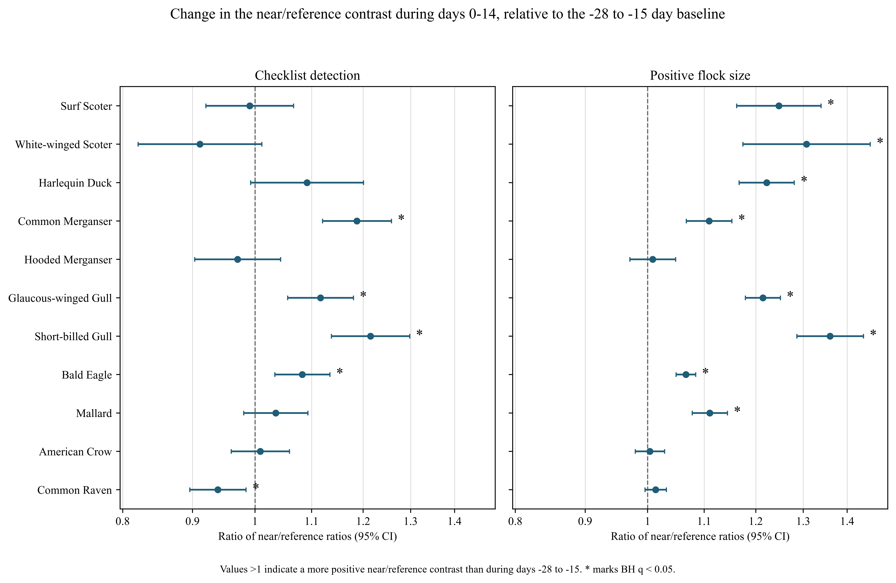
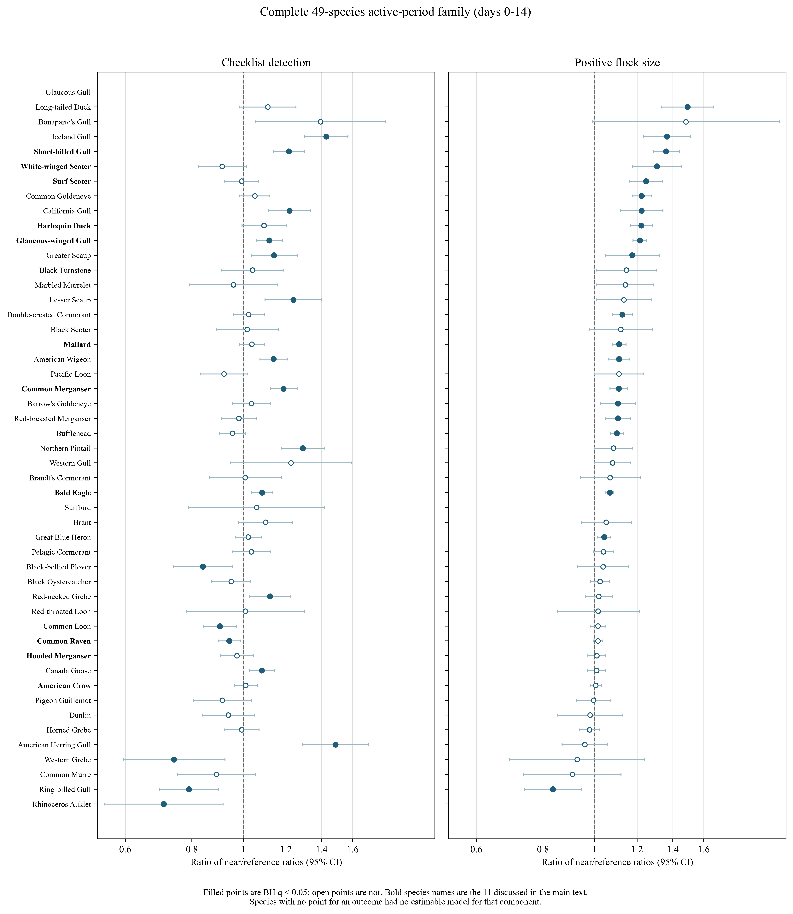
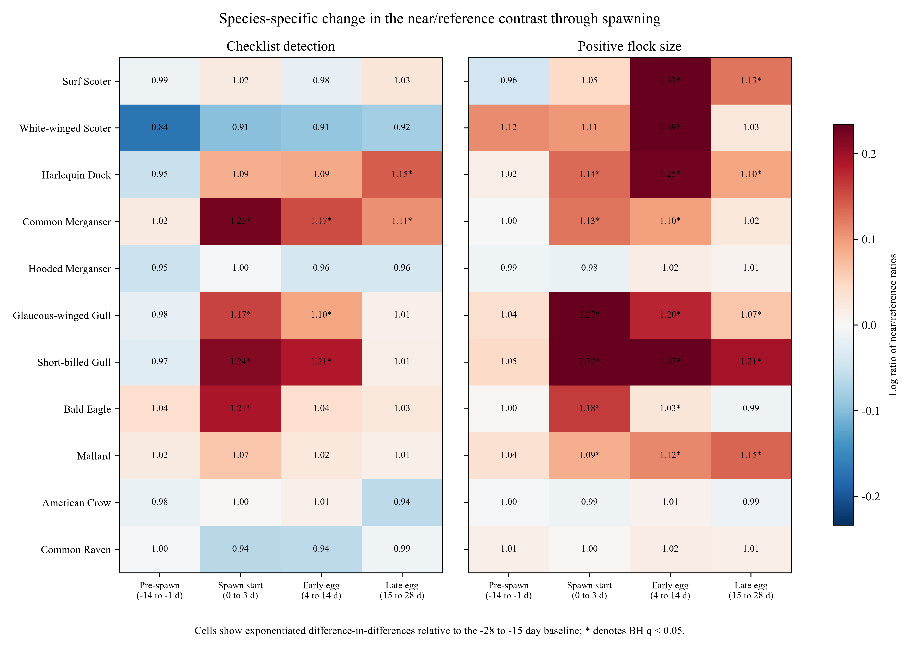

**Affiliation:** University of Victoria, [AUTHOR TO SUPPLY: full postal address], Canada 
**Corresponding author:** Jacob T. Dingwall; dingwalljake@gmail.com; [AUTHOR TO SUPPLY: telephone number] 
**ORCID:** 0009-0007-8389-6947

# Abstract {.unnumbered}

Pacific herring (*Clupea pallasii*) spawning is a brief, spatially concentrated resource pulse used by diverse coastal birds, but spring migration and shoreline sampling produce similar calendar patterns. We linked Fisheries and Oceans Canada spawn records to 217,200 complete eBird checklists from the Strait of Georgia, British Columbia (2005–2025), and asked whether the difference between checklists within 5 km of recorded spawn and same-day checklists 5–20 km away changed after onset relative to a −28 to −15 day baseline. Mixed models kept checklist detection and finite positive flock size as distinct outcomes; days 0–14 formed the primary active period. Responses were heterogeneous. After Benjamini–Hochberg adjustment across 49 species, the active interaction was positive for detection in 13 of 48 estimable species and negative in six, and positive for flock size in 19 of 46 and negative in one. The largest increases were among gulls and sea ducks, including American Herring Gull (detection 1.49), Iceland Gull (1.43), and Long-tailed Duck (flock size 1.49), whereas Ring-billed Gull declined in both components. Surf Scoter, White-winged Scoter, and Harlequin Duck had larger flocks without higher detection; Common Merganser, Glaucous-winged Gull, Short-billed Gull, and Bald Eagle increased in both. Positive interactions were concentrated after recorded onset rather than in the 14 days before it. Northern Shoveler, a comparator without an assumed herring mechanism, also increased, showing that time-varying habitat, access, or reporting structure remains. The results are consistent with taxon-specific local aggregation, especially through flock size, but do not identify movement, abundance change, or causation.

**Keywords:** Pacific herring; eBird; community science; resource pulse; coastal birds; event study; flock size

# Introduction

Ecological resource pulses are short-lived increases in resource availability that can reorganize consumer distributions and interactions well beyond the duration of the pulse. Their consequences depend on the amount, accessibility, and timing of the resource, on the mobility and foraging traits of consumers, and on the spatial scale at which redistribution is observed. In coastal systems, pulses can connect pelagic production to shallow subtidal, intertidal, terrestrial, and aerial consumers. Such connections are conspicuous when a forage fish enters shallow water to reproduce, but conspicuousness does not make the community response simple.

Pacific herring spawning is one such pulse. Adults move into coastal waters and deposit adhesive eggs on vegetation and other shallow substrates. Adults, eggs, milt, carcasses, and associated prey then become available through different pathways and over different intervals [@haegele1985; @hay1987; @hay2009; @grinnell2023; @rooper2024]. Recorded spawn is patchy among shorelines and years, and the link between a recorded source point and biologically accessible food depends on spawning depth, substrate, tides, weather, shoreline configuration, event duration, and egg survival. A date and a point describe a documented event, not the footprint of prey available to birds.

The Strait of Georgia supports a dense mosaic of spawning shorelines within a region used by large numbers of coastal birds, which makes it well suited to this question and also illustrates its central difficulty. Estuaries, rocky shores, eelgrass and macroalgal substrates, urban waterfronts, islands, and narrow channels differ in how roe is deposited and retained and in how birds reach it. They also differ in road access, recreational use, visibility from shore, and the density of bird observations. Ecological opportunity and observation opportunity are therefore entangled at the scale of a single checklist.

Bird responses should be heterogeneous for reasons of trait and timing. Diving sea ducks can reach attached roe, piscivores can take adults or prey concentrated around spawning, gulls and corvids can exploit eggs, fish, carcasses, or exposed material, and raptors can hunt or scavenge. Field observations and telemetry support these pathways directly: waterbirds aggregate near spawning areas, consume roe or adult fish, change foraging behaviour, and redistribute with spawn timing [@haegele1993; @sullivan2002; @rodway2003; @lewis2007; @lok2008; @lok2012; @kelly2018]. Harlequin Ducks aggregate at spawning sites in this system [@rodway2003], and Surf and White-winged Scoters alter movement and foraging during spawning [@lewis2007; @lok2008], with Surf Scoters tracking sequential spawning areas as a marine "silver wave" during spring migration [@lok2012]. These studies identify mechanisms for particular species at particular places. They do not establish that a near-spawn association measured across a whole region and a whole community is caused by the pulse.

That gap is what this paper addresses, and the obstacle to closing it is spring phenology. Herring spawning and northward bird migration occupy the same weeks, so comparing active dates with dates several weeks earlier can recover migration even when birds do not respond locally to herring. Two further alternatives compound the problem: near-spawn shorelines may differ persistently from other coastal sites in habitat, access, observer participation, and the probability that a checklist is submitted at all; and observers may deliberately visit conspicuous events. A design that addresses all three must compare spatial zones on the same dates, and must ask whether the difference between those zones changes through spawning relative to the difference already present before it.

Complete eBird checklists can support that comparison. A complete checklist indicates that observers reported all species detected and identified, which allows an omitted species to contribute a nondetection under explicit taxonomic and ambiguity rules [@sullivan2009; @kelling2019]. Protocol, duration, distance travelled, and party size describe measured effort, and repeated observers and generalized locations permit clustered models. eBird nonetheless remains a semi-structured observation process: participants choose when and where to go, observers vary in detection and counting, and an unquantified `X` report indicates detection without a numeric flock size [@johnston2018; @johnston2021]. Because a checklist records reporting rather than presence, we model two outcomes that can move independently. Checklist detection asks whether a taxon was reported at all; conditional positive count asks how large a finite numeric report was when the taxon was detected and quantified. Keeping both prevents a larger flock from being mislabelled as a general increase in occurrence, and prevents an occurrence response from being hidden by stable flock size.

We therefore ask: **does the difference between near-spawn and contemporaneous reference checklists become more positive at recorded spawn onset and during egg availability than the same spatial difference before spawning?** The primary active period is days 0–14, combining spawn start (0–3 d) and early egg availability (4–14 d), and the contrast is a difference-in-differences against a −28 to −15 day baseline. We made three predictions before execution. First, species with established or plausible access to herring should show positive interactions in detection, flock size, or both, but responses should not be universal. Second, positive interactions should be concentrated after recorded onset rather than throughout the pre-spawn period, if the pulse carries information beyond common migration. Third, comparator taxa without an assumed direct herring mechanism should not reproduce a coherent active-period response. As reported below, the third prediction failed.

# Methods

## Study system and data sources

The study was restricted to the Strait of Georgia, British Columbia, Canada. This inland sea supports recurrent Pacific herring spawning along accessible and inaccessible shorelines and is used by resident, wintering, and migratory birds. Bird observations came from the eBird Basic Dataset EBD_relMay-2026, with responses restricted through 2025 [@ebird_ebd]. Herring exposure came from the Fisheries and Oceans Canada Pacific Herring Spawn Index Data and its documented index construction [@dfo_spawn_data; @grinnell2023]. The spawn index is relative rather than absolute spawning biomass; missing herring components were not treated as zero, and unmonitored records were not converted to surveyed negatives. The event study used recorded source-event timing and geometry to define exposure links and did not model spawn biomass.

The analytical population comprised 217,200 eligible complete checklists from 2005 to 2025. Eligible protocols were stationary and travelling; checklists lasted 5–300 min, travelled no more than 5 km, and represented parties of one to ten observers. These eligibility rules were inherited unchanged from an earlier registered analysis of the same linked data, which used a broader active-near classification and a six-window timing model. The present analysis is an additive refinement specified after those results were reviewed, and is therefore post-result and exploratory; it returns to the same frozen checklist-to-event link table rather than replacing or relabelling the earlier estimates.

## Response semantics

Detection was one when a species was reported on an eligible complete checklist and zero when it was omitted under frozen taxonomic and ambiguity rules. An unquantified `X` report contributed to detection but never to numeric count. Finite numeric reports greater than zero entered the conditional count outcome. Lower-bound reports, ambiguous records, structural unknowns, and finite exact counts remained distinct, and none was silently recoded as another state.

The conditional count model used the natural logarithm of finite positive reported count, so its exponentiated contrasts are ratios of geometric mean reported flock sizes among numeric detections. This conditioning matters for interpretation: a species can have a count ratio above one without being detected on more checklists, and a rare species can have too little joint support for the count model despite sufficient detection support.

## Event periods, spatial zones, and concurrent links

Six fixed periods were defined relative to recorded onset: baseline (−28 to −15 d), early pre-spawn (−14 to −8 d), immediate pre-spawn (−7 to −1 d), spawn start (0–3 d), early egg (4–14 d), and late egg (15–28 d). These boundaries were fixed before execution and were tested at every endpoint. We use "pre-spawn" for the duration-weighted average of the two seven-day pre periods, that is days −14 to −1, and "active" for the duration-weighted average of spawn start and early egg. Near links were less than 5 km from a recorded source point and reference links were 5–20 km away, inclusive at 20 km. Distances refer to the checklist point representation, including the point associated with a travelling checklist, rather than to a reconstructed route or shoreline-access path.

A checklist could link to several herring source events at different distances and event-relative dates. Every eligible link was retained and counted in its actual period-by-zone cell, so the design contained 12 additive joint counts: six periods crossed with two zones. We did not multiply marginal time totals by marginal distance totals, because doing so invents a pairing when different events supply the two margins. Each checklist remained one model row however many events it linked to, which avoids pseudoreplication while preserving simultaneous exposure that a "closest event only" rule would discard. Coefficients therefore describe a change per linked recorded event within a cell, conditional on the other joint counts, rather than a mutually exclusive assignment of each checklist to one period and zone.

## Model specification

Each core species was fitted separately for detection and for conditional positive numeric count. Detection used a binomial generalized linear mixed model with logit link, fitted by `lme4::glmer` with `nAGQ = 0`; conditional log count used a Gaussian linear mixed model fitted by restricted maximum likelihood with `lme4::lmer` [@bates2015]. The fixed structure contained all 12 joint period-by-zone link counts, factor checklist year, protocol, log duration, log travelled distance plus one, and observer count. Random intercepts represented herring event block, observer cluster, and generalized location cluster. The species list, response definitions, time windows, spatial zones, eligibility rules, adjustment set, and random-effects structure were fixed before execution and were not selected from results. No simplified fallback was allowed: a component with insufficient joint-cell support or numerical failure remained failed, and a singular fit remained identified as such.

All 49 support-qualified species were fitted for both outcomes, and all 49 are reported (Table S1). Eleven species are discussed individually in the text: Surf Scoter, White-winged Scoter, Harlequin Duck, Common Merganser, Hooded Merganser, Glaucous-winged Gull, Short-billed Gull, Bald Eagle, Mallard, American Crow, and Common Raven. Six were emphasized in the earlier registered analysis, and five (Bald Eagle, Hooded Merganser, Mallard, American Crow, Common Raven) were added before execution to span contrasting predicted mechanisms, including taxa expected to show no response. **This panel is not the set of largest effects, and it was not chosen from the results.** Because it excludes both the largest positive and several of the largest negative interactions in the family, the Results report those interactions explicitly and display the complete family alongside the panel. Gadwall and Northern Shoveler were fitted separately as detection-only specificity comparators. They were not called negative controls, because their migration, habitat use, observation process, or indirect ecology could covary with spawning bays.

## Contrasts and interpretation

For period *p*, the near/reference interaction was:

> (near at period *p* − reference at period *p*) −
> (near at baseline − reference at baseline).

For detection, exponentiation produces a ratio of near/reference odds ratios; for conditional count, a ratio of near/reference flock-size ratios. A value above one means the near/reference contrast became more positive than its baseline value, and a value below one means it became more negative. It is not the raw ratio at near sites, and it should not be described as a percent increase in population size.

The primary active contrast covered days 0–14 and weighted the spawn-start interaction by 4/15 and the early-egg interaction by 11/15. Weighting reflected period duration and was not estimated from outcomes. The pre-spawn summary equally averaged the two seven-day pre interactions. We also report the immediate pre-spawn, spawn-start, early-egg, and late-egg contrasts separately, and the baseline near/reference difference as a descriptive quantity rather than an event response.

This is a difference-in-differences design of the kind used to draw causal inferences from observational panels, and its assumptions are the standard ones [@wing2018; @roth2023]. Applied to ecology, such quasi-experimental designs strengthen inference from observational data without delivering experimental control [@butsic2017; @larsen2019]. Comparing spawn dates to earlier spring dates cannot separate herring from migration, because both peak together. Our contrast can, because the reference checklists are same-day and because we subtract whatever near/reference difference already existed before onset. What it cannot do is control a factor that changes differently between the two zones at the same time as recorded spawning. Remaining alternatives include time-varying habitat use, access, targeted checklist submission, event-date error, shoreline geometry, weather, tide, observer behaviour, and indirect ecological responses.

## Multiplicity and support

Benjamini–Hochberg (BH) adjustment was applied within each core-species outcome-by-contrast family across the 49 species [@benjamini1995]. Comparator detection contrasts formed separate two-species families. We present effect sizes and 95% confidence intervals before q-values, retain all estimates regardless of sign, and do not treat a confidence interval overlapping one as evidence of no effect. Term support was evaluated for every joint period-by-zone cell, and model status, convergence, singularity, rank deficiency, sample size, and contrast availability were released in privacy-safe aggregate tables (Table S1). Support counts below 20 checklist years were suppressed. All models were fitted, and all exponentiated estimates and BH q-values were independently recomputed, before any interpretation was written.

# Results

## Sample, support, and model completion

The analytical frame contained 217,200 eligible complete checklists from 2005 to 2025. Global joint exposure support ranged from 2,992 near-zone checklists at spawn start to 28,655 reference-zone checklists in the late-egg period, and the smallest released joint-cell support among the eleven discussed species was 259 exposed model rows. Near-zone early- and immediate-pre periods were represented in fewer than 20 checklist years, so those year counts were suppressed, although checklist and event-block support remained above the privacy threshold.

The complete family contained 100 species-response fits and 1,400 contrast rows. Ninety-five fits completed normally, one completed with a singular warning, three failed for insufficient support, and one failed numerically. Surfbird, Rhinoceros Auklet, and Glaucous Gull conditional-count models lacked sufficient joint-cell support; Glaucous Gull detection failed numerically, and its generic failure code did not preserve a more specific reason; Western Gull conditional count completed with a singular warning. No failed component was replaced by a simplified fit. All 22 models for the eleven discussed species completed without convergence failure, rank deficiency, or singularity. Detection was therefore estimable for 48 of 49 species and conditional count for 46.

## Primary active-period interaction

The primary 0–14 day interaction was more often expressed through conditional flock size than through checklist detection (Figure 1; Table 1). Among estimable core species, 13 of 48 detection interactions were positive at BH q < 0.05 and six were negative; 19 of 46 count interactions were positive and one was negative. Most species therefore showed no positive active interaction, which is inconsistent with a community-wide increase near spawn, while positive interactions were nonetheless spread across sea ducks, gulls, mergansers, and one raptor.

{width=100% fig-alt="Forest plot for eleven bird species showing exponentiated difference-in-differences for checklist detection and conditional positive flock size during days zero to fourteen, relative to a twenty-eight to fifteen day pre-onset baseline. Asterisks mark Benjamini-Hochberg q below 0.05."}

**Figure 1. Primary 0–14 day near/reference interactions for the eleven species discussed in the text.** Points and 95% confidence intervals are exponentiated duration-weighted difference-in-differences. Values above one indicate that the near/reference contrast became more positive than during the −28 to −15 day baseline. Asterisks mark BH q < 0.05 within the 49-species outcome-and-contrast family. Both panels share one axis range. The complete family is shown in Figure 2.

**Table 1. Primary active-period interactions for the eleven species discussed in the text.** Detection values are ratios of near/reference odds ratios; count values are ratios of conditional near/reference flock-size ratios. Values are estimate (95% CI) with BH q. These eleven species are not the largest effects in the family; see Table 2 and Figure 2.

| Species | Checklist detection | Positive flock size |
|---|---:|---:|
| Surf Scoter | 0.99 (0.92–1.07), q = 0.867 | 1.25 (1.16–1.34), q = 5.37 × 10^-9^ |
| White-winged Scoter | 0.91 (0.82–1.01), q = 0.177 | 1.31 (1.17–1.46), q = 3.52 × 10^-6^ |
| Harlequin Duck | 1.09 (0.99–1.20), q = 0.163 | 1.22 (1.17–1.28), q = 3.48 × 10^-16^ |
| Common Merganser | 1.19 (1.12–1.26), q = 1.13 × 10^-7^ | 1.11 (1.07–1.15), q = 4.96 × 10^-7^ |
| Hooded Merganser | 0.97 (0.90–1.04), q = 0.581 | 1.01 (0.97–1.05), q = 0.731 |
| Glaucous-winged Gull | 1.12 (1.06–1.18), q = 0.00059 | 1.21 (1.18–1.25), q = 2.01 × 10^-36^ |
| Short-billed Gull | 1.22 (1.14–1.30), q = 1.13 × 10^-7^ | 1.36 (1.29–1.44), q = 1.36 × 10^-25^ |
| Bald Eagle | 1.08 (1.03–1.13), q = 0.00333 | 1.07 (1.05–1.08), q = 1.57 × 10^-13^ |
| Mallard | 1.04 (0.98–1.09), q = 0.312 | 1.11 (1.08–1.14), q = 3.69 × 10^-11^ |
| American Crow | 1.01 (0.96–1.06), q = 0.810 | 1.00 (0.98–1.03), q = 0.815 |
| Common Raven | 0.94 (0.90–0.98), q = 0.026 | 1.01 (1.00–1.03), q = 0.215 |

Surf Scoter, White-winged Scoter, and Harlequin Duck increased in conditional flock size without a supported detection increase. Their ratios imply that numerically reported flocks near spawn were larger relative to reference checklists than the same spatial contrast before spawn, while the fraction of checklists reporting each taxon did not change equivalently. White-winged Scoter detection was in fact below one in every post-baseline period, most strongly during the pre-spawn window (0.84), although no individual detection contrast reached BH significance. Common Merganser, Glaucous-winged Gull, Short-billed Gull, and Bald Eagle increased in both components.

## The wider family, including the largest and the negative effects

The eleven species above were named before execution and are not the largest effects in the family (Figure 2; Table 2). The three largest active interactions belong to species not discussed individually: American Herring Gull detection 1.49 (1.29–1.71), Iceland Gull detection 1.43 (1.30–1.57), and Long-tailed Duck conditional count 1.49 (1.33–1.67). Several sea ducks with well-established associations with herring spawn also increased in flock size without appearing in Table 1, including Common Goldeneye (1.22), Greater Scaup (1.18), Double-crested Cormorant (1.13), Barrow's Goldeneye and American Wigeon (1.11 each), and Bufflehead and Red-breasted Merganser (1.10 each).

Negative interactions were correspondingly broader than the single case visible in Table 1. Six detection interactions were negative at BH q < 0.05: Rhinoceros Auklet 0.71 (0.55–0.91), Western Grebe 0.74 (0.60–0.92), Ring-billed Gull 0.79 (0.69–0.90), Black-bellied Plover 0.84 (0.74–0.95), Common Loon 0.90 (0.84–0.97), and Common Raven 0.94 (0.90–0.98). The first five are larger in magnitude than most of the positive interactions reported above. Ring-billed Gull was the only species negative in both components, with a conditional count interaction of 0.83 (0.74–0.94). The positive taxa were therefore embedded in a broad distribution of positive, null, and negative estimates rather than drawn from an analysis in which coastal birds generally rose near spawn.

{width=100% fig-alt="Forest plot of all forty-nine core species for checklist detection and conditional positive flock size during days zero to fourteen. Filled points denote Benjamini-Hochberg q below 0.05 and bold labels denote the eleven species discussed in the text."}

**Figure 2. Complete 49-species active-period family.** Filled points are BH q < 0.05 and open points are not. Bold species names are the eleven discussed individually in the text. Species are ordered by conditional count ratio where estimable. Absent points indicate a component with no estimable model. Both panels share one axis range.

**Table 2. All BH-significant negative active interactions, and all BH-significant positive interactions outside the eleven species of Table 1.** Full values, confidence intervals, and q-values are in `Table_2_family_extremes_v7.csv`; the complete family is in Table S1.

## Timing relative to recorded onset

Positive interactions were concentrated after recorded onset (Figure 3). The 14-day pre-spawn summary contained no BH-positive detection result and one BH-positive count result across the core family. Restricted to the immediate pre-spawn window of days −7 to −1, the corresponding counts were zero and two. Spawn start contained ten positive and four negative detection interactions and 13 positive count interactions. Early egg contained 12 positive and two negative detection interactions and 21 positive and one negative count interaction. Late egg contained ten positive and two negative detection interactions and 13 positive count interactions.

{width=100% fig-alt="Two-panel heat map for eleven bird species showing checklist detection and positive flock-size ratios for the fourteen-day pre-spawn summary, spawn start, early egg, and late egg interactions."}

**Figure 3. Species-specific timing of the near/reference interaction.** Cells show exponentiated difference-in-differences for the 14-day pre-spawn summary (−14 to −1 d), spawn start (0–3 d), early egg (4–14 d), and late egg (15–28 d), each relative to the −28 to −15 day baseline. Asterisks denote BH q < 0.05 within the 49-species outcome-and-contrast family.

Timing differed among taxa in ways consistent with access to adult fish or to eggs. Surf Scoter count was near null before spawn, modest at spawn start, strongest during early egg (1.33), and still positive in late egg (1.13). White-winged Scoter count was highest in early egg (1.39). Harlequin Duck count rose at spawn start (1.14), early egg (1.25), and late egg (1.10), while its detection became clearly positive only late (1.15). Common Merganser detection rose at spawn start (1.25), early egg (1.17), and late egg (1.11), with a smaller count response concentrated at onset and early egg. Glaucous-winged and Short-billed Gulls increased in both components during onset and early egg, with count responses extending later.

The count family showed the clearer temporal progression, rising from one positive in pre-spawn to 13 at spawn start and 21 in early egg before declining to 13 in late egg; detection positives rose from zero to ten and twelve, then declined to ten. This progression is consistent with a pulse whose broadest flock-size response follows deposition, but it is a descriptive family summary rather than a formal test that early egg exceeds every other period, and the contrasts share model coefficients and data. Temporal concentration also does not mean that recorded onset matches biological availability exactly: event dates carry uncertainty, spawning can continue, eggs persist or are lost, and concurrent events contribute additively. What it does show is that the positive family-wide pattern was not already present during the 14 days before onset.

## Five species selected to span contrasting predictions

**Bald Eagle.** Baseline near/reference detection and count ratios were close to one (0.98 and 1.00). At spawn start the detection interaction was 1.21 (1.13–1.30; q = 2.30 × 10^-6^) and the count interaction 1.18 (1.15–1.21; q = 1.27 × 10^-41^). The early-egg count interaction remained positive but much smaller (1.03), and late-egg values were near one. The duration-weighted active interaction was positive in both components but attenuated relative to the onset peak.

**Hooded Merganser.** Detection was already higher near source events during baseline, at 1.11 (1.05–1.17; q = 0.0012). No post-baseline interaction was supported: the active detection ratio was 0.97 and the count ratio 1.01, and spawn-start, early-egg, and late-egg estimates were all near one. A spatial association with shorelines that later supported recorded spawn was therefore present before onset and did not increase through the event.

**Mallard.** Detection did not change clearly in any period. Conditional flock size increased at spawn start (1.09, 1.04–1.14; q = 0.00074), early egg (1.12, 1.08–1.16; q = 1.07 × 10^-10^), and late egg (1.15, 1.11–1.18; q = 4.00 × 10^-16^), giving an active ratio of 1.11.

**American Crow.** Both components had positive baseline near/reference differences: detection 1.06 (1.02–1.10) and count 1.06 (1.04–1.08). After those persistent differences were subtracted, the active interactions were 1.01 for detection and 1.00 for count. The late-egg detection interaction was 0.94 (0.90–0.99), with a confidence interval excluding one but a BH q of 0.069.

**Common Raven.** The baseline detection ratio was near one (0.99), although the baseline count ratio was slightly below one at 0.98 (0.96–0.99; q = 0.0064). The active detection interaction was negative at 0.94 (0.90–0.98; q = 0.026), and the early-egg detection interaction was also negative at 0.94, with a BH q of 0.058. Conditional count remained near one.

These five species were selected to span contrasting predictions, and they did. One showed a sharp two-component onset response, one a prolonged count-only response, two no event-associated increase once baseline spatial structure was removed, and one a negative detection interaction.

## Specificity comparators

Gadwall had a negative baseline near/reference difference (0.88, 0.80–0.97; q = 0.024) and a null active interaction (1.03, 0.90–1.17; q = 0.704). It did not reproduce the active-period signal.

Northern Shoveler had a near-null baseline difference (1.00, 0.90–1.11) and a positive active interaction of 1.24 (1.08–1.43; q = 0.0056). Its early-egg ratio was 1.25 (1.07–1.46; q = 0.011) and its late-egg ratio 1.27 (1.10–1.46; q = 0.0025). This taxon therefore reproduced a positive post-onset detection pattern despite lacking a strong assumed direct herring mechanism, which falsifies our third prediction. Full comparator results are in Table S3.

# Discussion

## A migration-adjusted but noncausal event-linked signal

The near/reference difference increased after recorded herring-spawn onset for a nonrandom subset of coastal birds, especially in reported flock size, and positive results were uncommon in the 14 days before onset. This sequence fits local consumer aggregation around the resource pulse better than it fits a Strait-wide migration increase affecting near and reference checklists equally.

Comparing spawn dates to earlier spring dates cannot separate herring from migration, because both peak together. Our contrast can, because the reference checklists are same-day and because we subtract whatever near/reference difference already existed before onset. It is still not causal evidence. The required counterfactual is that, absent a local event-linked response, the near/reference difference would have changed as it did during the baseline window. That condition is not testable from these checklists, and it fails if habitat use, access, submission, or an indirect ecological process changes differently between zones at the same time as spawning.

Northern Shoveler makes this limitation empirical rather than rhetorical. A comparator chosen for its lack of an assumed herring mechanism produced a positive active interaction of the same magnitude as several focal taxa, after common migration and baseline zone adjustment had both been removed. Our third prediction therefore failed, and the appropriate conclusion is narrower than the one we set out to test: recorded spawning added species- and component-specific information about checklist reporting and flock size beyond a common seasonal change, but the coefficients do not isolate ingestion of herring or movement caused by spawning. Near and reference zones need not host the same mixture of migratory pathways or staging habitats, and that mixture can shift through March and April in ways a calendar-year term does not model.

The baseline comparison earns its place as a diagnostic. Hooded Merganser and American Crow were already distributed differently between zones before onset and had null interactions, so a design using only near observations during spawning could have attributed those persistent patterns to the event. Bald Eagle, by contrast, had a near-null baseline and a sharp onset interaction, which makes a stable shoreline difference a weaker explanation for that species. Baseline subtraction does not solve time-varying confounding, but it changes which biological stories remain consistent with the observed sequence.

## Occurrence and flock size describe different ecological responses

Separating detection from conditional count changed the ecological story materially. Surf Scoter, White-winged Scoter, and Harlequin Duck had larger reported flocks without supported detection increases, which is consistent with individuals concentrating into larger groups at a subset of sites already used during spring, leaving the fraction of checklists reporting them comparatively stable. The positive-count subset may also differ in viewing conditions, countability, or observer composition. A detection-only analysis would have missed the aggregation pattern; a count-only analysis would have overstated how broadly it occurred.

Common Merganser, Glaucous-winged Gull, Short-billed Gull, and Bald Eagle increased in both components, which is compatible with a larger fraction of checklists encountering the taxon and larger flocks among numeric detections. Even here, conditional count is not abundance across all checklists, and one checklist may not represent one independent bird group, because individuals move and checklists sample overlapping places. Mallard showed the complementary count-only pattern over a longer interval, Hooded Merganser and American Crow showed persistent baseline differences with null interactions, and Common Raven detection declined. Together these results describe a heterogeneous community response rather than a general increase near spawn, and they show the value of retaining null and negative components in a study that begins with a conspicuous natural-history expectation.

## Taxon-specific interpretation, and where the guild logic breaks

The scoter results align with established natural history. Surf and White-winged Scoters consume herring roe and change movement and foraging around spawning [@lewis2007; @lok2008; @lok2012], and their strongest count interactions fell in the early-egg period, when attached eggs are plausibly available. The absence of a detection interaction suggests larger local aggregations rather than proportional expansion across sampled sites. That is compatible with tracking a sequence of concentrated resources, but the analysis does not observe individual trajectories and cannot test the silver-wave mechanism directly [@lok2012]. Harlequin Ducks are likewise established users of herring spawn in this system [@rodway2003]; their count response extended from spawn start through late egg, and detection became most positive late, which could reflect persistent access to roe in shallow habitats. Recorded source dates and point distances remain coarse proxies for substrate-specific availability, and depth, vegetation, tide, and wave exposure are likely effect modifiers.

Common Merganser showed the clearest active detection increase of the two mergansers, with smaller count increases, which is plausible for a piscivore near the onset of adult spawning, though mergansers can also respond to other prey concentrated in the same setting. Hooded Merganser was already more likely to be reported near future event sources at baseline and did not change through spawning. Bald Eagle produced the sharpest onset response of any species discussed here, with both components peaking in days 0–3 and diminishing thereafter, which is compatible with rapid exploitation of adult fish, newly available spawn, scavenging, or prey made vulnerable during spawning. It is equally compatible with observers preferentially visiting spectacular onset events and reporting conspicuous eagles; contemporaneous reference checklists make a general seasonal rise unlikely as a complete explanation, but localized visitation remains possible.

Gulls illustrate why guild-level reasoning fails here. Glaucous-winged and Short-billed Gull detection and count both increased during onset and early egg, and American Herring, Iceland, and California Gulls showed some of the largest positive interactions in the family. Gulls can access surface fish, eggs, carcasses, and shoreline material and can shift among feeding sites quickly [@haegele1993; @sullivan2002], and their conspicuousness may make changes in flocking especially detectable in checklist data. Ring-billed Gull, however, declined in both components, the only species in the family to do so. A mechanism defined at the level of "gulls can reach this food" cannot accommodate that result, and the species differ in ways the design does not measure, including their use of inland, agricultural, and urban sites during spring. The same caution applies to corvids, where American Crow baseline differences vanished in the interaction while Common Raven detection declined modestly. Mallard's prolonged count-only increase and Northern Shoveler's positive comparator response point the same way: dabbling ducks may use productive shoreline habitat, displaced invertebrates, or vegetation associated with spawning bays without targeting herring, and they may share migration timing and accessible observation sites.

## Timing, scale, and redistribution

Event timing was informative because the family-wide signal was not already present in the pre-spawn summary, and because count responses increased most broadly at spawn start and early egg. That concentration suits a short pulse whose accessible pathways shift from adult fish and deposition to attached eggs and later residual material, and different taxa peaked in different periods, as expected from differences in diet, diving ability, flocking, and shoreline access. The windows should not be read as sharply bounded biological states: onset dates may lag or precede local availability, events continue, eggs persist, and concurrent events place one checklist in more than one cell. Late-egg responses were mixed, with Surf Scoter, Harlequin Duck, gulls, and Mallard retaining count increases while Bald Eagle returned toward baseline; persistence could reflect eggs, carcasses, associated prey, or repeated nearby events, and decline could reflect depletion, movement to a newer event, or changed observation.

The interaction is local in both space and interpretation. "Near" means a checklist point within 5 km of at least one recorded source event and "reference" means linked events 5–20 km away, distances that are broad relative to the foraging scale of some birds and narrow relative to the daily movement of others. Redistribution is one plausible source of the signal: birds moving from reference shorelines toward newly active sites would raise near detections or flock sizes relative to reference, birds arriving from outside both zones would raise both, and resident flocks merging near spawn would raise conditional count while leaving detection stable, as observed for several sea ducks. Each process implies a different relationship between these local coefficients and the total number of birds in the Strait, and distinguishing them would require an estimand that preserves the regional total and models interference among sites. We therefore use "local aggregation" as a compatible interpretation rather than an identified movement mechanism. Scale also shapes the null results: a taxon could respond within hundreds of metres of deposited eggs while a 5-km near zone dilutes the change, or respond across more than 20 km so that both zones move together. A null interaction can mean no average divergence at the chosen scale rather than no biological response.

## What the specificity comparison does and does not show

Specificity was evaluated with taxa rather than assumed from natural-history labels, and the result was mixed in an informative way. Gadwall showed no active interaction, which argues against an analysis that mechanically pushes every dabbling duck upward. Northern Shoveler did show one, which means that shared migration, habitat, access, submission, classification, or indirect ecology can generate an event-timed near/reference increase, and weakens any claim that positive focal coefficients reflect direct use of herring. One positive comparator does not erase differences in magnitude, component, and timing among focal taxa, but neither does a null comparator prove that focal associations are caused by herring, because a comparator may not share the relevant habitat or observation process. The two together bound interpretation more effectively than either alone.

A stronger design would use habitat-matched reference shorelines, direct measures of observer visitation, and several comparator taxa chosen before prospective outcomes are available, with tide, daylight, weather, substrate, and shoreline exposure frozen as a small mechanistically justified set. Adding those covariates now, after observing these outcomes, would risk a result-selected repair.

## Community science as an event-monitoring system

The breadth of eBird supplied a sample that event-focused field studies rarely achieve: 217,200 complete checklists across 21 years and a 49-species family, with complete-checklist semantics supporting detection outcomes, effort covariates describing part of the observation process, and repeated observers and locations supporting random intercepts. The same flexibility is the principal limitation. Participants choose sites and dates, a known spawn can attract observers, travelling routes are represented by a point, and source events are represented by recorded points rather than prey surfaces. Random intercepts and effort terms reduce some of this structure but do not make checklists a probability sample [@johnston2018; @johnston2021].

The most defensible use is therefore hypothesis refinement and surveillance. Community-science records can identify which taxa, components, periods, and locations deserve targeted follow-up, after which structured surveys can test whether detection, numbers, behaviour, and diet change at matched near and reference shorelines. The design generalizes to other ephemeral events, and its ingredients are an event clock, contemporaneous spatial references, a pre-event spatial baseline, response components matched to observation semantics, and explicit handling of concurrent links. Those ingredients do not convert opportunistic data into an experiment, but they do move the estimand closer to the ecological alternative under discussion. For herring specifically, the framing shifts from asking whether birds are associated with spawn to asking how a local spatial contrast changes through onset and egg availability, which separates persistent habitat use from event-linked change, common migration from local divergence, and occurrence from flock size.

# Limitations and future directions

This analysis is a post-result refinement. Its question and implementation were motivated by review of an earlier registered analysis, even though code, periods, species roles, and contrasts were committed and fixture-tested before execution. The evidence is exploratory and estimand-refining, and the locked 2026–2028 response cannot be examined until a complete prospective release.

The design relies on parallel change between near and reference zones absent a local response. It controls a common seasonal shift and stable baseline zone differences, but not differential time-varying confounding, and Northern Shoveler demonstrates that such structure remains. Exposure is also approximate: distance runs from a checklist point to a recorded source point rather than from a route to a realized prey footprint, onset can be uncertain, eggs can be transported or lost, and additive link counts do not measure prey quantity. Responses are observation outcomes throughout. Detection is not occupancy, conditional finite count excludes `X`, lower-bound, and ambiguous detections and may describe a selected subset of observers and conditions, and neither component measures regional abundance, demographic response, energetic benefit, ingestion, or individual movement. Not every model was estimable: three conditional-count components failed support, Glaucous Gull detection failed numerically, and Western Gull count was singular, which limits complete taxonomic comparison. Multiple testing is substantial, and effect sizes, intervals, family context, timing coherence, and prior natural history should carry more weight than a binary q-value threshold.

Prospective confirmation should freeze the present primary interaction, comparator panel, and interpretation rules; treat the complete 2026–2028 release as one locked unit without interim looks; execute the fixed 0–14 day interaction for both outcomes; and preserve all named species regardless of direction. Agreement in effect direction, timing, and response component would be more persuasive than replication of q-value status alone. Any environmental sensitivity should be specified from external knowledge and frozen without using holdout responses.

Targeted field work can address what a checklist analysis cannot. Repeated counts at matched shorelines could estimate total local numbers rather than conditional reports, behavioural scans and prey sampling could distinguish foraging from resting or passage, tagged birds could reveal arrival and residence and movement among successive spawn sites, and observations spanning tide and daylight could separate availability from detectability. Ring-billed Gull, Rhinoceros Auklet, and Western Grebe deserve particular attention, because a negative interaction of that magnitude is as informative about local redistribution as the positive results are.

# Conclusions

Coastal-bird responses through recorded Pacific herring spawning in the Strait of Georgia were heterogeneous and were expressed more consistently through conditional flock size than through checklist detection. During days 0–14, the near/reference contrast increased relative to its −28 to −15 day baseline for scoters, Harlequin Duck, Common Merganser, several gulls, Bald Eagle, and Mallard, while Hooded Merganser and American Crow did not change and Common Raven, Ring-billed Gull, Rhinoceros Auklet, Western Grebe, Black-bellied Plover, and Common Loon declined in detection. Positive family-wide results were concentrated after recorded onset rather than throughout the 14 days before it.

The zone-by-period interaction is stronger migration-adjusted evidence than an active-date comparison, because it uses contemporaneous reference checklists and subtracts baseline spatial differences. It is not causal proof. Northern Shoveler reproduced a positive active interaction and falsified our specificity prediction, showing that time-varying habitat, access, submission, classification, or indirect ecological structure remains. The results support a taxon-specific event-linked aggregation interpretation, especially for reported flock size, while requiring prospective confirmation and structured local study before any claim about movement, abundance, or direct use of herring.

# Data availability

Raw eBird and herring source records, checklist identifiers, observer identifiers, locality identifiers, exact coordinates, and record-level derivatives are restricted and are not distributed in the repository. Privacy-safe aggregate estimates, support summaries, diagnostics, specifications, execution records, and hash manifests are provided with the reproducible analysis package. Source datasets remain available from their respective custodians under applicable terms.

# Code availability

Versioned R, Python, and PowerShell code for fixture and production execution, the frozen event-study specification, aggregate output manifests, the manuscript asset builder, and tests are included in the repository. Production execution requires an explicit authorization acknowledgement and protected inputs matching recorded hashes. Outputs of the earlier registered analysis are preserved unchanged.

# Declarations

**Funding:** [AUTHOR TO SUPPLY.]

**Competing interests:** The author declares no competing interests.

**Ethics:** The study used existing biodiversity and fisheries-monitoring records and involved no direct handling of animals.

**Author contributions:** Jacob T. Dingwall: Conceptualization, Methodology, Software, Formal analysis, Investigation, Data curation, Visualization, Writing – original draft, Writing – review and editing.

**Use of generative AI:** [AUTHOR TO REVIEW AND SUPPLY JOURNAL-COMPLIANT DISCLOSURE.]

# Acknowledgments

We thank the eBird participants, data reviewers, and Fisheries and Oceans Canada personnel whose observations and monitoring made this analysis possible. [AUTHOR TO SUPPLY additional acknowledgments.]

# References
