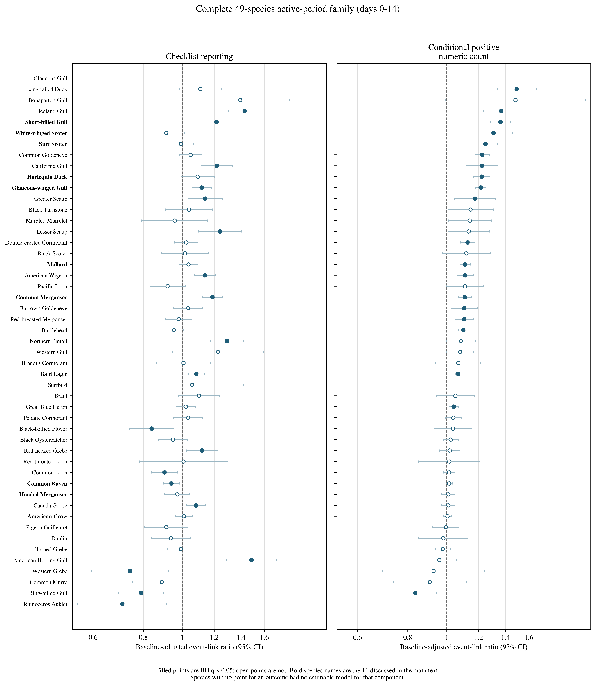
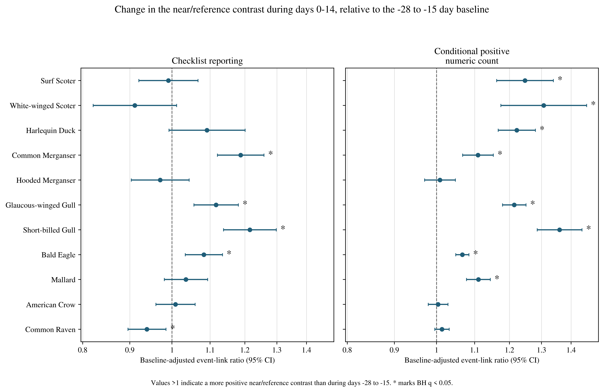
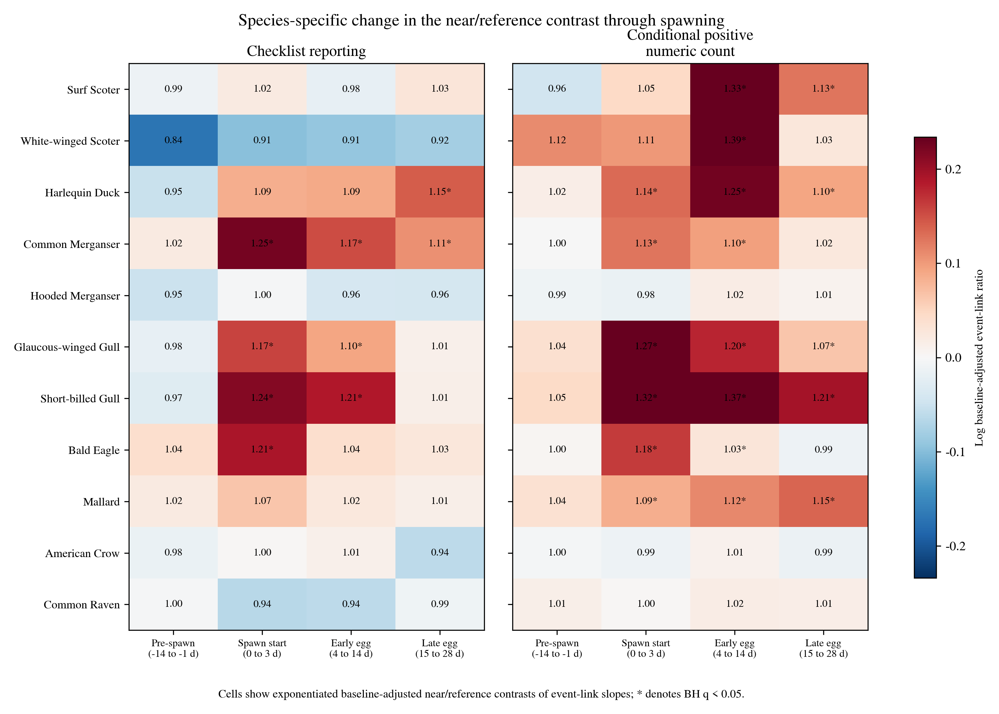

**Affiliation:** University of Victoria, [[AUTHOR INPUT REQUIRED: full postal address]], Canada\
**Corresponding author:** Jacob T. Dingwall; dingwalljake@gmail.com; [[AUTHOR INPUT REQUIRED: telephone number]]\
**ORCID:** 0009-0007-8389-6947

# Abstract {.unnumbered}

Pacific herring (*Clupea pallasii*) spawning creates a brief coastal resource pulse, but spring migration, habitat, access, and observer behaviour can produce similar patterns in bird observations. In a post-result exploratory refinement of an earlier registered analysis, we linked Fisheries and Oceans Canada spawning records to 217,200 complete eBird checklists from the Strait of Georgia, British Columbia (2005–2025). We compared checklists <5 km from recorded spawning events with contemporaneous checklists linked to events 5–20 km away and asked whether this spatial contrast changed during days 0–14 relative to a −28 to −15 day baseline. Separate mixed models described checklist reporting and conditional positive numeric counts. Exposure predictors were additive counts of checklist-to-event links, so each coefficient represents the association with one additional recorded event link, conditional on the other links. After Benjamini–Hochberg adjustment across 49 species, active-period checklist-reporting contrasts were positive for 13 of 48 estimable species and negative for six; conditional-count contrasts were positive for 19 of 46 and negative for one. Several sea ducks had larger reported positive counts without increased checklist reporting, whereas Common Merganser, Glaucous-winged Gull, Short-billed Gull, and Bald Eagle increased in both outcomes. Few pre-onset estimates met the adjustment threshold, but this timing pattern was descriptive rather than a formal post-minus-pre test. Positive results in four of five dabbling ducks and Canada Goose indicate residual spatial and observation-process structure. The associations are compatible with taxon-specific local aggregation, but they do not establish herring consumption, herring-induced movement, or changes in regional abundance.

**Keywords:** Pacific herring; eBird; community science; resource pulse; coastal birds; checklist reporting; conditional count

# Introduction

Ecological resource pulses are short-lived increases in resource availability that can reorganize consumer distributions and interactions. Their consequences depend on the amount, accessibility, and timing of the resource; the mobility and foraging traits of consumers; and the spatial scale at which redistribution is observed. In coastal systems, pulses can connect pelagic production to shallow subtidal, intertidal, terrestrial, and aerial consumers.

Pacific herring spawning is one such pulse. Adults enter coastal waters and deposit adhesive eggs on vegetation and other shallow substrates. Adults, eggs, milt, carcasses, and associated prey can then become available to consumers through different pathways and over different intervals [@haegele1985; @hay1987; @hay2009; @grinnell2023; @rooper2024]. Recorded spawning is spatially patchy, and a recorded date and point do not describe the complete footprint of prey available to birds. Spawning depth, substrate, tides, weather, shoreline configuration, event duration, and egg survival all affect accessibility.

Coastal birds are expected to differ in how they encounter this pulse. Diving sea ducks can reach attached roe, piscivores can take adults or associated prey, gulls and corvids can exploit eggs, fish, carcasses, or exposed material, and raptors can hunt or scavenge. Field observations and telemetry show that some waterbirds aggregate near spawning areas, consume roe or adult fish, change foraging behaviour, or redistribute with spawn timing [@haegele1993; @sullivan2002; @rodway2003; @lewis2007; @lok2008; @lok2012; @kelly2018]. Harlequin Ducks aggregate at spawning sites in the Strait of Georgia [@rodway2003], and Surf and White-winged Scoters alter movement and foraging during spawning [@lewis2007; @lok2008]. Surf Scoters can track sequential spawning areas during spring migration [@lok2012]. These studies establish plausible mechanisms for particular taxa and places, but they do not show that every regional near-spawn association is caused by herring.

The Strait of Georgia is well suited to examining this distinction. Recurrent spawning occurs within a mosaic of estuaries, rocky shores, eelgrass and macroalgal substrates, urban waterfronts, islands, and narrow channels. These environments differ both ecologically and observationally. Shorelines vary in prey access, bird habitat, roads, recreational use, visibility, and the likelihood that a checklist is submitted. Herring spawning and northward bird migration also occupy the same weeks. A comparison between spawning dates and earlier spring dates can therefore recover migration, persistent habitat differences, or changing observation patterns even when birds do not move toward spawning.

Complete eBird checklists provide broad coverage but remain a semi-structured observation process. A complete checklist means that observers reported all species they detected and identified, allowing a taxon omitted from the list to contribute a report/nonreport outcome under explicit taxonomic rules [@sullivan2009; @kelling2019]. Protocol, duration, travel distance, and party size describe measured effort. However, participants choose when and where to observe, observers differ in identification and counting, and a reported `X` indicates that a species was observed without a numeric count [@johnston2018; @johnston2021]. These data therefore describe checklist reporting and reported counts, not occupancy or a probability-sampled census.

We asked whether the difference between checklists near recorded herring spawning and contemporaneous reference checklists changed after recorded onset relative to the spatial difference already present earlier. The primary active period was days 0–14, combining spawn start and early egg availability, and the baseline was days −28 to −15. We expected established or plausible herring-associated taxa to show positive event-linked associations in checklist reporting, conditional positive numeric count, or both, while recognising that responses need not be universal. We also expected positive estimates to be more common after recorded onset than during the preceding 14 days and expected two nominated comparator taxa not to show a coherent active-period association. The second expectation can be assessed only descriptively with the current output because a direct post-minus-pre contrast was not calculated. The comparator expectation was contradicted.

# Methods

## Study area and data sources

The study was restricted to the Strait of Georgia, British Columbia, Canada. Bird observations came from the eBird Basic Dataset release EBD_relMay-2026, with responses restricted to 2005–2025 [@ebird_ebd]. Taxa followed eBird/Clements taxonomy v2025. Herring information came from Fisheries and Oceans Canada Pacific Herring Spawn Index Data and its documented index construction [@dfo_spawn_data; @grinnell2023]. The spawn index is relative rather than an estimate of absolute spawning biomass. Missing herring components were not treated as zero, unmonitored records were not converted to surveyed negatives, and spawning biomass was not included as an exposure.

The analytical population contained 217,200 eligible complete checklists. Stationary and travelling protocols were included when checklists lasted 5–300 min, travelled no more than 5 km, and represented parties of one to ten observers. The Strait of Georgia frame contained 1,115 recorded herring source events grouped into 58 event blocks, 29,248 observer clusters, and 22,980 generalized location clusters.

The checklist eligibility rules were inherited from an earlier registered analysis of the same linked data. Results from that earlier analysis had already been examined when the present event-link specification was developed. The present analysis is therefore a post-result exploratory refinement, not an independently preregistered analysis. Its specification was archived before this refinement was executed, and it did not overwrite or relabel the earlier registered results. [[AUTHOR INPUT REQUIRED: registration identifier and/or repository DOI]]

## Checklist selection and response construction

Two outcomes represented different parts of the checklist observation process. **Checklist reporting** was one when a taxon was reported on an eligible complete checklist and zero when it was omitted under the fixed taxonomic and ambiguity rules. Omission from a complete checklist is useful for modelling reporting, but it is not proof that the species was biologically absent.

Every positive report retained its count state. A finite positive number contributed to both checklist reporting and the conditional numeric-count model. An unquantified `X` contributed to checklist reporting but not to the numeric-count model. Ambiguity-affected records, lower-bound reports, structural unknowns, and finite exact counts remained distinct and were not silently recoded as zeros or as exact counts. Taxonomic changes across the series—including the Mew-to-Short-billed Gull split, the Herring Gull complex split yielding American Herring Gull, and the Thayer's-to-Iceland Gull lump—were resolved to fixed analysis concepts using versioned mapping.

The second outcome was the natural logarithm of the finite positive number reported for a taxon. It is therefore termed **conditional positive numeric count**. Exponentiated contrasts compare geometric mean reported counts among checklists on which the species was both reported and assigned a finite number. This is not a measure of abundance across all checklists, and a checklist total, particularly from a travelling route, need not represent one independent flock.

## Herring events, timing, and spatial linkage

A **source event** was the recorded herring-spawning unit with an onset date and source point used to create checklist-to-event links. Source events linked concurrently to the same checklist were joined into a common **event block**. This unioning was used to keep connected events and checklists within one statistical dependency group; an event block should not be interpreted as a single biological spawning complex. A checklist linked to several source events remained one model row and carried the random effect of the event block formed by those connected links.

Event blocks were not matched treatment-control strata, and the model did not require every source event or block to contain both near and reference observations. Near and reference checklist links could occur within a block, but the released output does not state how many blocks contained adequate support in both zones and periods. [[ANALYSIS REQUIRED: report the number of source events and event blocks with adequate near and reference support in each principal period.]]

Six periods were defined relative to recorded onset: baseline (−28 to −15 d), early pre-spawn (−14 to −8 d), immediate pre-spawn (−7 to −1 d), spawn start (0–3 d), early egg (4–14 d), and late egg (15–28 d). The 14-day pre-spawn summary equally combined the two seven-day pre-spawn periods. The primary active summary combined spawn start and early egg in proportion to their durations: 4/15 and 11/15.

A checklist-to-event link was **near** when the checklist point was <5 km from the source point and **reference** when the distance was 5–20 km, inclusive at 20 km. Distances used the checklist's point representation, including the point attached to a travelling checklist, rather than a reconstructed route or shoreline-access path. Approximately 12% of near-zone checklists travelled more than 2.5 km and approximately 3% travelled more than 4 km. Route representation can therefore contaminate the near/reference distinction; the direction of resulting bias is not guaranteed.

A checklist could link to several source events at different distances and event-relative dates. All eligible links were counted in their actual period-by-zone cells, producing 12 additive exposure variables: six periods crossed with two zones. Marginal time and distance totals were not multiplied because that could pair information from different events. Each checklist remained one model row regardless of the number of links. Consequently, baseline and active exposure were not mutually exclusive: 5,163 checklists, or 5.5% of those with any modelled exposure, contributed to both through different events. Collinearity among the 12 link-count predictors was low, with variance inflation factors from 1.22 to 1.26.

## Statistical estimand and models

The analytical logic is most clearly expressed in terms of event links. For checklist \(i\), the conceptual model for each species was

$$
g[E(Y_i)] =
\alpha +
\sum_{p,z}\beta_{p,z}L_{i,p,z} +
\gamma^\top C_i +
u_{b(i)} +
u_{o(i)} +
u_{\ell(i)} ,
$$

where $Y_i$ is checklist reporting or log conditional positive numeric count; $g$ is the logit link for checklist reporting and the identity link for log count; $L_{i,p,z}$ is the number of recorded source-event links for checklist $i$ in period $p$ and zone $z$; $\beta_{p,z}$ is the slope for one additional link in that cell; $\mathbf{C}_i$ contains the adjustment variables; and the three $u$ terms are random intercepts for event block, observer cluster, and generalized location cluster.

For a period \(p\), the reported baseline-adjusted near/reference contrast was

$$
\theta_p =
(\beta_{p,\mathrm{near}}-\beta_{p,\mathrm{reference}})
-
(\beta_{\mathrm{baseline},\mathrm{near}}
 -\beta_{\mathrm{baseline},\mathrm{reference}}).
$$

This is a difference-in-differences contrast applied to additive event-link slopes. We refer to it as a **baseline-adjusted near/reference contrast of event-link slopes**. Its unit is the change associated with one additional recorded event link, conditional on the other 11 link counts and the adjustment terms. It is not the raw difference between near and reference checklists, a percentage change in bird abundance, or a conventional binary treatment-versus-control effect.

For example, a checklist linked to two source events—one near event during the active period and one reference event during baseline—contributed one to each of those two predictors and zero to the other ten. The checklist was not duplicated. A checklist linked to two near active events contributed two to the near-active predictor. Its contribution therefore reflects the number of recorded links, not the presence of a mutually exclusive treatment.

Checklist reporting was fitted with a binomial generalized linear mixed model with logit link using `lme4::glmer` and `nAGQ = 0`; conditional log count was fitted with a Gaussian linear mixed model using restricted maximum likelihood and `lme4::lmer` [@bates2015]. The approximation used for the reporting models makes the analysis computationally feasible but can affect fixed-effect covariance estimates in sparse binomial mixed models. Representative Laplace refits are therefore required before strong reliance is placed on the reporting-model uncertainty estimates.

Fixed adjustment terms were checklist year, protocol, log checklist duration, log travel distance plus one, and observer count. Random intercepts represented event block, observer cluster, and generalized location cluster. Each of the 49 support-qualified species was fitted separately for both outcomes where support allowed. No simplified fallback replaced a failed model.

Eleven species were selected for detailed natural-history discussion before execution of this refinement: Surf Scoter, White-winged Scoter, Harlequin Duck, Common Merganser, Hooded Merganser, Glaucous-winged Gull, Short-billed Gull, Bald Eagle, Mallard, American Crow, and Common Raven. This panel was not selected from the refinement's numerical results, but the same linked dataset had already informed development of the refinement. The criteria were not exhaustive, and six species emphasised by the earlier analysis were omitted without a recorded biological justification. The full support-qualified family is therefore the primary inferential set; the eleven species are illustrative examples.

## Multiplicity, sensitivity analyses, and interpretation

For each named contrast and outcome, Benjamini–Hochberg (BH) adjustment was applied across the 49 core species [@benjamini1995]. Gadwall and Northern Shoveler were analysed as a separate two-species exploratory reporting family. Their separate multiplicity threshold should not be interpreted as strong evidence of ecological specificity.

Exponentiated checklist-reporting contrasts are ratios of near/reference odds ratios per additional event link. Exponentiated count contrasts are ratios of near/reference geometric-mean count ratios per additional event link. Values above one mean that the near/reference event-link slope became more positive than its baseline value; values below one mean that it became more negative. Effect estimates, 95% confidence intervals, model status, and BH-adjusted q-values are reported together.

The available analyses include a subset of 72,443 checklists linked to a single source event and a distributional assessment of the log-count models. The current release does not contain all requested model-validation and observation-process sensitivities. Missing analyses are identified explicitly rather than inferred from the existing estimates.

## Reproducibility and data access

The analysis specification was archived before execution of this post-result refinement. Code and privacy-safe aggregate results are available in the associated repository, while the earlier registered analysis remains distinct and unchanged. Record-level eBird data, identifiers, and exact coordinates are not redistributed.

# Results

## Dataset and model completion

The final frame contained 217,200 complete checklists from 2005–2025, linked to 1,115 recorded source events in 58 event blocks. Global joint exposure support ranged from 2,992 near-zone checklists at spawn start to 28,655 reference-zone checklists in the late-egg period. The smallest released joint-cell support among the eleven illustrative species was 259 exposed model rows.

The complete analysis comprised 100 species-outcome fits: two outcomes for 49 core species plus reporting models for the two exploratory comparators. Ninety-five fits completed normally, one completed with a singular warning, three failed because of insufficient support, and one failed numerically. Conditional-count models failed the support requirement for Surfbird, Rhinoceros Auklet, and Glaucous Gull; the Glaucous Gull reporting model failed numerically; and the Western Gull conditional-count model completed with a singular random-effect warning. All 22 fits for the eleven illustrative species completed without a convergence, rank-deficiency, or singularity warning. Checklist reporting was estimable for 48 core species and conditional positive numeric count for 46.

## Active-period results across the complete species family

Active-period associations were heterogeneous across the complete family (Figure 1; Table S1). At BH q < 0.05, 13 of 48 estimable checklist-reporting contrasts were positive and six were negative. Nineteen of 46 conditional-count contrasts were positive and one was negative. Most species therefore did not show a positive active-period association at the selected threshold.

{width=6.5in fig-alt="Forest plot of all 49 core species showing checklist-reporting and conditional-positive-numeric-count ratios for days zero to fourteen. Filled points denote Benjamini-Hochberg q below 0.05 and bold labels identify the eleven illustrative species."}

**Figure 1. Complete 49-species active-period family.** Points and 95% confidence intervals show the exponentiated baseline-adjusted near/reference contrast of event-link slopes for days 0–14. Filled points have BH q < 0.05; open points do not. Bold labels identify the eleven illustrative species. A value above one means that the near/reference slope per additional recorded event link was more positive during the active period than during baseline. Missing points indicate an unestimable model component. The outcomes are checklist reporting and conditional positive numeric count, not occupancy and abundance.

The largest positive checklist-reporting contrasts were American Herring Gull at 1.49 (1.29–1.71), Iceland Gull at 1.43 (1.30–1.57), and Northern Pintail at 1.29 (1.18–1.42). The largest conditional-count contrast was Long-tailed Duck at 1.49 (1.33–1.67). Positive count associations also occurred in Common Goldeneye, California Gull, Greater Scaup, Double-crested Cormorant, American Wigeon, Barrow's Goldeneye, Bufflehead, Red-breasted Merganser, and Great Blue Heron (Table 2).

Negative associations were also substantial. Six checklist-reporting contrasts were negative at BH q < 0.05: Rhinoceros Auklet 0.71 (0.55–0.91), Western Grebe 0.74 (0.60–0.92), Ring-billed Gull 0.79 (0.69–0.90), Black-bellied Plover 0.84 (0.74–0.95), Common Loon 0.90 (0.84–0.97), and Common Raven 0.94 (0.90–0.98). Ring-billed Gull was the only species negative in both outcomes, with a conditional-count contrast of 0.83 (0.74–0.94).

## Illustrative species profiles

Figure 2 and Table 1 present the eleven species selected for detailed ecological discussion. Surf Scoter, White-winged Scoter, and Harlequin Duck had positive conditional-count contrasts without a supported increase in checklist reporting. This means that finite numeric reports were larger near recorded events relative to reference links than the corresponding baseline contrast, while the fraction of checklists reporting each taxon did not show an equivalent change. Common Merganser, Glaucous-winged Gull, Short-billed Gull, and Bald Eagle increased in both outcomes.

{width=6.5in fig-alt="Forest plot for eleven illustrative bird species showing checklist-reporting and conditional-positive-numeric-count ratios during days zero to fourteen. Asterisks mark Benjamini-Hochberg q below 0.05."}

**Figure 2. Active-period contrasts for eleven illustrative species.** Points and 95% confidence intervals are exponentiated baseline-adjusted near/reference contrasts of event-link slopes for days 0–14. Asterisks mark BH q < 0.05 within the 49-species outcome-and-contrast family. These species illustrate contrasting ecological profiles and are not the species with the largest effects.

**Table 1. Active-period contrasts for the eleven illustrative species.** Checklist-reporting values are ratios of near/reference odds-ratio slopes per additional recorded event link. Conditional-count values are ratios of near/reference geometric-mean count-ratio slopes per additional event link. Values are estimate (95% CI) with BH q.

| Species | Checklist reporting | Conditional positive numeric count |
|---|---:|---:|
| Surf Scoter | 0.99 (0.92–1.07), q = 0.867 | 1.25 (1.16–1.34), q = 5.37 × 10^-9^ |
| White-winged Scoter | 0.91 (0.82–1.01), q = 0.177 | 1.31 (1.17–1.46), q = 3.52 × 10^-6^ |
| Harlequin Duck | 1.09 (0.99–1.20), q = 0.163 | 1.22 (1.17–1.28), q = 3.48 × 10^-16^ |
| Common Merganser | 1.19 (1.12–1.26), q = 1.13 × 10^-7^ | 1.11 (1.07–1.15), q = 4.96 × 10^-7^ |
| Hooded Merganser | 0.97 (0.90–1.04), q = 0.581 | 1.01 (0.97–1.05), q = 0.731 |
| Glaucous-winged Gull | 1.12 (1.06–1.18), q = 0.00059 | 1.21 (1.18–1.25), q = 2.01 × 10^-36^ |
| Short-billed Gull | 1.22 (1.14–1.30), q = 1.13 × 10^-7^ | 1.36 (1.29–1.44), q = 1.36 × 10^-25^ |
| Bald Eagle | 1.08 (1.03–1.13), q = 0.00333 | 1.07 (1.05–1.08), q = 1.57 × 10^-13^ |
| Mallard | 1.04 (0.98–1.09), q = 0.312 | 1.11 (1.08–1.14), q = 3.69 × 10^-11^ |
| American Crow | 1.01 (0.96–1.06), q = 0.810 | 1.00 (0.98–1.03), q = 0.815 |
| Common Raven | 0.94 (0.90–0.98), q = 0.026 | 1.01 (1.00–1.03), q = 0.215 |

**Table 2. BH-significant negative active-period associations and BH-significant positive associations outside the eleven illustrative species.** Values are the baseline-adjusted near/reference contrast of event-link slopes for days 0–14.

| Species | Outcome | Direction | Active 0–14 d ratio (95% CI) | BH q |
|---|---|---|---:|---:|
| American Herring Gull | Checklist reporting | positive | 1.49 (1.29–1.71) | 7.32 × 10^-7^ |
| Iceland Gull | Checklist reporting | positive | 1.43 (1.30–1.57) | 2.43 × 10^-12^ |
| Northern Pintail | Checklist reporting | positive | 1.29 (1.18–1.42) | 7.32 × 10^-7^ |
| Lesser Scaup | Checklist reporting | positive | 1.24 (1.10–1.40) | 0.003 |
| California Gull | Checklist reporting | positive | 1.22 (1.11–1.33) | 1.38 × 10^-4^ |
| American Wigeon | Checklist reporting | positive | 1.14 (1.07–1.21) | 1.38 × 10^-4^ |
| Greater Scaup | Checklist reporting | positive | 1.14 (1.03–1.26) | 0.026 |
| Red-necked Grebe | Checklist reporting | positive | 1.12 (1.02–1.23) | 0.032 |
| Canada Goose | Checklist reporting | positive | 1.08 (1.02–1.14) | 0.021 |
| Common Loon | Checklist reporting | negative | 0.90 (0.84–0.97) | 0.022 |
| Black-bellied Plover | Checklist reporting | negative | 0.84 (0.74–0.95) | 0.023 |
| Ring-billed Gull | Checklist reporting | negative | 0.79 (0.69–0.90) | 0.002 |
| Western Grebe | Checklist reporting | negative | 0.74 (0.60–0.92) | 0.023 |
| Rhinoceros Auklet | Checklist reporting | negative | 0.71 (0.55–0.91) | 0.024 |
| Long-tailed Duck | Conditional positive numeric count | positive | 1.49 (1.33–1.67) | 1.64 × 10^-11^ |
| Iceland Gull | Conditional positive numeric count | positive | 1.36 (1.23–1.51) | 1.38 × 10^-8^ |
| Common Goldeneye | Conditional positive numeric count | positive | 1.22 (1.18–1.27) | 1.71 × 10^-21^ |
| California Gull | Conditional positive numeric count | positive | 1.22 (1.12–1.34) | 5.02 × 10^-5^ |
| Greater Scaup | Conditional positive numeric count | positive | 1.18 (1.05–1.32) | 0.016 |
| Double-crested Cormorant | Conditional positive numeric count | positive | 1.13 (1.08–1.17) | 1.28 × 10^-7^ |
| American Wigeon | Conditional positive numeric count | positive | 1.11 (1.06–1.16) | 3.51 × 10^-5^ |
| Barrow's Goldeneye | Conditional positive numeric count | positive | 1.11 (1.02–1.19) | 0.021 |
| Bufflehead | Conditional positive numeric count | positive | 1.10 (1.07–1.13) | 6.41 × 10^-11^ |
| Red-breasted Merganser | Conditional positive numeric count | positive | 1.10 (1.05–1.17) | 6.94 × 10^-4^ |
| Great Blue Heron | Conditional positive numeric count | positive | 1.04 (1.01–1.07) | 0.010 |
| Ring-billed Gull | Conditional positive numeric count | negative | 0.83 (0.74–0.94) | 0.010 |

Common Raven's negative checklist-reporting contrast, shown in Table 1, is the sixth negative reporting result and is not repeated in Table 2.

## Timing relative to recorded onset

Few pre-onset estimates met the BH threshold, whereas more did after recorded onset (Figure 3). Across the core family, the 14-day pre-spawn summary contained no BH-positive checklist-reporting estimate and one BH-positive conditional-count estimate. The immediate pre-spawn window contained zero and two, respectively. Spawn start contained ten positive and four negative reporting estimates and 13 positive count estimates. Early egg contained 12 positive and two negative reporting estimates and 21 positive and one negative count estimate. Late egg contained ten positive and two negative reporting estimates and 13 positive count estimates.

{width=6.5in fig-alt="Two-panel heat map for eleven illustrative bird species showing checklist-reporting and conditional-positive-numeric-count ratios for pre-spawn, spawn start, early egg, and late egg periods."}

**Figure 3. Timing of the near/reference event-link contrast for eleven illustrative species.** Cells show exponentiated baseline-adjusted contrasts for the 14-day pre-spawn summary (−14 to −1 d), spawn start (0–3 d), early egg (4–14 d), and late egg (15–28 d), each relative to the −28 to −15 day baseline. Asterisks denote BH q < 0.05 within the 49-species outcome-and-contrast family.

This sequence is a descriptive comparison of the number of estimates passing a multiplicity threshold. The analysis did not directly test whether a species' active-period coefficient exceeded its pre-spawn coefficient, and the estimates share model coefficients and checklists. It therefore does not establish that the post-onset association was absent before onset or formally greater after onset.

[[ANALYSIS REQUIRED: calculate species-level active-minus-pre contrasts using the full fixed-effect covariance matrix, and provide a family-level or hierarchical summary of post-minus-pre effects.]]

For the illustrative species, Surf Scoter conditional count was near null before spawning, strongest during early egg (1.33), and positive in late egg (1.13). White-winged Scoter count was highest in early egg (1.39). Harlequin Duck count increased at spawn start (1.14), early egg (1.25), and late egg (1.10). Common Merganser checklist reporting increased at spawn start (1.25), early egg (1.17), and late egg (1.11). Glaucous-winged and Short-billed Gull estimates were positive for both outcomes at spawn start and during early egg.

## Specificity and contradictory results

Gadwall had a negative baseline near/reference reporting difference of 0.88 (0.80–0.97; q = 0.024) and an active-period contrast of 1.03 (0.90–1.17; q = 0.704). Northern Shoveler had a baseline difference of 1.00 (0.90–1.11) and a positive active-period contrast of 1.24 (1.08–1.43; q = 0.0056). Its early-egg contrast was 1.25 (1.07–1.46; q = 0.011), and its late-egg contrast was 1.27 (1.10–1.46; q = 0.0025).

The wider family strengthened this contradiction. Mallard, Northern Pintail, American Wigeon, and Northern Shoveler showed a positive active-period association in at least one outcome, as did Canada Goose. Gadwall was the only one of five support-qualified dabbling ducks without a positive active-period association at the selected threshold. Northern Pintail's reporting contrast exceeded that of every species in the illustrative panel. These findings are evidence of residual zone-specific habitat, migration, access, ecological, or observation-process structure; they prevent the positive family-wide pattern from being interpreted as specific evidence of herring consumption.

## Sensitivity analyses completed

The single-event subset contained 72,443 checklists. The available summary indicates that the principal conditional-count patterns were retained and were often larger when only checklists linked to one event were used. This supports the conclusion that the count findings were not created solely by concurrent additive links, but complete results for both outcomes are needed for full evaluation.

A distributional assessment supported the log-count model for the species carrying the strongest conditional-count results and identified weaker fit mainly among species with small or null count associations. Laplace (`nAGQ = 1`) checklist-reporting refits and a negative-binomial count sensitivity were not completed at this data scale.

# Discussion

## Main findings

Coastal-bird checklist reporting and conditional positive numeric counts changed in different directions and magnitudes around recorded herring spawning. The complete 49-species family contained positive, null, negative, failed, and singular components. Positive active-period associations were more common for conditional count than for checklist reporting, and several sea ducks showed larger reported positive counts without being reported on a larger fraction of checklists. Other taxa, including Common Merganser, Glaucous-winged Gull, Short-billed Gull, and Bald Eagle, changed in both outcomes.

These estimates are baseline-adjusted near/reference contrasts of additive event-link slopes. They show that the association with one additional event link differed between the active and baseline periods, conditional on other recorded links and the adjustment variables. They do not directly compare a mutually exclusive group of near checklists with a control group. This distinction matters when several recorded spawning events overlap in space and time and when one checklist contributes to more than one event-period cell.

The contemporaneous reference comparison adjusts for seasonal changes shared by near and reference areas, while baseline subtraction removes a stable average spatial difference. It does not control migration, habitat use, access, event classification, or observer behaviour that changes differently between the two zones. The dabbling-duck and goose results show that such residual structure is present in the observed family.

## Ecological interpretation

The scoter and Harlequin Duck results are compatible with local aggregation around roe availability. Surf and White-winged Scoters consume herring roe and change movement and foraging around spawning [@lewis2007; @lok2008; @lok2012], while Harlequin Ducks are established users of spawning sites in this system [@rodway2003]. Their conditional-count associations were strongest around egg availability, and checklist reporting did not increase equivalently. This pattern is consistent with larger reported groups at a subset of already used sites, but it does not identify individual movement or demonstrate consumption within the analysed checklists.

Common Merganser showed a positive reporting contrast and a smaller positive conditional-count contrast, which is compatible with a piscivore encountering adult fish or associated prey near spawning onset. Bald Eagle showed its strongest estimates at spawn start, consistent with rapid exploitation of fish, spawn, scavenging opportunities, or vulnerable prey. Targeted observer visitation to conspicuous events remains an alternative explanation, especially for conspicuous eagles and large gull gatherings.

Gulls did not show a uniform guild response. Glaucous-winged, Short-billed, American Herring, Iceland, and California Gulls had positive associations in at least one outcome, whereas Ring-billed Gull declined in both. Differences in marine, agricultural, inland, and urban habitat use may contribute to this contrast. A mechanism stated only as “gulls can access herring” cannot explain the opposing result for Ring-billed Gull.

The dabbling ducks and Canada Goose limit trophic interpretation. These taxa may use sheltered spawning bays, associated vegetation, displaced invertebrates, or loose roe, but the analysis does not separate those pathways from coincident spring habitat and birding access. Their positive associations do not invalidate the natural-history interpretation for scoters, gulls, mergansers, or eagles. They do show that an event-linked coefficient is not specific evidence that birds consumed herring or moved because of herring.

Negative associations also deserve biological attention. Ring-billed Gull, Rhinoceros Auklet, Western Grebe, Common Loon, Black-bellied Plover, and Common Raven became less positively associated with near event links than they had been during baseline. These patterns could reflect local redistribution, changing habitat use, migration pathways, or observation processes. A negative value is no more automatically causal than a positive one.

## Observation-process and design limitations

Both outcomes depend on observer decisions. Checklist reporting is not occupancy or formal detection probability. Conditional positive numeric count excludes reports recorded as `X`, ambiguity-affected observations, and all checklists on which the species was not reported. When checklist reporting itself changes with exposure, the positive-count model also conditions on a changing set of checklists. The reporting and count estimates should therefore be interpreted as complementary observation outcomes rather than independent confirmation of abundance change.

Assignment of a finite number versus `X` is a third observation process. Descriptive diagnostics indicate that unquantified reporting varied with exposure for several taxa, but its consequences are not identified. An observer may use `X` because a group is large, because birds are distant or mobile, because visibility is poor, because several species are mixed, because identification is uncertain, or simply because of personal reporting practice. The omitted numeric values could be larger or smaller than the quantified subset. The current analysis therefore cannot establish that conditioning on finite counts biases the reported ratios toward the null or makes them conservative.

[[ANALYSIS REQUIRED: model finite numeric count versus `X` among reported observations, using the same exposure structure and appropriate clustering.]]

Spatial exposure is also approximate. Distances run from a checklist point to a recorded source point, not from the complete travelled route to the realized prey footprint. Near and reference radii may be broad for some taxa and narrow for others. Source dates may differ from local biological availability, spawning can continue after onset, and eggs may persist, move, or be lost. Additive event-link counts measure recorded linkage, not prey quantity. The linearity assumption means that the change from zero to one linked event is treated as equal on the model scale to the change from one to two; this has not been tested directly.

The reporting models used `nAGQ = 0`, an approximation whose effect on fixed-effect uncertainty should be assessed. The released diagnostics identify failures and singularity but do not provide all requested random-effect variances, gradients, influence measures, or event-level resampling. These limitations affect the strength of inference, particularly for headline reporting results.

Finally, the design cannot establish changes in the total number of birds in the Strait of Georgia. Birds could move from reference shorelines toward recorded spawning, enter both zones from elsewhere, redistribute among nearby sites, or form larger local groups without changing the regional total. Overlapping checklists and mobile birds also prevent checklist totals from being interpreted as independent groups. The analysis does not observe diet, individual trajectories, demographic effects, or direct use of herring.

## Implications and future work

The most defensible use of these results is to identify taxa, periods, and response components for structured follow-up. Repeated surveys at habitat-matched near and reference shorelines could estimate local numbers under a controlled observation schedule. Behavioural scans and prey sampling could distinguish feeding from resting or passage. Tracking could test movement among successive spawning sites, and observations spanning tide, daylight, and weather could separate prey availability from visibility and access.

Prospective confirmation should preserve the current primary contrast and complete species family, use the complete planned 2026–2028 release without interim inspection, and retain all named outcomes regardless of direction. Agreement in effect direction, timing, and response component would be more informative than replication of a q-value threshold alone. Environmental covariates and comparator taxa should be chosen from external ecological reasoning before prospective outcomes are examined.

The most important immediate statistical additions are direct active-minus-pre contrasts, representative higher-accuracy reporting-model refits, and a formal analysis of finite counts versus `X`. Spatial encodings based on stationary checklists, restricted travelling distances, alternative radii, binary any-link exposure, nearest-event assignment, and capped link counts would then show how dependent the conclusions are on the current exposure representation.

# Conclusion

After accounting for seasonal changes shared by near and reference areas and for stable pre-onset spatial differences, several taxa showed post-onset changes in checklist reporting or conditional positive numeric counts. The estimates describe a baseline-adjusted near/reference contrast of slopes per additional recorded event link, not a conventional treatment effect or a change in regional abundance. Few pre-onset estimates met the BH threshold, but a formal post-minus-pre comparison remains outstanding. Spatially varying habitat, migration, access, event classification, and observer behaviour prevent these associations from being attributed specifically to herring consumption or herring-induced movement. The results nevertheless identify ecologically plausible and taxonomically contrasting patterns that can guide prospective analysis and structured field study.

# Data availability

Bird observations were obtained from the eBird Basic Dataset EBD_relMay-2026, with analysed records restricted through 2025, and herring-spawn records were obtained from Fisheries and Oceans Canada [@ebird_ebd; @dfo_spawn_data]. Record-level eBird data, identifying fields, and exact coordinates cannot be redistributed under the applicable data-use terms. Privacy-safe aggregate results and analysis materials are archived at [[AUTHOR INPUT REQUIRED: repository DOI]].

# Code availability

Code for data processing, taxonomic harmonisation, model fitting, statistical contrasts, diagnostics, and figures is archived at [[AUTHOR INPUT REQUIRED: repository DOI]]. The earlier registered analysis and the later post-result exploratory refinement are retained as distinct analysis records.

# Declarations

**Funding:** [[AUTHOR INPUT REQUIRED: funding statement]]

**Competing interests:** The author declares no competing interests.

**Ethics:** The study used existing biodiversity and fisheries-monitoring records and involved no direct handling of animals.

**Author contributions:** Jacob T. Dingwall: Conceptualization, Methodology, Software, Formal analysis, Investigation, Data curation, Visualization, Writing – original draft, Writing – review and editing.

**Use of generative AI:** [[AUTHOR INPUT REQUIRED: journal-compliant disclosure]]

# Acknowledgements

We thank the eBird participants, data reviewers, and Fisheries and Oceans Canada personnel whose observations and monitoring made this analysis possible. [[AUTHOR INPUT REQUIRED: additional acknowledgements]]

# References
