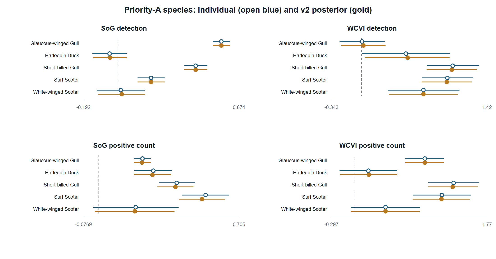
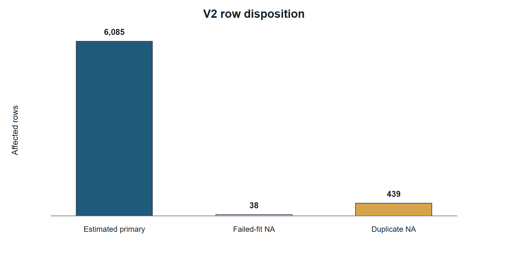
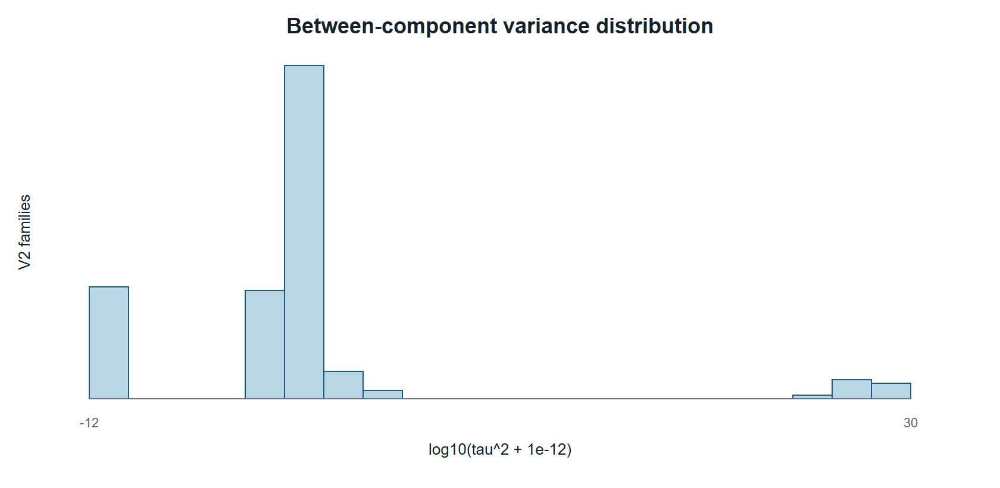
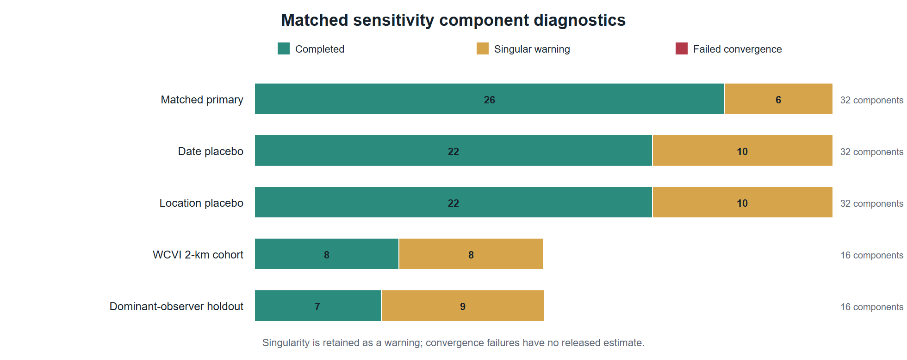

# Supplement scope

This supplement documents the complete registered Stage 4A v2 publication evidence without refitting a response model. Machine-readable companion tables are the authoritative detailed results. They retain every registered row, warning, explicit NA reason, deterministic key, and source hash needed to audit the manuscript. No source checklist, observer identity, exact locality, exact coordinate, event token, or transformation mapping is included.

The analysis-freeze commit is `c54b8e7f95a2fe3573e2e38633079cd223c5a783`, tagged `stage4a-publication-v2-analysis-freeze`. The manuscript branch changes only publication text, audit tables, rendered documents, and formatting artifacts.

# Registered analysis and model disposition

Supplementary Table S1 (`../metadata/stage4a_publication_model_disposition_v2.csv`) lists every historical model relevant to the publication package and its disposition. M26 v1 is historical only and retired without replacement. M27/M28 v1 and the earlier unmatched WCVI sensitivities are superseded by their matched v2 implementations. This disposition does not change the historical registry.

Supplementary Table S2 (`../outputs/stage4a_results/effect_estimates.csv`) is the full privacy-safe individual-estimate release. It includes all activated species, guild, region, outcome, contrast, coefficient, standard error, interval, p-value, model-specific BH q-value, fit status, and historical pooling fields. Historical v1 `partial_pool_*` values are not used for inference; their authoritative invalidation and v2 replacement are described below.

# Response construction and observation states

The factorized denominator distinguishes detection, positive numeric count, unquantified `X`, lower-bound count, ambiguity, and deterministic omission zero. A deterministic zero exists only when an eligible complete checklist did not report the taxon and no ambiguity mask made the state structurally unknown. `X` contributes only to detection. Positive numeric count is conditional on a finite positive report and therefore cannot be interpreted as total abundance or biomass.

Complete-checklist eligibility was restricted to stationary or traveling protocols, 5-300 minutes, no more than 5 km traveled, one to ten observers, and the registered region-specific period through 2025. All concurrent eligible event links were encoded additively in one checklist row. No checklist was duplicated as an independent row for each link.

# Event-time results

Supplementary Table S3 (`../outputs/stage4a_publication_v2/event_time_table_v2.csv`) contains all 160 registered M05 rows: eight guilds, two regions, two hurdle components, and five discrete windows. Individual and compatible-family v2 posterior estimates are shown together with their uncertainty, model-specific BH q-values, component-evidence IDs, and pooling reason codes.

{width=100% fig-alt="All registered priority species estimates and compatible-family posterior summaries."}

**Supplementary Figure S1. Priority-A species associations.** Open marks show individual estimates and filled marks show compatible-family v2 posterior summaries. Detection and conditional positive-count coefficients remain on distinct scales.

# Partial-pooling repair

The historical v1 pooling implementation mixed incompatible family identities and could retain duplicate M11/M12 representations as if they were independent evidence. An early aggregate audit found 4,890 rows in 84 families, but that parser globally treated `NA` as missing and therefore omitted the registered North-region literal code. The authoritative typed audit covers 6,562 finite v1 rows in 112 historical families.

Column-specific parsing preserves categorical identities and applies missingness rules only to numeric fields. Compatible families may not mix model, estimand, response state, unit class, scale, exposure, window, buffer, population, adjustment set, or coefficient meaning. The frozen normal-normal empirical-Bayes method-of-moments estimator produced 162 compatible and estimable v2 families. The repair yielded 6,085 v2 posterior rows, retained 439 duplicate M11/M12 representations as explicit NA, and retained 38 noncompleted rows as explicit NA. Individual estimates, standard errors, confidence intervals, p-values, and model-specific BH q-values were exactly preserved, and no v1 artifact was modified.

Supplementary Table S4 (`../outputs/stage4a_publication_v2/supplementary_family_table_v2.csv`) contains all 162 compatible pooling families. Supplementary Table S5 (`../outputs/stage4a_publication_v2/supplementary_exclusion_summary_v2.csv`) summarizes the three row dispositions; row-level reason codes and crosswalks are in the associated metadata files.

{width=100% fig-alt="Complete disposition of 6,562 invalid historical finite pooling rows."}

**Supplementary Figure S2. Pooling row disposition.** Excluded duplicate representations and noncompleted rows remain explicit NA rather than zero effects.

{width=100% fig-alt="Distribution of between-component heterogeneity estimates among compatible pooling families."}

**Supplementary Figure S3. Compatible-family heterogeneity.** The distribution is a diagnostic of the frozen partial-pooling estimator, not a new ecological outcome.

# Singular-fit component audit

Supplementary Table S6 (`../outputs/stage4a_publication_v2/singular_fit_claim_audit_v2.csv`) contains all 43 completed singular-warning components. The declared diagnostic-to-estimate join is one-to-one on model version, region, guild, and outcome. Every coefficient, standard error, and interval is finite. No component contributes to the repaired partial-pooling families, and no headline claim depends exclusively on a singular component.

The intended structure contained random intercepts for event block, observer cluster, and generalized location cluster. A singular warning means at least one variance term was estimated on the boundary, so the effective fitted structure is simpler. The released diagnostic does not identify the collapsed term. Accordingly, singular matched-reference and sensitivity components are retained in main figures with qualification; placebo components remain diagnostics rather than biological evidence.

| Model version | Singular components |
|---|---:|
| M01_PRIMARY_v2 | 6 |
| M27_v2 | 10 |
| M28_v2 | 10 |
| S4A11_WCVI_DOMINANT_OBSERVER_v2 | 9 |
| S4A12_WCVI_2KM_v2 | 8 |
| **Total** | **43** |

# Placebo and matched sensitivity details

Supplementary Table S7 (`../outputs/stage4a_publication_v2/matched_sensitivity_table_v2.csv`, restricted to M27/M28) contains all 64 whole-bundle placebo components. M27 ordered protected analysis-event tokens within region-year and applied a nonzero cyclic shift; M28 ordered protected location then event tokens within region-year and applied its registered nonzero shift. Neither construction read a response. The complete linked bundle moved together, preserving within-stratum bundle distributions and concurrent-link invariants with zero fixed positions. No component had BH q below 0.05.

Supplementary Table S8 (the same matched sensitivity table, restricted to the WCVI 2-km and dominant-observer versions plus the matched reference) contains the complete spatial and observer sensitivity estimates. Each sensitivity changed one registered dimension. The 2-km analysis restricted eligibility to the high-precision cohort; the observer analysis removed one pre-defined dominant observer cluster from every guild and outcome. Both used the matched sparse M01 architecture.

Supplementary Table S9 (`../outputs/stage4a_publication_sensitivity_v2/matched_validation_v2.csv`) contains 512 model-component-fold rows. Each of the 128 components has four event-blocked folds. Validation uses fixed effects only, excludes unsupported fixed factor levels transparently, suppresses cells below 20, and never uses conditional observer or location BLUPs.

{width=100% fig-alt="Execution status and diagnostics for all protected publication-sensitivity model components."}

**Supplementary Figure S4. Sensitivity execution and fit diagnostics.** All components completed; singular warnings remain explicit and failures are not recoded as successful fits.

# Strait of Georgia specificity/falsification audit

The registered M29 purpose was specificity assessment, not a promise that Gadwall and Northern Shoveler were biological nonresponders. Both models were detection-only, used the true SoG active-near exposure, and retained the registered adjustment. Gadwall had a log-odds coefficient of 0.234 (95% CI 0.132 to 0.337; BH q = 7.28e-06), and Northern Shoveler had a coefficient of 0.628 (0.527 to 0.729; BH q = 6.56e-34).

These magnitudes lie within the range of primary SoG guild-detection coefficients. The panel directly challenges causal, species-specific, and simple mechanism-specific readings of those detection associations. It tests a mixture of specificity and shared seasonal, spatial-access, checklist-submission, site-selection, and exposure-classification structure. It does not directly test the positive-count component, WCVI estimates, population abundance, or whether the checklist association is present descriptively. The resulting manuscript treatment is therefore to downgrade ecological specificity, state residual-confounding and classification explanations, and retain rather than hide the panel.

The full two-row audit is `../outputs/stage4a_publication_v2/sog_falsification_claim_audit_v2.csv`.

# DFO monitoring, exposure classification, and regional interpretation

The Pacific Herring Spawn Index Data are an official relative index with documented observation and measurement caveats [@grinnell2023; @dfo_spawn_data]. Surveyed-positive, surveyed-negative, and unmonitored-unknown states are distinct. The literal regional code `NA` denotes the registered North region in the analysis registry; it is not a missing value. Missing herring components are not zero.

SoG is the primary 2005-2025 population; WCVI is candidate-primary from 2015; Central Coast and North are hierarchical descriptive frames. The manuscript does not use protected localities or exact coordinates. Regional heterogeneity can reflect biological timing, habitat, survey coverage, observer composition, and exposure misclassification; it is not interpreted as a coast-wide abundance gradient.

# Reproducibility, provenance, and artifact hashes

Supplementary Table S10 (`../metadata/stage4a_manuscript_artifact_manifest_v2.csv`) records the SHA-256 and byte size of the submission artifacts after rendering. The table/figure provenance registry (`../metadata/stage4a_publication_table_figure_provenance_v2.csv`) records each manuscript artifact, location, source file and hash, generation script and commit, filters, model or family IDs, caption, and privacy class.

The analysis freeze is immutable. Manuscript assembly is a downstream transformation of privacy-safe aggregates and does not modify frozen v1 or v2 analysis outputs. Authorized researchers can reconstruct protected analysis inputs under the eBird and DFO source terms; public readers receive aggregate outputs, code, specifications, hashes, and documented access constraints.

# References
